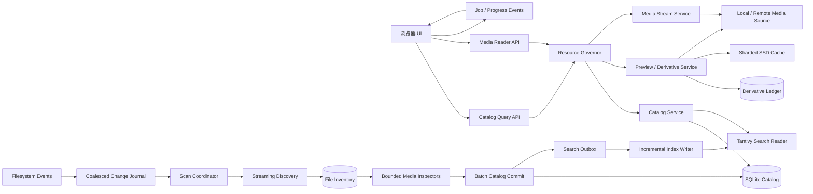
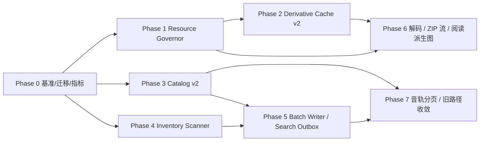
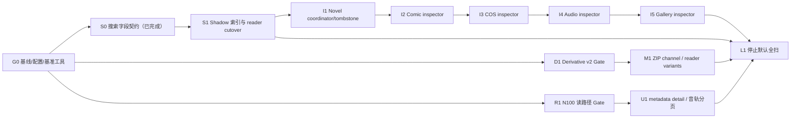

# ArisList NAS / N100 / 4GB 加载架构优化与重构计划

状态：分阶段实施中；本轮只推进 Inventory Scanner 与 Search shadow/incremental reader 两项实验功能，生产默认开关仍关闭。Phase 1 本地候选实现已通过，Phase 2 第一批已接入且默认关闭，Phase 3 的 SQLite/有界读路径保持活动；Facet bitmap、Derivative Cache v2、JPEG downscale 本轮不规划，qmediasync 继续 Deferred。Inventory Scanner 已具备按 kind rollout、bounded batch、generation/lease fence、失败不删除、watcher 定向事件和 ownership promotion gate；Search 已具备 shadow-v3 outbox、SQLite/Tantivy 事实对账、双读 canary、fail-closed、损坏恢复、incremental reader arm 和 prewarm。当前正式稳定窗口固定为 `1 CPU / 4GiB / 256 PID / 双客户端 / 300 秒（5 分钟）`，Docker approximation 结果直接作为本项目正式验收依据；真实 NAS/N100、30 分钟、24 小时和额外 soak 不再作为本阶段阻塞项。

### 本轮范围冻结（2026-08-22）

1. Inventory Scanner：实验性落地和按 kind 的 Docker 规模证据属于本轮工作；未选中 kind
   继续由 legacy writer 负责，不能用全局开关一次切换所有媒体类型。
2. Search shadow/incremental reader：实验性落地、事实对账、canary、恢复和 cutover
   gate 属于本轮工作；只有 persisted reconciliation、revision、outbox 和 ownership
   条件同时满足时才允许 reader arm。
3. Facet bitmap、Derivative Cache v2、JPEG downscale 与 qmediasync：本轮不实施、不做
   稳定窗口验收，也不计入本轮未完成项；保留默认关闭和后续单独规划入口。

最新落地批次（2026-08-22）：Audio/Gallery reconciliation 的 inventory 路径已纳入短
`TrackedReadTransaction`，流式读取完成即提交，超限/元数据错误显式回滚；对应的 runtime
回归与 validator 契约已通过。该批不改变媒体 HTTP、ownership、Search、qmediasync 或正式
稳定窗口口径。

2026-08-23 补充闭环：Gallery rollback 后的 reconciliation 首次复核发现的是
Catalog v2 writer fingerprint 前缀与 legacy scanner metadata 的表示差异，而非媒体事实
漂移。当前对账比较已按 kind 归一化受控前缀，并以新增回归固定该契约；在同一
`1 CPU / 4GiB / 256 PID` 容器中 job `13` 已通过 `600/600` works、`0` missing/
unexpected/mismatch/error，耗时约 `1,224s`，最终 root `700,000/700,000`、ownership
保持 `legacy`、SQLite `quick_check/integrity_check=ok`。该修复只服务 Inventory/Catalog
promotion fence，不扩大本轮范围；Facet bitmap、Derivative Cache v2、JPEG downscale 和
qmediasync 继续 Deferred。

### 当前稳定窗口覆盖范围

本阶段只把受限 Docker 的 `1 CPU / 4GiB / 256 PID / 双客户端 / 300 秒（5 分钟）`混合负载
作为稳定窗口验收。30 分钟、24 小时、真实 NAS/N100 和额外 soak 均降级为非阻塞风险或用户
自测，不再作为下一 Gate 的前置条件。目标规模数据库、代表性预览、标签筛选、漫画/CoserPicture
页、音声 Range 起播和轻小说摘要必须在同一 300 秒窗口的 artifact 中保持成功率和资源指标。

### 当前 release 的正式复测结果（2026-08-22）

封面完整性修复后的 `arislist:n100-sim-cover-r1` 已在同一 `1 CPU / 4GiB / 256 PID` 边界
完成唯一正式 300 秒窗口。artifact：
`perf-results/docker-n100-scale-1cpu/unified-scale-cover-r1-5m/run.json`。根、媒体和混合
Gate 均通过；目标规模 `40,000 works / 740,000 assets / 800,000 work_tags`，混合负载
`39,360/39,360` 成功、`0` 失败、`0` 个 503，媒体矩阵 `240/240` 成功。total P95/P99（ms）为：
Catalog `75.55/79.48`、标签 `103.03/170.74`、图库冷/热 `91.01/95.66` / `90.74/94.73`、
漫画 `281.08/294.04`、CoserPicture `289.53/301.54`、音声 Range `88.43/93.24`、轻小说
摘要 `77.35/81.62`。内存峰值约 `128.8MiB`、WAL `78,312B`，busy/超时/写队列/OOM 全为 0；
1 CPU 节流约 `461.1s`，只作为余量证据记录。AMD CPU 型号预检失败属于 approximation 允许项。
本结果是当前代码树的正式模拟验收依据；不再追加其他稳定窗口时长。

本轮 N100 preflight 入口补充：生产镜像不安装 Node，Docker 验证应从宿主执行
`node scripts/perf/check-n100-environment.mjs --container <container> ...`，由
`docker exec` 读取容器内 cgroup、CPU 型号和 diskstats；这只增强边界证据，不把
Windows/AMD Docker 结果升级为 N100 结论。

本轮又将 `/api/inventory/status` 的根状态与队列计数合并到一个短 tracked read
snapshot；这是已完成的单一诊断入口收敛，不能外推为“全部 legacy 读路径已迁移”。

本轮又将 S1 shadow search outbox 的作品/标签文档批量读取收敛到一个短
`TrackedReadTransaction`；读取完成后立即提交，Tantivy 写入不再持有 SQLite 快照。该路径仍
默认关闭，不改变生产 reader 或 ownership promotion；正式稳定窗口继续唯一采用
`1 CPU / 4GiB / 256 PID / 双客户端 / 300 秒（5 分钟）`。

outbox、shadow index 和 reconciliation 的独立状态 helper 也已统一为短 tracked read wrapper，
避免恢复/增量候选路径从隐式 pool checkout 读取状态；同一事务只覆盖状态查询，不跨任何
Tantivy 或媒体 I/O。

shadow fact reconciliation 进一步把 before/after 状态合并为各一个短快照；after 快照直接提供
Catalog/Search revision，避免在 Tantivy 文件读取完成后再分别 checkout revision 状态。该调整
仍只影响默认关闭的 S1 对账 worker，不改变生产 reader 或正式媒体 Gate。

Inventory coordinator 的 pending root、terminal error/count 和空 drain phase 读取也已合并为
短 tracked read helper，避免每个 root 的多次隐式 pool checkout；事务不跨 inspector、文件 I/O
或 coordinator writer。该批不改变默认 ownership、qmediasync Deferred 或正式五分钟窗口。

本轮继续将 Catalog reconciliation 的启动基线收敛到一个短 tracked read snapshot：
revision、kind roots、上一轮 evidence、ownership、scanner lock 与 pending events 在进入
文件/归档 inspector 前从同一 SQLite generation 读取并提交。该事务不会跨越后续媒体 I/O，
也不改变 after revision/root stale fence、ownership 或实验性默认开关。

### 30.53 watcher ownership 判断同快照收敛（2026-08-21）

watcher 的一个 burst 可能同时包含五类媒体事件。此前
`event_requires_legacy_scan_inner` 与 `journal_paths_for_specs_with_kinds` 分别对五种
kind 调用 `catalog_kind_is_v2`，固定产生最多五次 pool checkout，并可能在切换边界读取
混合 ownership 状态。当前新增 `catalog_v2_kinds_snapshot`，在一个短
`TrackedReadTransaction` 中读取全部 `catalog-v2` ownership，再复用 `BTreeSet` 完成
事件判断和 changed-key journal；快照在写入 `scan_events` 或进入文件 I/O 前提交。

未选中 kind 仍 fail-closed 回到 legacy 全扫描，rollback 仍通过完整 reconcile 恢复；只
减少固定 checkout，不扩大任何 ownership 或实验性开关。新增回归确认五类判断只产生
一个 tracked snapshot、无 implicit rollback。该批定向 inventory 测试为 `38 passed /
0 failed / 1 ignored`，全量 Rust 为 `334 passed / 0 failed / 3 ignored`，Clippy、Node
perf、前端 build、validator、fmt、diff check 均通过。

当前 release 的 Docker 近似运行证据已补齐：`arislist:n100-sim-r11` 在 4GiB/4CPU/256
PID 容器中，`/api/catalog/reconciliation` 顺序 50 次为 `2.664/3.817/24.570ms`
（P50/P95/P99），双并发 100 次为 `2.418/3.219/13.314ms`；失败和 503 均为 0，
health 中 implicit rollback、SQLite busy、pool acquire timeout/error 均为 0。原始
artifact 位于 `perf-results/docker-n100-sim/reconciliation-baseline-r11/`。这些数值
只用于当前代码的本机 Docker 近似对比，不等价于 N100 CPU、NAS HDD 或 TB 级媒体库
验收，实机数据由用户执行。

2026-08-21 增量搜索补充状态：当前 patched release 已在 Windows Docker 4GiB/4CPU/256 PID
近似环境完成 shadow canary、incremental reader rerun 和全新启动 cutover probe。修复
后台 `SearchWriter` permit/`SHADOW_OUTBOX_LOCK` 反向等待，给 gate 锁等待加入 profile
interactive deadline，并增加 shadow `building` 状态的无锁快速 fail-closed 预检；新增证据目录为
`perf-results/docker-n100-sim/search-shadow-v24-final/`、
`search-shadow-v24-final-rerun/` 和 `search-shadow-v24-unarmed-early/`。结果证明
未 armed 时返回受控 503，armed 后固定 corpus 可走 production reader；不改变实验性
默认开关或 ownership promotion 状态，也不替代真实 N100/NAS Gate。

Migration Gate 补充状态（2026-08-21）：上一份 v23 artifact 使用旧 release 二进制，
按设计保留为失败/过期证据；当前 release 对同一 quiesced v23 fixed corpus 的新 Gate
已通过，迁移后及 restore 均为 schema v24、`integrity_check=ok`，源库前后 hash 一致，
启动约 `36.224s`。这只证明开发机 fixed corpus 的版本迁移契约，真实 NAS 旧库、备份
恢复耗时/RSS 与存储性能仍未验证。

Facet bitmap Docker 近似补充状态（2026-08-20）：使用 fixed corpus 的选择性
`genre:perf-tag-0002` 查询命中 bitmap，构建 `1,958ms`、估算常驻 `12.67MiB`，30
次冷响应 P95/P99 为 `13.386/18.043ms`，0 fallback/build failure/scope rejection；
`genre:perf-tag-0001` 为全量 hot tag，预聚合直接返回，相关失败编排证据保留但不计为
bitmap Gate。该 artifact 仍只证明 Windows Docker approximation 的资源和路由行为，
不替代真实 N100、HDD await、温度降频或 24 小时 NAS soak。

补充状态（2026-08-20）：scanner tag 的当前 lease 读取与标签关联已统一到一个 tracked
writer transaction；扫描前后 Catalog/Search revision 也已合并为单一 tracked read snapshot；
后端最新回归为 328 passed / 0 failed / 3 ignored。该修复不改变
实验性开关或 ownership promotion 状态，真实 NAS Gate 仍未执行。

媒体 Gate 补充状态（2026-08-20）：隔离服务已使用当前工作树和 `nas-n100-4g` profile
完成开发机媒体 HTTP 预检；修正 Comic/CoserPicture target 的 `/stream` 路由后，8 个
场景共 240/240 请求成功、0 失败、0 个 503，双客户端并发预检累计 480/480 成功。
该证据只验证端到端路径和工具编排，不改变真实 N100/NAS Gate 状态；Windows/AMD 主机的
N100 前置检查已按设计拒绝，下一阶段必须在 Linux/N100/4GiB cgroup/NAS HDD 上重跑。

本机 Docker 近似状态（2026-08-20）：新增 `docker-compose.n100-sim.yml`，可隔离使用
4GiB hard limit、4 CPU 配额、256 PID 上限、8788 端口和独立数据目录运行同一服务，适合
验证资源 governor、队列、OOM/暂停、Range/断流和混合 Gate 编排。它不模拟 N100 IPC、
缓存、温度/频率或 NAS HDD/network filesystem；Docker 结果必须单独标记为
`approximation`，不能替代正式 N100/NAS artifact。

2026-08-20 的首次实际尝试中，Docker Desktop Linux engine 曾在 Rust 依赖编译期间以 RPC
`EOF` 退出；该事件只说明本机 Docker backend 当时不稳定，不能作为项目构建或性能失败。

2026-08-20 Docker 近似复测已完成：镜像 `arislist:n100-sim` 成功构建，8788 容器在
`Memory=4294967296`、`MemorySwap=4294967296`、`NanoCPUs=4000000000`、`PidsLimit=256`
下健康运行。小型媒体数据库的 60 秒双客户端混合矩阵为 2,880/2,880 成功、0 个 503；
该结果仍仅是 approximation。随后将 40,000 works、740,000 assets、800,000 work-tag
links 的 fixed corpus（源库约 392.9MiB，启动后由当前程序迁移到 schema v24）放入第二个
隔离容器，在同样 cgroup 限制下完成 300 个 Catalog works/counts/facets 三元组（900/900
成功）。该规模容器观测内存约 222–229MiB，未 OOM、未重启、SQLite busy/获取超时均为 0，
资源等待超时为 0；SQLite pool 在持续并发时曾达到上限，最大 tracked acquire wait 约
11.9ms，需在真实 N100/HDD 上继续观察。

固定 corpus Docker artifact 位于 `perf-results/docker-n100-sim/r1g-v23-catalog/`；
该证据加强了 4GiB cgroup 下的规模读路径验证，但仍不能替代 Linux/N100/NAS HDD artifact。

2026-08-20 又完成了 30 分钟 Docker 双客户端媒体稳定窗口：8 个场景、144 个完整轮次、
69,120/69,120 请求成功、0 个失败、0 个 503；每秒 sampler 取得 1,820 个样本且 health
failures 为 0。各场景 total P95/P99（毫秒）为：图库冷/热缩略图 `23.80/55.27`、
`23.91/52.95`，漫画页 `403.32/552.09`，CoserPicture 页 `459.03/587.96`，音声
Range 起播 `22.52/55.12`，轻小说详情 `8.40/47.57`，目录首屏 `7.85/35.13`，标签
筛选 `7.76/39.30`。4GiB cgroup memory current 在采样中最高约 `41.9MiB`，SQLite WAL
稳定在约 `1.04MiB`，busy/获取超时/资源等待超时/写队列均为 0；tracked pool acquire
最大等待约 `33.2ms`，pool 曾饱和但没有请求失败。窗口结束时 archive/processing/
inflight permit 均归零，容器仍 healthy、OOMKilled=false、RestartCount=0。

该长窗口仍是 Windows Docker approximation：没有有效 NAS HDD await、CPU 温度/降频、
RSS/PSS peak 或真实大媒体根目录，因此只证明当前 governor、Range/归档流、分页/筛选和
SQLite 长时间资源回收没有在该负载下失稳，不能据此完成真实 N100/NAS Gate。原始证据位于
`perf-results/docker-n100-sim/media-mixed-2c-1800s/` 和
`perf-results/docker-n100-sim/system-samples-1800s.csv`。

目标运行环境：Intel N100、服务端内存上限 4GB、Linux/Docker、媒体主体位于 NAS HDD 阵列

目标数据规模：约 3–4 万作品、约 74 万媒体资产、约 80 万作品标签关联、至少约 29TB 媒体文件（尚未计入未给出体积的轻小说）

## 0. 当前实施状态（2026-08-20）

本轮收尾（Search source revision fence）：schema 已推进至 v24；legacy Search freshness
现在同时绑定 Catalog revision 与 Search source revision，标签事实变化会 fail-closed；
同一事务的 outbox fan-out 复用一个 Search revision，旧 claim 不能确认后续 revision。
开发机最终验证为后端 328 passed / 0 failed / 3 ignored（共 331 项），Clippy、fmt、validator、前端
production build 与 33 项 perf 回归全绿。该结果仍不构成 N100/4GiB/NAS Gate。

随后审计 legacy `fetch_*(&self.pool)` 读取入口：对媒体流/缩略图等单语句热路径保留
隐式 pool query，以避免每个请求增加事务 checkout；对需要复合一致性的路径继续使用
显式 tracked snapshot。`link_current_scanner_tag` 的 lease 读取与标签写入已统一到一个
tracked writer transaction，并由回归与 validator 双重约束。该修复不改变默认开关或
ownership 状态。

随后又完成当前 schema 版本契约收敛：性能工具、R1G fixture、migration Gate 和初始化
测试统一使用 v24；R1G profile 更新为 `r1g-40k-740k-800k-v6`，并由 validator 检查版本
契约文件存在且自动对照 Rust migration 列表。新增的 `prepare-media-targets.mjs` 可从
当前 SQLite 事实只读生成 8 项媒体 Gate target；缺少任一必需代表样本时 fail-closed，
不会生成半套矩阵。历史 v23 artifacts 保留为历史证据，不再作为当前 schema 输入。

本轮又在当前工作树重新执行了 Inventory/Derivative scale wrapper：700,000 Inventory
与 700,000/1,400,000 Derivative 均通过，artifact 为
`perf-results/scale-dev-20260820-v24-provenance`；scale 与 baseline 现在共用 commit、
dirty hash、schema 和安全 feature-flag provenance。该结果仍是 Windows 开发机证据，
不改变真实 N100/NAS Gate 的未完成状态。

说明：下方 Phase 0/Phase 5 行仍保留部分早先批次的历史措辞；本段与实施进度文档中的
v24、双 revision Search fence、自动 schema 对照和 328 项通过测试结果是当前工作树的最新覆盖范围。

本表以当前工作树为准。`v0.3.0`/`origin/main` 尚不包含这些未提交改动，不能把候选实现的资源边界视为已发布能力。

最新落地批次（2026-08-21）：Catalog 书架已加入有界下一页预取。预取只保留紧邻下一页，
复用同一复合游标和查询条件，受现有 5 页 LRU 限制；查询变化、刷新和卸载会取消后台请求，
因此不会恢复全库下载或造成无界浏览器内存增长。媒体混合负载 runner 的固定 `--rounds`
计数也已修正，后续 Gate 的轮数与 coverage 证据可信。qmediasync 相关新增改动、专项测试、
性能 Gate 和 ownership promotion 继续冻结，另行规划。

2026-08-23 增量优化：Search production reader 的已 arm 只读 gate 已改用短
`TrackedReadTransaction`，不再申请单写入闸门；首次 arm 仍保留同一 tracked writer transaction
中的事实校验与条件更新。该调整减少高频搜索 readiness 校验与后台 SearchWriter/Catalog
提交之间的竞争，不改变 shadow lock、revision/hash/ownership 门禁或 fail-closed 行为；r6
Docker `1 CPU / 4GiB / 256 PID` cutover、canary、incremental reader 证据全部通过。

| 范围 | 当前状态 | 已有证据 | 进入下一 Gate 前仍缺 |
|---|---|---|---|
| Phase 0 migration | 部分完成 | `schema_migrations`、checksum runner、schema version health；当前追加到 v24，覆盖 Derivative ledger、Catalog、collections/keyset assets、shadow inventory、kind-level Facet 预聚合、typed writer ownership、external-id ownership、search outbox/search reconciliation、tombstone/history retention、Novel coordinator checkpoint、Novel/Comic/CoserPicture/Audio/Gallery Catalog promotion 对账证据、内容/阅读活动修订号分离、持久化的 Audio `rj/folder/auto` 分组模式、present/work inventory 覆盖索引、有界 archive manifest cache，以及 legacy `production-v2` 搜索索引的 catalog revision fence 和 Search source revision fence；已有“新 schema 拒绝旧二进制”、v7→v8 ownership backfill 和 v16→v24 进度修订契约升级测试；v24 40k/740k/800k fixed corpus 的开发机迁移/恢复已通过 | 加入真实旧库升级副本、备份恢复和正式 NAS 上的 migration 时长/RSS Gate |
| Phase 0 metrics/profile | G0 工具候选完成，真实基线未执行；DB1 观测第一批已接入，显式 tracked read snapshot 与运行时短写 tracked transaction 已补齐；`/catalog/reconciliation` overview 与 reconciliation 启动 baseline、watcher ownership 判断已收敛；当前 release Docker 近似采样已完成 | `/api/health/resources` 已增加 outbox、Catalog/资源、SQLite runtime、单写入闸门累计 wait/hold、cgroup memory/CPU quota、显式 tracked read transaction active/hold/oldest/implicit rollback 及可选被动 WAL checkpoint 证据；`nas-n100-4g` profile、Compose 4GiB hard limit；`scripts/perf/` 可只读捕获 SQLite/环境/dirty hash、完整安全 feature flags、显式媒体根目录的有界文件/像素/ZIP 中央目录清单、按 kind 的资产/标签长尾、Inventory root/file/status 长尾、搜索索引 readiness、运行 GET 场景、采样 cgroup/CPU/温度/iowait/diskstats/WAL/outbox，并将 SQLite pool/writer/checkpoint/read-snapshot 指标与系统采样对齐，生成 nearest-rank P50/P95/P99；新增 `check-n100-environment.mjs`，对 Linux/N100/4GiB/profile/health/block-device 做 fail-closed preflight；Rust 定向测试已覆盖 active/oldest/commit/drop/failure 生命周期；reconciliation overview 与 baseline、watcher ownership 判断都有单 snapshot 回归；r11 近似 evidence 为顺序 50 次 `2.664/3.817/24.570ms`、双并发 100 次 `2.418/3.219/13.314ms`，0 失败/503、implicit rollback/busy/timeout/error 均为 0 | 在真实旧库副本和 N100 上保存 preflight、原始 JSONL/CSV 与 `dataset-manifest.json`；继续补其余 legacy 多查询读事务覆盖率、真实长读快照/WAL busy、worker/permit 时序字段 |
| Phase 1 governor | 本地候选完成 | thumbnail/archive/remote/scan/search writer 已接入；原子组合预约、交互优先级、10 秒 deadline、受控 503、3GiB/2688MiB 后台暂停滞回与取消安全均有测试 | N100/4GiB cgroup 下执行并发浏览、断流和 3GiB 压力 Gate |
| Phase 1 archive memory | 本地候选完成；CBZ/COS manifest 持久化候选已接入 | blocking task 取消后继续持有预算；body 断流释放 inflight；漫画/EPUB manifest 各受 128MiB 字节预算限制；CBZ/COS 页名进入 migration v22 有界表，按 8MiB 单条、128MiB 总量和 source size/mtime fence 淘汰；manifest 分页命中缓存行时不打开 archive pool；漫画 ZIP 已有 bounded channel streaming；panic/取消/部分读取测试通过 | N100 上注入最大 ZIP 页面并记录 RSS/首次写入延迟；重启命中率、SQLite WAL/写闸门代价、COS reader derivative 与实机 Gate 仍待执行 |
| Phase 1 thumbnail failure | 本地候选完成 | cache 配额满或解码失败返回 `private, no-store` SVG 占位图，不再把原图回退给网格 | N100 冷图与缓存满额场景复测 |
| Phase 2 Derivative Cache v2 | 本轮 Deferred，不实施、不纳入验收 | 既有代码和默认关闭开关保留，历史开发机/Docker 证据仅作背景 | 后续单独立项时再定义容量、冷图、故障和灰度 Gate；本轮不排期 |
| Phase 3 Catalog v2 | 活动读路径保留；Facet bitmap 本轮 Deferred | works、random、collections、counts、history、assets 的 bounded/tracked read、游标 revision fence、Facet 热缓存和已有 Catalog v2 读路径继续维护；冷 Facet bitmap 代码与默认关闭开关保留为历史候选 | 后续单独立项时再定义 bitmap 的真实库容量、回退和稳定窗口；本轮不排期、不纳入验收 |
| Phase 4 Inventory Scanner | 本轮实验性落地，按 kind 默认关闭；Docker scale evidence 已完成 | 有界 WalkDir `1024` 行批次、双批次 channel、generation/lease fence、失败不删除、root/status 诊断、watcher 定向事件、Catalog promotion gate；Novel `10,000/10,000`、Comic `10,000/10,000`、CoserPicture `8,000/8,000`、Audio `10,000/10,000`、Gallery `700,000/700,000` 均有独立 `1 CPU / 4GiB / 256 PID` artifact；Gallery 完整 scan job 约 `40分05秒`，Inventory root 约 `12分41秒` 完成；Comic/CoserPicture/Audio/Gallery/Novel inspector、短状态 writer gate、逐字段 reconciliation 和 rollback fence 已接入 | 本轮仍不切换各 kind ownership；后续仅需在实际启用前补逐 kind promotion/rollback 复核。qmediasync provider promotion、真实 NAS/N100 和更长 soak 不在本轮范围 |
| Phase 5 Batch/Search Outbox | 本轮实验性落地；shadow/incremental reader 已完成 Docker 近似 Gate，生产默认仍关闭 | `shadow-v3` outbox baseline、claim/commit/ack、幂等重放、SQLite/Tantivy document/id hash 对账、双读 canary、revision fence、损坏恢复、fail-closed、incremental reader arm、prewarm 和 unarmed `503 -> armed 200` probe；固定 corpus `30,015` 与历史 `40,000` works evidence 均通过，missing/unexpected/duplicate/invalid 均为 `0`，hash 一致，pending/revision lag 为 `0` | 本轮不切换生产默认 reader/ownership；后续仅需在实际启用前补一次按部署库的 promotion/cutover 复核。真实 NAS/N100、更长 soak、Facet/Derivative/JPEG 和 qmediasync 不属于本轮阻塞项 |
| Phase 6/7 reader/audio | 现有 reader/audio 有界路径保留；JPEG downscale 本轮 Deferred | 漫画/COS manifest 分段、ZIP 正文 bounded channel、音轨分页/单 audio engine/虚拟队列、图库 reader 虚拟化等已落地路径继续维护；JPEG DCT/进一步派生预取保持默认关闭 | 后续单独立项时再定义 JPEG/预取方案和 Gate；本轮不实施、不纳入验收 |
| U1 bounded detail | 第一阶段完成；`asset_mode=summary` 已接入，Catalog v2 前端已使用，summary 详情、图库封面和漫画 manifest 已在短的 tracked read snapshot 内完成；legacy 默认保持兼容 | 摘要详情对非音频/归档作品增加 16 条资产上限；保留精确计数和 `assets_complete`；作品、统计、首批资产、标签和外部 ID 使用同一 snapshot；图库封面最多读取显式图片封面和归档 fallback 两行；漫画 manifest 的 archive/kind/meta 读取与 page-count 语义保持同一 snapshot；轻小说 enrichment 不再调用完整详情；旧客户端显式/默认 legacy；后续资产使用 cursor API；生命周期断言已纳入回归 | 1 万轨 Network/DOM/heap、所有 reader 回归、默认 summary 稳定窗口、详情 JSON <256KiB、真实封面/manifest 冷热延迟的测量 |

当前候选实现于 2026-07-31 重新验证：后端 164 项通过、0 项失败、3 项 ignored。原失败的 fixture 已改用不含旧标题词的稳定路径；另增加 source path rename、category/description 单字段替换以及 tag key/label/translation 替换用例，确认旧词项删除和未变字段保留；Facet 缓存另增加 revision 隔离、single-flight 和 entries/materialized-items 双上限用例；Facet bitmap 增加 sparse/dense、kind/selected-tag/incremental snapshot、后台构建/连续 revision delta 和 SQLite 动态 Facet 对账测试；Search canary 增加 ready/双索引门禁、ID/顺序差异分类、两个持久化索引真实查询及漂移指标测试。S0 因此完成，但 S1 仍缺真实固定 corpus/SQLite 事实对账、tombstone、持久化 diff、degraded/cutover 和实机 Gate；`SEARCH_OUTBOX_SHADOW_ENABLED` 与 `SEARCH_SHADOW_CANARY_ENABLED` 继续保持 `false`。被忽略的空库初始化、`synthetic_700k_inventory_uses_fixed_batches` 和 Derivative 规模 Gate 均不在普通回归中自动运行；其中 Derivative Gate 已按 70 万/140 万两档显式执行并保存证据，inventory Gate 仍不能记为通过。

其余核验结果：`cargo clippy -p media-shelf-server --all-targets -- -D warnings`、`cargo fmt --all -- --check`、前端 `npm run build`、`node scripts/validate-project.mjs` 和 10 项 perf 工具单测均通过。通过项覆盖 Phase 1 故障注入、Derivative Cache 回归、Catalog keyset/游标、collections/history/assets、Tantivy 候选组合、常驻 Reader 与有界 single-flight 候选缓存、SQLite N100 配置、kind-level Facet 预聚合、Facet 热缓存 revision/容量/single-flight/runtime evidence、冷 Facet bitmap 构建/容量/增量/回退 evidence、Search 显式 canary 双读/门禁/漂移和 redacted corpus evidence、普通 ZIP 漫画、集合式 assets merge、typed WorkMutation、ownership/fence、novel inspector、前端有界页缓存、shadow inventory、watcher journal 和 G0 artifact smoke；它们仍不替代真实旧库副本升级、N100 实机 RSS/延迟 Gate、浏览器 heap snapshot、真实库/N100 冷 Facet bitmap、novel coordinator/delete/tombstone、真实搜索 corpus/事实对账和生产搜索切换验证。每个后续批次都必须重新执行，不沿用本表作为新改动的验证证据。

D1 开发机证据：70 万行 ledger 插入 8.148s、O(1) 容量查询 1.586ms、淘汰 88,704 行用时 19.743s；140 万行插入 18.778s、容量查询 1.792ms、淘汰 177,408 行用时 37.910s。两档均从约 32.06GiB 淘汰到不高于 28GiB，`EXPLAIN QUERY PLAN` 仅使用 `idx_derivatives_eviction_lru`、无临时 B-tree，`integrity_check=ok`。原始 JSON 位于 `perf-results/d1-dev-20260731/`；该结果来自开发机 debug 构建，只证明查询形状、批次语义和近似线性增长，不能替代 N100 Gate。

Facet 开发机证据：原 SQLite 冷路径的全局 50% 覆盖标签场景 30 次请求总延迟 P95 为 573.709ms，超过 300ms Gate；加入有界短 TTL 缓存后，同键 30 次热请求 P50 为 2.139ms、P95 为 2.938ms，3 个并发冷请求只产生 1 次 miss 和 2 次 coalesced，冷组约 690ms，原始证据位于 `perf-results/facet-cache-dev-20260731/`。在完整 40k works/2048 tags/800k associations fixture 上启用独立 bitmap 候选后，后台构建用时 2.129s，估算常驻内存 13,283,401 bytes（约 12.67MiB），bitmap 内部计算平均 3.432ms、最大 4.249ms；30 次逐次过期响应缓存的 HTTP 请求全部成功，P50 15.851ms、P95 18.256ms、P99 18.818ms，query 增加 30 且 fallback/scope rejection/build failure 均为 0。原始 JSONL、summary 和 runtime delta 位于 `perf-results/facet-bitmap-dev-20260731/`。这证明开发机 300ms Gate 与边界/路由契约已通过，不证明 N100/4GiB、真实库标签长尾或混合负载已经通过；`FACET_BITMAP_ENABLED` 继续保持 `false`。

## 1. 执行摘要

### 0.1 2026-08-18 DB1 增量状态

当前已把单写入闸门落到 Catalog v2 ownership change、typed WorkMutation/tombstone
和既有有界数据库事务，并在 health 中记录排队深度/估算字节、等待和持有时间。WAL
`PASSIVE` checkpoint 可通过 `/api/health/resources?checkpoint=true` 显式采样，避免普通
健康轮询改变负载。该实现是迁移期的可观测串行边界，不等同于“所有 legacy 单语句写入
已经由独占 writer actor 执行”；legacy scanner、inventory、search outbox 仍需后续批次
逐步纳入 typed command 队列。没有 N100/4GiB 混合负载和真实旧库证据前，不提高 writer
并发、不切换 ownership，也不打开实验性默认开关。N100 默认 writer 等待队列为 32
项/64MiB 估算字节，超限 fail-closed；该上限不是实测最优值，必须由目标 NAS Gate
验证后再调整。

当前候选已经解决一部分目录分页和资源 admission 问题，但端到端目标仍未成立。目标 NAS 环境中的限制因素不是 SQLite 的绝对容量，而是以下五条仍处于权威路径或默认活动路径的加载链路互相放大：

1. 扫描器每次完整遍历媒体根目录，并按模块串行执行。
2. 图库扫描先把全部匹配路径收集到内存，再按父目录分组。
3. watcher 即使写入 shadow journal，最终仍排队权威全库扫描；每次权威扫描结束仍请求 Tantivy 完整重建。
4. Derivative v2 默认关闭，活动缩略图路径仍依赖旧容量账本；冷图生成仍完整解码原图。
5. legacy 详情路径仍可能返回全部非归档资产；摘要详情现已纳入单一 tracked read snapshot，但尚未完成默认兼容窗口、1 万轨浏览器 heap Gate 和所有 reader 回归。

因此，目标状态不是在当前结构上继续增加缓存额度或 SQL 索引，而是把“加载”重构为四条相互解耦、有背压的流水线：

- 目录发现与增量目录清单流水线；
- 作品目录与标签查询流水线；
- 派生图生成与持久化缓存流水线；
- 原始媒体流与阅读预取流水线。

架构决策：目标规模下必须重构上述加载链路，但不需要更换 SQLite，也不需要重建作品、资产和历史的领域模型。重构边界是“谁发现变化、谁提交目录、谁维护搜索、谁生成预览、谁向客户端传输正文”；数据库主表和稳定 ID 继续作为兼容锚点。任何只提高缓存配额、并发数或 SQLite page cache 的方案都不能消除 watcher 全扫、Tantivy 全量重建、冷图完整解码和详情全资产返回，因此不能作为最终方案。

重构采用增量迁移，而不是一次性替换。旧 API、旧扫描记录和旧缓存可以在迁移期继续工作，通过功能开关逐项切换，并保留一键回退路径。

## 2. 约束、假设与非目标

### 2.1 硬约束

- 服务端容器内存硬上限为 4GB。
- N100 只有 4 个低功耗核心；长期满载时必须考虑降频。
- 媒体根目录可能位于 HDD、RAID、Btrfs 或其他元数据延迟明显高于 NVMe 的文件系统。
- SQLite、Tantivy、派生图缓存和运行时临时文件必须位于 NAS 本机文件系统；SQLite 不得位于 SMB/NFS 共享。
- 媒体目录继续只读挂载。
- 设计以 1–2 个交互用户为主要场景，但不能因两个用户同时阅读而超过 4GB。
- 不以全量预生成 70 万张缩略图作为正常运行前提。

### 2.2 兼容约束

- 保留现有作品 ID、资产 ID、阅读历史和进度。
- 现有 `/library`、`/works/{id}`、漫画、EPUB 和资产流接口在迁移期间保持可用。
- 迁移不得要求重新导入阅读历史或重新创建用户数据。
- 旧缓存可以只读命中；新缓存逐步接管，不能要求一次性删除旧缓存。
- 本地漫画需要在新扫描器中同时识别 `.cbz` 和普通 `.zip`，同时保留 ZIP 安全限制。

### 2.3 非目标

- 不把媒体二进制内容存入数据库。
- 不因为目标规模迁移到 PostgreSQL。
- 不为了缩短初次扫描而牺牲删除检测、扫描租约或原子提交语义。
- 不把浏览器端所有作品重新复制到另一套全局状态库；目标是减少常驻数据，而不是换一个状态管理框架继续全量加载。
- 不依赖 N100 核显承担图片解码；当前目标优化应在普通 CPU 路径下成立。

### 2.4 本轮容量输入与解释

| 模块 | 用户给定规模 | 推导出的平均粒度 | 对负载的含义 |
|---|---:|---:|---|
| 图库 | 约 7TB、70 万图片、约 600 个作者文件夹 | 约 10MB/图、约 1167 图/作者（仅均值） | 主要压力是 70 万次目录项/stat、图片像素解码和资产行数；作者文件夹只有 600 个并不能消除全路径收集成本 |
| 轻小说 | 约 1 万本，体积未给出 | 通常 1 EPUB/作品 | 目录项不多，但每本需要 ZIP/EPUB metadata、封面和标签解析；本文不把其体积计入 29TB 下限 |
| CoserPicture | 约 6TB、8000 个压缩包、约 500 个作者文件夹 | 约 750MB/包、约 16 包/作者 | 扫描瓶颈是跨 8000 个大包的 seek/中央目录与 fingerprint；浏览瓶颈是大图解压和派生页 |
| 音声 | 约 6TB、约 1 万音频文件 | 约 600MB/文件 | Range 起播通常不需要读完整文件；主要风险是 metadata 扫描、分组规则以及极端单作品轨道数 |
| 漫画 | 约 10TB、1 万以上 CBZ/ZIP | 约 1GB/包（按 1 万包估算） | 扫描与 CoserPicture 类似；预览还受每包页数、单页未压缩大小、ZIP 解压和完整页缓冲影响 |

除轻小说外，已知媒体体积合计约 29TB。数据库 `works` 数量约 3–4 万是根据 1 万小说、8000 COS 包、1 万以上漫画、音声分组和图库目录推导的规划值，不是实库计数；正式 Gate 必须由 dataset manifest 记录实际 works/assets/work_tags、每作者/每作品长尾，而不能只使用上述均值。

## 3. 性能与可靠性预算

以下预算是实施后的验收目标，不是当前实现的表现。

### 3.1 服务端内存预算

| 类别 | 预算 | 说明 |
|---|---:|---|
| 基础进程、SQLite 连接、常驻状态 | 512MB | 包含正常波动和连接池 |
| SQLite/Tantivy 活跃页与搜索读取 | 512MB | 允许操作系统回收，不假设全部索引常驻 |
| 前台媒体处理总预算 | 1024MB | 缩略图、ZIP 条目、远程图片统一计费 |
| 扫描与搜索维护任务 | 512MB | 流式扫描、Tantivy writer、批量写入 |
| HTTP 在途响应与运行时碎片 | 384MB | 对大响应另设字节上限 |
| 安全余量 | 1152MB | 避免 cgroup OOM，容纳库和内核记账差异 |

硬性门槛：

- 常规浏览 RSS/PSS 目标低于 1.5GB。
- 扫描或索引期间目标低于 2.5GB。
- 两个用户并发阅读并伴随维护任务时峰值必须低于 3.2GB。
- 达到 3.2GB 软阈值后，后台派生图和维护任务必须停止领取新任务。

### 3.2 交互性能预算

| 场景 | N100 目标 |
|---|---:|
| 热书架首屏 | P95 < 500ms |
| 类别/标签/搜索分页 | P95 < 100ms 数据库时间，P95 < 300ms 端到端 |
| 热缩略图 | P95 < 150ms |
| 冷图库 256px 缩略图 | 普通不超过 24MP JPEG：中位 < 400ms，P95 < 1.5s |
| 冷图库首批 4 张 | < 1.5s，优先于视口其余任务 |
| 20 张可见图库冷首屏 | 单 worker 渐进完成 < 8s；只有预算允许临时双 worker 时目标 < 5s |
| 普通 CBZ 冷翻页 | P95 < 500ms |
| COS 阅读派生页 | P95 < 1s |
| 音频开始播放 | 本地网络 P95 < 500ms |
| 单目录增量扫描 | 普通作者目录 P95 < 60s |
| 无变化一致性检查 | < 5min，不读取媒体正文 |

### 3.3 维护性能预算

- 完整扫描允许小时级，但必须可中断、可恢复、可报告进度，并且不阻塞媒体流。
- 搜索索引更新采用增量批次；完整重建只用于首次部署、索引格式变化或恢复。
- 任何后台任务不得把所有 N100 核心持续占满并导致热书架 P95 超过 1 秒。

### 3.4 当前版本量化基线与估算边界

以下区间是根据当前代码的文件元数据操作数、压缩包抽样字节数、SQLite 调用数和并发上限推导的工程估算，不代替 N100 实机数据。标准假设是数据库、WAL、Tantivy 和派生缓存位于 NAS 本机 SSD，媒体位于本机 HDD/RAID，只服务 1–2 个交互客户端。应用数据若和媒体共用 HDD，初次建库和小文件随机读取通常还会慢 2–4 倍。

| 模块 | 规模推导 | 当前初次扫描估算 | 当前无变化完整复扫估算 |
|---|---:|---:|---:|
| 图库 | 70 万图片，平均约 10MB/图 | 30–150 分钟 | 15–90 分钟 |
| 轻小说 | 1 万 EPUB | 5–35 分钟 | 3–12 分钟 |
| CoserPicture | 8000 ZIP，平均约 750MB/包 | 5–30 分钟 | 3–12 分钟 |
| 漫画 | 1 万包，平均约 1GB/包 | 8–40 分钟 | 4–15 分钟 |
| 音声 | 1 万音频，平均约 600MB/文件 | 3–20 分钟 | 1–8 分钟 |
| 串行总计 | 加搜索完整重建 | 约 1–5 小时 | 约 30–150 分钟 |

推导依据：

- 约 28,000 个 CBZ/EPUB/ZIP 每次 fingerprint 都抽样首尾各 64KiB，合计约 3.4GiB 数据和约 56,000 次跨文件寻道。
- 图库必须对约 70 万文件逐一读取 metadata。当前 W1 已按 512 资产分批，约 1368 批、约一万级应用层 SQL 边界调用；SQLite 仍执行约 70 万行 merge、行级 trigger 与索引维护，不能把边界调用下降误读成写放大已经消失。
- 约 3–4 万 unchanged works 仍分别执行 fingerprint 查询和 scanner touch；五个媒体 kind 串行。
- 当前完整扫描结束后总是请求 Tantivy 完整重建。

当前交互基线估算：

| 场景 | 当前实现、SSD 应用数据 | 主要限制 |
|---|---:|---|
| Legacy `/library` 首个 100 条书架页 | 0.2–0.8 秒 | 相关 tag/asset 子查询；Catalog v2 默认路径已绕开 |
| Legacy 前端后台拉完 4 万作品 | 5–30 秒，终端相关 | 约 60–80 个请求和反复前端重算；仅回退路径 |
| 热 256px 缩略图 | 30–150ms/张 | SSD 小文件延迟 |
| 普通冷缩略图 | 0.3–1.5 秒/张 | 完整原图解码 |
| 24–50MP 冷缩略图 | 1–4 秒/张 | N100 CPU 和峰值像素内存 |
| Legacy 客户端标签筛选 | 50–300ms/次 | 全库拆分 `tag_keys`；Catalog v2 与 v7 kind-level 预聚合候选已绕开该路径，但 40k/800k 的 N100 Gate 尚未执行 |
| 普通本地漫画页 | 0.1–0.5 秒 | HDD seek、ZIP 解压和完整页缓冲 |
| 大型漫画/COS 页 | 0.5–3 秒 | 完整原图传输和客户端解码 |
| 本地音频起播 | 50–300ms | HDD seek 与局域网；正文使用 Range |

第 3.2 节“无变化一致性检查 < 5min”只适用于事件增量检查、目录级快速检查或文件系统 metadata 已预热的场景。冷态 HDD 上对 70 万文件逐项 stat 的完整 reconcile 验收目标改为：可暂停、可恢复、有进度和 ETA，标准数据集期望 10–60 分钟，不阻塞交互请求；不同阵列的绝对时间单独记录。

## 4. 当前加载架构的问题边界

| 当前路径 | 当前行为 | 目标规模下的问题 |
|---|---|---|
| `scanner::scan_all_locked` | 漫画、小说、音声、图库、COS 严格串行 | 完整维护窗口过长，任何变化都等待前序模块 |
| `walk_matching_files` | 返回完整 `Vec<PathBuf>` | 图库 70 万路径产生不必要峰值内存，无法边遍历边提交 |
| 图库 scanner | 先发现父目录，再逐目录读取和提交；父目录发现有 65,536 安全上限 | 仍需完整发现目录后开始逐组提交；目标 600 作者目录下不再保留 70 万路径，但 inventory authority/增量 changed-key 尚未切换 |
| `upsert_scanner_assets` | 512 条 TEMP staging + set merge | 应用层往返已降到约一万级；70 万行 trigger、WAL、全目录 stat 和改变目录的全快照写入仍是瓶颈 |
| `/library` + legacy `App.refresh` | Catalog v2 关闭或不可用时，每页 500 条拉到末尾 | 兼容回退会让约 4 万作品最终全部驻留客户端，稳定窗口后应停止默认使用 |
| legacy `availableTagKeys` / `filteredWorks` | 回退路径每次对全部作品拆分 `tag_keys` | Catalog v2 活动时已绕开；旧路径常驻仍会形成 50–300ms 主线程任务 |
| legacy `/tags` | 仅返回计数前 500 个 | Catalog v2 Facet 已解除可见性限制；旧接口只保留兼容用途 |
| 缩略图 cache | 旧路径为平铺目录、进程内容量、无 LRU；v2 默认关闭 | 连续 miss 会反复核算目录，满额后新图不可缓存；必须通过 v2 ledger 切换 |
| `stream_comic_page` | ZIP 条目完整读入 `Vec<u8>` 后响应，已受全局 worker/inflight 预算约束 | OOM 风险已收敛，但每页仍完整缓冲，首字节延迟和单请求占用仍偏高 |
| Tantivy | 每次扫描后完整重建 | N100 长时间 CPU 满载，和前台请求争用 |
| 音频详情 | 首批 128 轨道 + 精确计数；队列 keyset 分页、最多 5 页缓存且只渲染邻近窗口 | 旧客户端/旧服务兼容路径仍可能请求全量；N100 起播与长时间播放 Gate 尚未执行 |

## 5. 目标架构



### 5.1 组件职责

#### Catalog Service

- 提供服务端类别、标签、搜索、集合和历史分页。
- 返回紧凑的书架 DTO，不返回 `source_path`、完整 `meta_json` 或所有 `tag_keys`。
- 负责不透明复合游标和 catalog revision。
- 通过 SQLite 查询作品和 facet，通过 Tantivy 只获取候选 work ID。

#### Scan Coordinator

- 管理每个根目录的扫描状态、generation、取消和恢复。
- 将完整 reconcile、事件增量扫描、媒体 inspector 和数据库 writer 分离。
- 同一根目录最多一个写入扫描，但不同根可以排队，不要求同时执行。
- 扫描租约继续作为防止陈旧任务提交的最终边界。

#### Preview / Derivative Service

- 统一图库缩略图、作品封面和漫画/COS 阅读派生图。
- 以数据库 ledger 作为缓存容量和状态真相，不通过请求路径全目录统计。
- 使用 single-flight 避免相同派生图并发生成。
- 维护交互高优先级队列和后台低优先级队列。

#### Media Stream Service

- 原图、音频、EPUB 使用 Range/流式传输。
- ZIP 页面通过有界通道流出，避免完整条目长期保留在响应内存。
- 对 in-flight 响应字节做全局预算。

#### Resource Governor

- 统一管理 CPU 工人、估算内存、归档句柄、远程源缓冲和维护任务。
- 所有大内存操作必须在开始前预约预算，而不是分配后再检查。
- 前台请求可以抢占尚未开始的后台任务，但不强制中断正在编码的文件。

## 6. Resource Governor 详细设计

### 6.1 资源类别

当前工作树已经包含 `resource.rs` 候选实现，并接入 thumbnail/archive/remote/scan/search writer；下表区分当前 `nas-n100-4g` 候选值与只能在实机 Gate 后采用的上限。未通过 N100/4GiB cgroup Gate 前，不能把后续上限视为默认能力：

| 资源 | 当前 N100 候选值 / 后续上限 | 预约依据 |
|---|---:|---|
| `interactive_metadata` | 当前无独立 pool；受 5 个 SQLite 连接和请求分页约束 | 小请求，不占大块缓冲；若后续增加独立 pool 再以混合负载定上限 |
| `thumbnail_decode` | 当前 1；实机通过后最多 2 | `compressed + width*height*4 + output` |
| `archive_stream` | 2 并发 | ZIP 条目未压缩大小和通道缓冲 |
| `remote_source` | 1 并发 | Content-Length 或最大允许缓冲 |
| `scan_io` | 当前 1；只有确认位于独立 SSD/设备时再评估 2 | 根目录设备配置 |
| `catalog_writer` | 1 | SQLite 单 writer |
| `search_writer` | 1、32MiB heap | 只有非 N100 profile 才使用 50MB 级 writer heap |
| `processing_memory` | 1024MiB | 以 16MiB token 为单位预约；实机 Gate 通过后才允许上调 |
| `inflight_media_bytes` | 256MiB | 尚未完成的媒体响应；最多容纳两个上限页面 |
| `archive_manifest_cache` | 256MiB 总量 | Comic/EPUB 各 128MiB，按估算字节淘汰，不按对象个数 |

### 6.2 优先级

从高到低：

1. 音频 Range、当前漫画页、当前 EPUB 章节；
2. 视口内缩略图和作品封面；
3. 相邻页与视口预取；
4. 增量扫描；
5. 派生图后台预热；
6. 完整 reconcile 和搜索完整重建。

### 6.3 预约协议

每个大任务在读取正文前执行：

1. 读取文件元数据或 ZIP 中央目录中的条目大小。
2. 解析图片头获得宽高，不完整解码。
3. 计算保守内存估算；超过单任务上限时选择缩放解码、流式路径或拒绝。
4. 获取类别并发 permit 和 memory tokens。
5. 执行任务并在 drop 时释放。

如果无法在交互超时内获得预算：

- 前台缩略图返回可重试占位响应，不回退传输数 MB 原图。
- 相邻页预取直接取消。
- 后台任务保持 queued，不占内存等待。

### 6.4 配置建议

新增可配置资源 profile：

```text
RESOURCE_PROFILE=nas-n100-4g
PROCESSING_MEMORY_BUDGET_BYTES=1073741824
INFLIGHT_MEDIA_BUDGET_BYTES=268435456
MEMORY_SOFT_LIMIT_BYTES=3221225472
MEMORY_RESUME_LIMIT_BYTES=2818572288
ARCHIVE_MANIFEST_CACHE_BYTES=268435456
RESOURCE_WAIT_TIMEOUT_MILLIS=10000
THUMBNAIL_WORKERS=1
ARCHIVE_STREAM_WORKERS=2
LOCAL_MEDIA_STREAM_WORKERS=2
SCAN_IO_CONCURRENCY=1
SEARCH_WRITER_HEAP_BYTES=33554432
```

保留通用桌面 profile，但 NAS 镜像默认文档应推荐 `nas-n100-4g`。

### 6.5 预约、取消与生命周期协议

资源池使用固定粒度 token，避免为每个字节建立 permit。处理内存以 16MiB 为单位、在途响应以 8MiB 为单位向上取整。组合预约必须在一个 admission 临界区内以 `try_acquire` 全部成功后才提交；任一池不足就释放本次全部临时 permit 再等待通知。仅规定获取顺序仍会让任务持有 processing token 等待 class slot，不能作为“原子预约”的替代。

```rust
enum ResourceClass {
    ThumbnailDecode,
    ArchiveStream,
    LocalMediaStream,
    RemoteSource,
    ScanIo,
    CatalogWriter,
    SearchWriter,
}

struct ReservationRequest {
    class: ResourceClass,
    processing_bytes: u64,
    inflight_bytes: u64,
    priority: Priority,
    deadline: Option<Instant>,
}

struct ResourceLease {
    class_permit: OwnedSemaphorePermit,
    processing_permit: Option<OwnedSemaphorePermit>,
    inflight_permit: Option<OwnedSemaphorePermit>,
}
```

预约状态机：

1. 在不读取正文的情况下，从文件 metadata、ZIP 中央目录和图片头计算保守估算。
2. 同时等待类别 slot、processing token 和 inflight token；任一等待被取消或超时，已经取得的 permit 立即 drop。
3. 任务开始后不得把预算 guard 移出受控对象；HTTP body、blocking task 或派生图临时文件 writer 必须持有 guard。
4. 客户端断开时 body stream 被 drop，资源 guard 和生产者 channel 同时释放。
5. 实际大小超过估算时只允许追加预约；追加失败则停止处理，不先分配再记账。
6. 所有后台任务在进入正文处理前检查 cgroup soft threshold；超过阈值时保持 queued。

类别 slot 与内存 token 不是同一个概念。例如一个 50MP JPEG 只占一个 `thumbnail_decode` slot，但应预约 `compressed_bytes + width*height*4 + encoder_scratch + output_limit`；未知图片尺寸时按 512MiB 保守预算。ZIP 页面在中央目录声明大小和 128MiB 安全上限中取较小值，同时预约 processing 和 inflight。

取消安全要求：

- `ResourceLease` 不允许手工 `forget`；所有 permit 由 RAII 释放。
- 指标中的 waiters 使用独立 guard 维护，future 被取消也必须递减。
- blocking worker 不能仅因 HTTP future 被取消而脱离预算运行；生产者应观察取消 token，或由持有 lease 的任务等待其退出。
- 测试必须覆盖“等待期间取消”“取得部分资源后取消”“body 发送一半断开”“blocking worker panic”四种路径。

## 7. 数据库与目录模型

现有 `works`、`assets`、`tags`、`work_tags`、历史和 scanner ownership 表保留。当前工作树的 append-only migration 已推进到 v10；本章记录已经落地的候选 schema 及其目标不变量。字段、约束或索引如与文字摘要不一致，以 `migrations.rs` 为事实来源。

### 7.1 Schema migration 基础

当前候选已新增 `schema_migrations(version, name, checksum, applied_at)`，把后续结构变更从启动时散落的条件迁移改为有版本、可重复验证的 migration。

迁移原则：

- 先建表和索引，不删除旧表或旧列。
- 大规模 backfill 作为可恢复 job，不在应用启动事务中执行。
- migration 失败时应用拒绝进入写模式，但仍可提供只读健康信息。

### 7.2 根目录和文件 inventory

当前 v6 候选结构如下。为便于审查，省略重复的 `CHECK` 和时间默认表达式，但保留影响恢复、generation fence 和容量诊断的字段：

```sql
CREATE TABLE library_roots (
    id INTEGER PRIMARY KEY AUTOINCREMENT,
    kind TEXT NOT NULL,
    provider TEXT NOT NULL DEFAULT 'local',
    root TEXT NOT NULL,
    scan_depth INTEGER,
    device_class TEXT NOT NULL DEFAULT 'hdd',
    enabled INTEGER NOT NULL DEFAULT 1,
    generation INTEGER NOT NULL DEFAULT 0,
    completed_generation INTEGER NOT NULL DEFAULT 0,
    status TEXT NOT NULL DEFAULT 'idle',
    active_token TEXT,
    scan_started_at TEXT,
    last_reconcile_at TEXT,
    last_event_seq INTEGER,
    present_files INTEGER NOT NULL DEFAULT 0,
    missing_files INTEGER NOT NULL DEFAULT 0,
    last_discovered INTEGER NOT NULL DEFAULT 0,
    last_inserted INTEGER NOT NULL DEFAULT 0,
    last_changed INTEGER NOT NULL DEFAULT 0,
    last_missing INTEGER NOT NULL DEFAULT 0,
    last_error TEXT,
    UNIQUE(kind, provider, root)
);

CREATE TABLE file_inventory (
    root_id INTEGER NOT NULL REFERENCES library_roots(id) ON DELETE CASCADE,
    relative_path TEXT NOT NULL,
    parent_key TEXT NOT NULL,
    media_class TEXT,
    size INTEGER NOT NULL,
    mtime_ns INTEGER NOT NULL,
    file_id TEXT,
    fast_fingerprint TEXT NOT NULL,
    work_key TEXT,
    seen_generation INTEGER NOT NULL,
    seen_event_seq INTEGER,
    status TEXT NOT NULL DEFAULT 'present',
    last_error TEXT,
    PRIMARY KEY(root_id, relative_path)
) WITHOUT ROWID;

CREATE INDEX idx_inventory_root_parent
ON file_inventory(root_id, parent_key);

CREATE INDEX idx_inventory_work_key
ON file_inventory(root_id, work_key);

CREATE INDEX idx_inventory_present_work_cover
ON file_inventory(
    root_id, work_key, relative_path, size, fast_fingerprint, file_id
)
WHERE status = 'present' AND work_key IS NOT NULL;

CREATE INDEX idx_inventory_root_generation
ON file_inventory(root_id, seen_generation, status);
```

`fast_fingerprint` 默认由文件类型、大小、mtime、可用 file ID 构成；只有字段变化时才打开媒体正文。对时间戳不可靠的源允许配置抽样内容哈希。

### 7.3 变更 journal

```sql
CREATE TABLE scan_events (
    seq INTEGER PRIMARY KEY AUTOINCREMENT,
    root_id INTEGER NOT NULL REFERENCES library_roots(id) ON DELETE CASCADE,
    relative_path TEXT NOT NULL,
    event_kind TEXT NOT NULL,
    work_key TEXT,
    observed_at TEXT NOT NULL,
    status TEXT NOT NULL DEFAULT 'pending',
    attempts INTEGER NOT NULL DEFAULT 0,
    last_error TEXT
);

CREATE INDEX idx_scan_events_pending
ON scan_events(status, root_id, seq);

CREATE UNIQUE INDEX idx_scan_events_pending_work
ON scan_events(root_id, work_key)
WHERE status = 'pending' AND work_key IS NOT NULL;
```

事件按 `root_id + work_key` 合并。事件队列溢出或 watcher 报错时，不假设事件完整，而是把对应 root 标为 `needs_reconcile`。

### 7.4 作品统计摘要

当前 v3 候选已包含一对一摘要表，避免书架每页使用相关子查询计算资产数和标签数：

```sql
CREATE TABLE work_stats (
    work_id INTEGER PRIMARY KEY REFERENCES works(id) ON DELETE CASCADE,
    asset_count INTEGER NOT NULL DEFAULT 0,
    tag_count INTEGER NOT NULL DEFAULT 0,
    image_count INTEGER NOT NULL DEFAULT 0,
    track_count INTEGER NOT NULL DEFAULT 0,
    page_count INTEGER NOT NULL DEFAULT 0,
    catalog_revision INTEGER NOT NULL DEFAULT 0,
    computed_at TEXT
);

CREATE TABLE catalog_state (
    singleton INTEGER PRIMARY KEY CHECK(singleton = 1),
    revision INTEGER NOT NULL,
    updated_at TEXT NOT NULL
);
```

`work_stats` 在作品扫描提交事务内更新。`catalog_state.revision` 在任何会改变目录查询结果的事务中递增，为游标和客户端缓存提供全局一致性版本。完整一致性 job 可以重新计算摘要，但正常请求不动态 COUNT。

为服务端标签过滤增加覆盖索引：

```sql
CREATE INDEX idx_work_tags_tag_work
ON work_tags(tag_id, work_id);
```

### 7.5 搜索 outbox

```sql
CREATE TABLE search_outbox (
    work_id INTEGER PRIMARY KEY,
    operation TEXT NOT NULL CHECK(operation IN ('upsert', 'delete')),
    catalog_revision INTEGER NOT NULL,
    payload_version INTEGER NOT NULL DEFAULT 1,
    attempts INTEGER NOT NULL DEFAULT 0,
    available_at TEXT NOT NULL,
    claimed_by TEXT,
    claimed_at TEXT,
    committed_at TEXT,
    last_error TEXT,
    created_at TEXT NOT NULL,
    updated_at TEXT NOT NULL
);

CREATE INDEX idx_search_outbox_available
ON search_outbox(committed_at, available_at, catalog_revision, work_id);

CREATE INDEX idx_search_outbox_claimed
ON search_outbox(claimed_at, claimed_by)
WHERE claimed_at IS NOT NULL;
```

`search_outbox.work_id` 故意不建立外键：删除作品时必须保留 `operation='delete'` 的 outbox 行，直到 Tantivy 已删除对应 document。

作品和标签修改事务同时 upsert outbox；Tantivy writer 批量消费，保证数据库提交成功而索引更新失败时仍可恢复。

### 7.6 派生图 ledger

```sql
CREATE TABLE derivatives (
    id INTEGER PRIMARY KEY,
    source_kind TEXT NOT NULL,
    source_id INTEGER NOT NULL,
    variant TEXT NOT NULL,
    source_version TEXT NOT NULL,
    relative_path TEXT NOT NULL,
    mime TEXT NOT NULL,
    width INTEGER NOT NULL,
    height INTEGER NOT NULL,
    bytes INTEGER NOT NULL,
    status TEXT NOT NULL,
    created_at TEXT NOT NULL,
    last_access_at TEXT NOT NULL,
    error_count INTEGER NOT NULL DEFAULT 0,
    last_error TEXT,
    UNIQUE(source_kind, source_id, variant, source_version)
);

CREATE INDEX idx_derivatives_eviction_lru
ON derivatives(status, last_access_at, id)
WHERE bytes > 0;
```

v10 用上述部分索引替换 v2 的全量 `idx_derivatives_lru`。淘汰按 `stale → orphan → ready` 分三次等值状态查询，每次按 `last_access_at, id` 读取至多 128 条；这样既保持状态优先级，也避免 `CASE` 排序和 bytes=0 的 failed/queued 行污染大规模 LRU 扫描。

`source_kind` 初始限定为 `asset`、`work-cover` 和 `archive-page`。这里不使用跨两张来源表的外键；来源删除事务必须显式把对应记录标记为 stale/orphan，使 ledger 仍保留文件路径并能完成磁盘清理，而不是因级联删除数据库行后留下无法追踪的缓存文件。

### 7.7 SQLite 连接、WAL 与内存治理

SQLite 在约 4 万 works、74 万 assets 和 80 万 work_tags 下仍有充足容量；需要治理的是并发写入、每连接 page cache、长读事务和 WAL 增长。当前候选仍让读写共用同一 pool，但 `nas-n100-4g` profile 已收敛为 5 个连接、每连接 24MiB page cache、64MiB mmap、10 秒 acquire/busy timeout；standard/desktop profile 才是 8 个连接、32MiB、128MiB 和 30 秒。目标分两步迁移：

1. 过渡期保持 N100 连接上限为 5，由 Resource Governor 保证 catalog/scanner 重写任务只有一个 writer；普通查询最多使用 3–4 个 reader。不得因为 standard profile 是 8 而在 NAS 部署中沿用该默认值。
2. WorkMutation writer 稳定后，让 writer actor 独占一个写连接，Catalog 使用 3–4 个只读连接。进度、历史、标签和 scanner mutation 通过有优先级的 typed command 进入同一 writer；前台小写入优先于批量扫描提交。

N100/4GB 建议起始参数和边界：

| 项目 | 建议起点 | 约束 |
|---|---:|---|
| reader 数 | 3–4 | 增加 reader 不会提高 HDD 解码速度 |
| writer 数 | 1 | 不允许 scanner、backfill 和普通业务写并发争锁 |
| 每连接 page cache | 16–32MiB | `cache_size` 是每连接配置，必须按连接总数计算 |
| mmap 上限 | 0–128MiB 试验值 | cgroup RSS/PSS Gate 通过前不扩大 |
| reader busy timeout | 2–5 秒 | 超时形成可诊断过载，不让 UI 无提示等待 30 秒 |
| writer busy timeout | 10–30 秒 | 仅 writer actor 使用，并记录 queue wait 与 lock wait |
| writer queue | 32 个等待请求 / 64MiB（N100 起点） | 超限返回可重试 503；必须通过目标 NAS 混合负载 Gate 后再调整 |
| catalog slow query | 100ms | 输出 query class、候选数和 query plan 标识，不输出用户隐私 |

WAL 运行协议：

- `journal_mode=WAL`、`synchronous=NORMAL` 保持不变，数据库/WAL 必须位于本机 SSD。
- 大批写入使用短事务和 checkpoint；不能让一个扫描事务覆盖整个 root。
- writer queue 空闲或完成一个可恢复批次后执行 `PASSIVE` checkpoint；`TRUNCATE` 只在无长读事务的维护窗口执行。
- 监控 WAL 大小和最老读快照；常规运行目标低于 256MiB，初次导入允许短时增长但应低于 1GiB。超过阈值先暂停后台 writer，不强制终止前台阅读。
- migration、大规模 backfill 和首次批量导入后运行 `ANALYZE`/`PRAGMA optimize`；日常按低频维护任务运行，不放在每个请求中。
- TEMP candidate 表只存在于一次借出的连接和一次请求生命周期内；请求取消后必须清空或随连接回收，不允许残留跨请求候选。

索引审计以实际 query plan 为准，重点固定：`works(kind, updated_at, id)`、`work_tags(tag_id, work_id)`、`assets(work_id, role, position, id)`、`work_stats(collection_key, work_id)`、历史排序、pending scan events 和 outbox revision。每增加一个索引都要记录初次扫描写放大和 SQLite 文件增量；不能为少量冷查询无限增加索引。

### 7.8 标签 Facet 的分层计算

原始动态 fallback 在没有已选标签时会聚合当前 kind 的全部标签关联；开发机 20 万关联约 205–224ms，换算 N100 约 0.7–1.8 秒。当前 v7 候选已为主路径接入 kind-level 预聚合，但尚无 40k works/800k work_tags 的 N100 实机延迟和事实对账证据；动态路径不能只依靠 page cache，分层策略如下：

```sql
CREATE TABLE tag_kind_counts (
    kind TEXT NOT NULL,
    tag_id INTEGER NOT NULL REFERENCES tags(id) ON DELETE CASCADE,
    work_count INTEGER NOT NULL CHECK(work_count >= 0),
    catalog_revision INTEGER NOT NULL,
    PRIMARY KEY(kind, tag_id)
) WITHOUT ROWID;
```

查询路由：

1. 只有 kind、没有搜索/collection/已选标签时，直接读取 `tag_kind_counts`，这是标签面板首次打开的主路径。
2. 已选择标签时，从最小候选标签集合开始 join；当前合成基准已证明 1–3 个已选标签无需预计算所有组合。
3. 带搜索 query 时，把 Tantivy 候选 ID 和 rank 写入 connection-local TEMP 表，再与 work_tags 聚合。
4. collection 范围先使用动态 TEMP join 和有界 query-result LRU；只有真实 N100 数据证明仍超过预算，才增加以归一化 collection ID 为键的 `tag_collection_counts`，避免在表中重复长字符串。
5. 相同规范化 query key 使用短 TTL Facet 页缓存，条目绑定规范化请求和 catalog revision；当前 N100 候选固定为 5 秒、最多 32 项且合计最多 4096 个 materialized items，并使用 single-flight 合并同键并发 miss。缓存是加速层，不是计数真相，也不能代替冷查询优化。

在 WorkMutation writer 上线前，`tag_kind_counts` 由扫描结束后的可恢复 set-based job 重建并标记 revision；writer 上线后，在作品旧/新标签集合已知的同一事务内增量维护。过渡期间现有 count triggers 继续作为 `work_stats` 真相，批量 writer 不得再叠加第二套逐资产增减逻辑。所有写路径收敛后，才评估把逐行 count trigger 替换成 affected-work dirty set 加事务末尾集合重算。

Facet Gate：40k works/800k work_tags 的无搜索首屏在 N100 上数据库 P95 < 100ms、端到端 P95 < 300ms；任意预聚合结果必须与事实表聚合逐 tag 对账，revision 落后时返回动态结果或明确的 warming 状态，不能返回已知错误计数。开发机短 TTL 热缓存已达到 P95 2.938ms 并通过 single-flight/capacity 检查，但未缓存的全局 50% 覆盖标签仍为 P95 573.709ms，因此冷 Gate 明确未通过。

## 8. 增量扫描架构

### 8.1 完整 reconcile

完整扫描改为流式管线：

1. 为 root 增加 generation 并取得扫描租约。
2. `WalkDir` 每发现一个文件，立即构造轻量 inventory row。
3. 每 512–2048 条把 inventory 写入临时表或批量 UPSERT。
4. 只有 inventory 发生变化的记录进入媒体 inspector 队列。
5. inspector 输出 `WorkMutation`，不直接逐字段写数据库。
6. 单 writer 将一批 `WorkMutation` 在事务中合并到 works/assets/tags/work_stats/outbox。
7. 遍历完整且租约有效后，按 generation 标记消失文件，并按受影响 work_key 重建或删除作品。
8. 遍历失败时不进行 mark-and-sweep 删除。

关键不变量：

- 任何时刻内存中只保存有界批次，而不是全部文件路径。
- unchanged 文件不打开 ZIP、EPUB、音频标签或图片正文。
- 受影响作品的 assets/tags 作为一个事务版本提交。
- 旧扫描任务即使晚到也不能覆盖新 generation。

### 8.2 事件增量扫描

文件事件不再调用全库扫描：

- 漫画、小说、COS：事件对应单文件作品。
- 图库：事件映射到图片父目录 work_key，重扫该目录。
- 音声：事件向上查找 RJ 或配置的 folder work_key，重扫该作品目录。
- rename 按 remove + create 合并，尽量利用 file ID 识别移动。
- 事件在 5–20 秒窗口内按 work_key 去重。
- 周期性 reconcile 用于修复 watcher 丢失，而不是每次事件的默认路径。

### 8.3 媒体 inspector

每个 inspector 接受文件/inventory 快照，返回纯数据结构：

```rust
struct WorkMutation {
    identity: WorkIdentity,
    source_version: String,
    work: WorkFields,
    assets: Vec<AssetMutation>,
    tags: Vec<TagMutation>,
    external_ids: Vec<ExternalIdMutation>,
    stats: WorkStatsMutation,
    search_dirty: bool,
}
```

Inspector 不持有数据库事务，不直接刷新全局标签计数。这样可以独立单测，并由统一 writer 批量提交。

### 8.4 格式和分组策略

- 漫画：识别 `.cbz`、`.zip`，扫描深度改为 root 配置；通过 ZIP 内容验证而不是扩展名决定安全性。
- CoserPicture：继续识别 `.zip`，但和漫画使用相同安全 ZIP inspector。
- 轻小说：EPUB 元数据和封面只在 source version 变化时提取。
- 图库：父目录为默认 work_key；允许未来配置“作者目录/作品子目录”规则。
- 音声：RJ 匹配改为大小写不敏感；增加 `rj | folder | auto` 分组策略；无法分组的文件进入 diagnostics，而不是静默忽略。

### 8.5 批量提交

优先使用临时表：

1. 把本批资产写入 `temp_scanned_assets`。
2. 一条 `INSERT ... SELECT ... ON CONFLICT DO UPDATE` 合并 assets。
3. 一条集合语句更新 scanner ownership。
4. 一条按 work_id 删除本版本不存在的 scanner-owned assets。
5. 标签和 tag sources 使用同样集合操作。
6. 更新 work_stats、catalog revision 和 search_outbox。

W1 已把图库初次建库从逐资产应用层 SQL 往返改为每批固定数量 SQL。后续目标不再是继续扩大事务，而是由 Inventory changed-key 避免 unchanged 作品写入，并由 typed writer 在事务末尾对 affected-work dirty set 做集合式统计，减少约 70 万行 trigger/WAL 放大。

## 9. Catalog v2 与服务端筛选

### 9.1 新 API

迁移期间新增 v2，不直接改变旧响应：

```text
GET /catalog/works
GET /catalog/collections
GET /catalog/facets/tags
GET /catalog/counts
GET /catalog/history
GET /works/{id}/assets
```

`/catalog/works` 参数：

```text
kind, collection, include_tag, q, sort, cursor, limit
```

响应示例：

```json
{
  "items": [
    {
      "id": 1,
      "kind": "comic",
      "title": "...",
      "subtitle": null,
      "cover_version": "...",
      "asset_count": 1,
      "tag_count": 12,
      "page_count": 86,
      "collection_key": "artist:...",
      "updated_at": "..."
    }
  ],
  "next_cursor": "opaque",
  "catalog_revision": 1234
}
```

书架摘要不包含：

- 源文件绝对路径；
- 原始 `meta_json`；
- 逗号拼接的全部 tag key；
- 当前页面不使用的详情字段。

### 9.2 游标

游标包含：

- sort key，例如 `updated_at`；
- `id` 作为稳定 tie-breaker；
- query/filter hash；
- catalog revision 或 snapshot generation。

如果用户改变过滤条件，旧游标必须拒绝使用。首批和后续页面使用相同排序，消除当前约 100 条重叠传输。

### 9.3 标签 facet

facet 查询基于当前 kind、搜索候选和已选标签计算：

- 支持标签关键字和分页，不设全局 Top 500 可见性限制。
- 返回当前过滤上下文中的 count。
- include 标签采用 AND 语义。
- 服务端通过 `work_tags(tag_id, work_id)` 和候选 work ID 查询。
- 搜索候选过大时使用临时 ID 表，而不是拼接超长 `IN (...)`。

### 9.4 集合

当前前端通过全部作品构建漫画、小说和 COS 集合。Catalog v2 必须提供服务端集合查询，否则前端不能停止全量载入。

集合响应包含：

- `collection_key` 和显示标题；
- 作品数、未读数、标签摘要；
- 首个/最近作品的 cover ID 和 version；
- 最近更新时间；
- 打开集合时使用的服务端过滤键。

### 9.5 详情和资产分页

- `/works/{id}` 只返回作品、标签、外部 ID 和小型资产摘要。
- `/works/{id}/assets?role=track&cursor=...` 为音轨分页。
- 图库继续使用已存在的 60 条窗口模型，但顺序翻页使用 `(position,id)` keyset；
  旧数字 offset 只保留为深度随机跳转兼容路径，避免大图库连续翻页的 OFFSET 丢弃成本。
- 漫画/COS 详情只返回 archive 摘要；页面 manifest 独立请求。
- 封面请求不得通过完整详情加载作品资产；应只读取 cover asset 或 archive source。

### 9.6 Catalog v2 SQL 查询策略

书架默认排序使用 `(updated_at DESC, id DESC)`，首批和后续批次必须使用同一排序。游标解码后绑定两个值，不使用 `OFFSET`：

```sql
SELECT
    w.id,
    w.kind,
    w.title,
    w.subtitle,
    w.cover_asset_id,
    s.asset_count,
    s.tag_count,
    s.image_count,
    s.track_count,
    s.page_count,
    w.updated_at
FROM works AS w
JOIN work_stats AS s ON s.work_id = w.id
WHERE w.kind = :kind
  AND (
      :cursor_updated_at IS NULL
      OR w.updated_at < :cursor_updated_at
      OR (w.updated_at = :cursor_updated_at AND w.id < :cursor_id)
  )
ORDER BY w.updated_at DESC, w.id DESC
LIMIT :limit_plus_one;
```

多个 include tag 使用临时表或 CTE，并用匹配数量实现 AND 语义。避免为每个标签拼一个相关子查询：

```sql
WITH selected_tags(tag_id) AS (
    SELECT tag_id FROM temp_selected_tags
),
matched AS (
    SELECT wt.work_id
    FROM work_tags AS wt
    JOIN selected_tags AS selected ON selected.tag_id = wt.tag_id
    GROUP BY wt.work_id
    HAVING COUNT(DISTINCT wt.tag_id) = (SELECT COUNT(*) FROM selected_tags)
)
SELECT w.id
FROM works AS w
JOIN matched ON matched.work_id = w.id
WHERE w.kind = :kind;
```

facet 先得到当前候选 work ID，再按标签聚合。候选超过约 500–1000 个时写入 connection-local TEMP 表，避免 SQLite 参数上限和巨大 `IN (...)`：

```sql
SELECT t.id, t.namespace, t.key, t.label, COUNT(*) AS context_count
FROM temp_catalog_candidates AS candidate
JOIN work_tags AS wt ON wt.work_id = candidate.work_id
JOIN tags AS t ON t.id = wt.tag_id
WHERE (:tag_query = '' OR t.key LIKE :tag_prefix OR t.label LIKE :tag_prefix)
GROUP BY t.id
ORDER BY context_count DESC, t.namespace, t.key
LIMIT :limit_plus_one;
```

查询实现约束：

- TEMP 表只能在同一借出的 SQLite connection 上创建、填充、查询和清空。
- 任何动态排序只能从枚举映射到固定 SQL 片段，不接受客户端 SQL 标识符。
- `catalog_revision` 变化不应无条件让正在浏览的所有游标失败；游标记录 query hash 和 snapshot boundary。影响当前查询排序/过滤结果的变更才要求客户端刷新。
- 搜索只从 Tantivy取得候选 `(work_id, score)`；score 和 ID 批量写入 TEMP 表，再由 SQLite应用 kind、tag、history 和权限条件。
- 使用 `EXPLAIN QUERY PLAN` 固化测试，防止书架页重新出现全表扫描或逐作品相关 COUNT。

## 10. 前端加载架构

### 10.1 状态分层

前端不再维护单一 `LibraryResponse` 全量对象，改为：

```text
CatalogQueryState
  filters / sort / query
  pages (bounded LRU)
  itemById (仅当前缓存页)
  nextCursor
  revision

FacetState
  query / pages / selected tags

DetailState
  selected work summary
  work detail
  paged assets

ReaderState
  current manifest / current page / bounded prefetch
```

### 10.2 分页缓存

- 默认只保留当前视口附近页面和最近访问页。
- 当查询条件变化时取消旧请求并丢弃旧 cursor 链。
- 同一 query key 的返回页可短期复用。
- 书架虚拟化继续保留，但虚拟化的输入是有限分页窗口，不是全部作品。

### 10.3 搜索和标签

- 输入 debounce 后直接请求 Catalog v2。
- Tantivy 返回的候选 ID 在服务端继续应用 kind/tag 权限和排序。
- 标签选择只改变 query key，不在主线程拆分所有作品 tag 字符串。
- 标签面板独立分页，并显示当前过滤上下文 count。

### 10.4 集合导航

- 书架模式直接请求 `/catalog/collections`。
- 打开集合后切换为 `collection=<key>` 的作品分页查询。
- 不再通过本地 `buildComicCollections` 等函数遍历全库构建集合。

### 10.5 音频队列

- 当前播放项和前后少量轨道常驻。
- 队列面板使用虚拟列表和按页请求。
- 下一轨预取只获取元数据，不提前下载音频正文。
- 播放结束时若下一页未加载，优先请求包含下一轨的资产页。

## 11. 派生图和缓存架构

### 11.1 缓存键和目录

缓存键：

```text
sha256(source_identity + source_version + transform_spec + encoder_version)
```

目录：

```text
derivatives/ab/cd/<hash>.jpg
```

不再把几十万文件放在单一目录。`source_version` 变化自然产生新 key，旧版本由 LRU 回收。

### 11.2 标准变体

初始只保留有限规格：

| 变体 | 用途 |
|---|---|
| `thumb-256` | 图库网格 |
| `cover-480` | 作品书架和详情 |
| `reader-1280` | 低带宽/小屏 COS |
| `reader-1920` | 默认 COS 阅读 |
| `reader-2560` | 高分辨率漫画可选 |

不要对每个任意请求尺寸创建缓存文件；请求尺寸映射到最近的标准 bucket。

### 11.3 生成状态机

```text
missing -> queued -> generating -> ready
                         |          |
                         v          v
                       failed <- stale
```

- `queued/generating` 由数据库行和进程内 single-flight 共同保护。
- 进程异常退出后，超时的 `generating` 在启动恢复为 `queued`。
- `failed` 使用指数退避，不在每次页面刷新时立即重试。
- 源版本变化把旧记录标为 stale，新版本独立生成。

### 11.4 LRU 和容量

- ledger 中的 `bytes` 是容量真相。
- 访问时间按内存队列批量刷新，例如每文件每小时最多写一次。
- 达到 high watermark（例如 32GiB）后，后台逐文件淘汰到 low watermark（例如 28GiB）。
- 淘汰必须逐个明确文件执行，失败时保留 ledger 并记录错误。
- 请求路径不得递归遍历缓存目录计算总量。
- 后台 reconcile 只核验 ledger 中抽样文件和最近异常；完整审计作为显式维护任务。

### 11.5 解码器

在 N100 实机比较以下路径后选择：

- 当前 Rust `image`；
- libjpeg-turbo 的 JPEG 缩放解码；
- libvips 顺序访问和缩略图 API。

选择标准：

- 15MP/24MP/50MP JPEG 的耗时；
- 峰值 RSS；
- Docker 镜像体积和 native 依赖稳定性；
- EXIF orientation、PNG/WebP/AVIF 兼容性；
- 单线程和 `concurrency=1` 下表现。

预期目标是 JPEG 缩略图不完整分配原图 RGBA，并把 N100 冷缩略图耗时降低 3–8 倍。

### 11.6 失败回退

缩略图生成失败时按顺序：

1. 返回仍有效的较旧 source version 派生图并带 revalidate；
2. 返回更小的派生图；
3. 返回固定占位图和可重试状态；
4. 记录诊断。

图库缩略图接口不再自动回退传输原图。原图只通过明确的原图/阅读接口提供。

## 12. 漫画、COS 与 EPUB 读取

### 12.1 Archive manifest

首次扫描或首次打开时生成轻量 manifest：

- 有序页面名；
- ZIP 压缩/未压缩大小；
- 封面 entry；
- page count；
- source version。

manifest 可以作为压缩 JSON/BLOB 或分层 sidecar 保存；当前候选使用 migration v22 的有界
SQLite `archive_manifest_cache` 表，按源 size/mtime 校验并在事务内按最旧条目淘汰。
页面尺寸只读取图片头并按需补充，避免首次扫描解码所有页面。

### 12.2 ZIP 页面流

目标路径：

1. 获取 archive handle permit 和响应字节预算。
2. 打开条目并校验未压缩大小。
3. 在 blocking worker 中分块读取。
4. 通过容量有限的 Tokio channel 发送 128–256KiB chunk。
5. 客户端断开时立即停止读取并释放 archive handle。

这样内存由 channel 大小限制，而不是条目 128MB 上限决定。

### 12.3 COS 阅读派生图

- 默认浏览请求 `reader-1920`，避免把 24–50MP 原图发送并解码到客户端。
- 用户放大或选择原图时再请求原 entry。
- manifest 返回原图尺寸、压缩大小和可用派生规格。
- 预取由页面字节和客户端网络提示决定，不固定前后各 4 页。

### 12.4 EPUB

- 继续使用 Range 和现有安全预算。
- manifest cache 从固定 8 本改为按内存预算的 LRU，但 metadata 很小，优先级低于图片任务。
- 章节和图片流不进入派生图容量账本，EPUB 封面进入统一 cover derivative。

## 13. 搜索索引

### 13.1 增量更新

Tantivy writer 消费 `search_outbox`：

- 每批最多 100–500 个作品或最多等待 2 秒。
- 删除旧 work ID document，再写入当前数据库快照。
- commit 成功后删除/确认 outbox 项。
- 同一 work ID 多次变更只保留最高 catalog revision。

### 13.2 N100 资源配置

- writer heap 默认 32MB，实机证明不足时再升到 50MB。
- 搜索完整重建为最低优先级维护任务。
- 当前有前台缩略图或媒体流排队时，搜索 writer 暂停领取下一批。
- 完整重建写入新索引目录，完成后原子切换 reader，不在原索引上先 `delete_all_documents`。

### 13.3 搜索与目录筛选组合

Tantivy 只返回候选 ID 和 score；SQLite 负责：

- kind；
- include tags；
- collection；
- 阅读历史/进度；
- catalog revision；
- 最终分页 DTO。

大量候选 ID 使用临时表或内存表 join，避免超过 SQLite 参数数量或构造巨大 SQL。

## 14. 可观测性和运维

### 14.1 运行时指标

新增 `/health/resources` 或等价诊断接口：

- resource governor 每类 used/limit/waiters；
- 派生图队列长度、命中率、生成耗时、失败率；
- cache ledger bytes、文件数、eviction 状态；
- scan root、阶段、已发现/变化/提交数量、速率和 ETA；
- search outbox 数量和最后 commit 时间；
- SQLite busy/slow query 计数；
- archive inflight bytes；
- 进程 RSS、可用 cgroup memory（Linux 可读时）。

### 14.2 日志

每个请求/任务使用稳定 correlation ID。慢任务日志至少包含：

- media kind；
- source size/pixels/page count；
- wait time 与 execution time；
- 命中的资源队列；
- cache hit/miss/stale/fallback；
- root/device class。

日志不输出访问 token、管理员密码、远程鉴权头或完整私有 URL 查询参数。

### 14.3 NAS 存储布局

推荐：

```text
SSD:
  /app/data/library.sqlite
  /app/data/search-index
  /app/data/derivatives
  /app/generated
  /app/cover-cache (迁移期旧缓存)

HDD/RAID read-only:
  /library/comics
  /library/novels
  /library/audio
  /library/gallery
  /library/coser-picture
```

SSD 至少预留 128GB；如果启用 64GiB 云缓存，建议 256GB 或把云缓存拆到独立卷。

## 15. 分阶段实施计划

每个阶段必须独立可发布，并有明确回滚开关。

### 15.1 阶段依赖与并行边界



- Phase 1 必须先于任何会增加图片或归档并发的新功能。
- Phase 2 和 Phase 3 在 Phase 1 完成后可以并行开发，但发布时先启用安全预算，再启用新缓存。
- Phase 4 shadow discovery 可以和 Phase 3 并行；新 scanner writer 必须等 Phase 5 的事务 writer 可用后才成为默认写路径。
- Phase 6 不等待 Phase 5，但 ZIP streaming 必须使用 Phase 1 的 inflight budget。
- Phase 7 只有在 Catalog v2 已成为默认目录路径后才能关闭旧全量 library 加载。

风险、收益和复杂度：

| 阶段 | 主要收益 | 实施复杂度 | 数据风险 | 默认启用条件 |
|---|---|---:|---:|---|
| Phase 0 | 可观测、可迁移、可回归 | 中 | 低 | migration checksum 和现有测试通过 |
| Phase 1 | 4GB OOM 风险受控 | 高 | 低 | 取消/超时/断流故障注入通过 |
| Phase 2 | 图库和封面稳定流畅 | 高 | 中 | ledger/磁盘一致性和 LRU 恢复通过 |
| Phase 3 | 标签、集合、全库加载变有界 | 高 | 低 | 新旧查询结果 shadow 对比通过 |
| Phase 4 | 单文件变化不再全库扫描 | 很高 | 高 | shadow inventory 不执行删除且对账通过 |
| Phase 5 | 初次写入和搜索更新大幅缩短 | 很高 | 高 | 崩溃点幂等、outbox 恢复通过 |
| Phase 6 | 高清 COS/漫画翻页和内存改善 | 高 | 中 | N100 大图、断流、损坏 ZIP 基准通过 |
| Phase 7 | 极端音轨作品可用、旧路径收敛 | 中 | 中 | 至少一个稳定版本兼容窗口完成 |

### Phase 0：基准、指标和迁移框架

交付：

- 增加 schema migration 版本表和 migration runner。
- 增加 resource/scan/cache/search 指标骨架。
- 增加 N100 资源 profile 配置解析，但暂不切换默认行为。
- 固化 4 万 works、74 万 assets、80 万 work_tags 合成数据库基准。
- 固化图库、CBZ、COS、EPUB、音频只读样本基准脚本。

Gate：

- 现有功能、测试和 API 无行为变化。
- 在实际 NAS 记录当前版本基线。

### Phase 1：Resource Governor 与请求安全

交付：

- 建立全局 processing memory 和 inflight response 预算。
- 缩略图、归档、远程源、搜索 writer 接入 governor。
- N100 profile 默认缩略图 1 工人、归档 2 工人。
- 大任务无法预约时返回受控错误/占位，不触发原图洪泛。

Gate：

- 故障注入最大图片和最大 ZIP 页面时 RSS 峰值低于 3.2GB。
- 两个客户端中断读取后资源 permit 必须释放。

### Phase 2：Derivative Cache v2

交付：

- derivatives ledger、分层目录、single-flight、状态机和 LRU。
- `thumb-256`、`cover-480` 标准变体。
- 旧缓存只读命中和新缓存 read-through。
- 缓存满额不回退图库原图。

Gate：

- 70 万 ledger 合成数据下容量查询为 O(1)/索引查询，不遍历目录。
- 达到 high watermark 后逐文件淘汰到 low watermark。
- 崩溃恢复不留下永久 `generating`。

### Phase 3：Catalog v2 与前端分页状态

交付：

- work_stats 和覆盖索引。
- `/catalog/works`、collections、facets、counts。
- 复合游标和 catalog revision。
- 前端 bounded page cache、服务端标签筛选和服务端集合。
- SQLite reader/writer 预算、WAL/slow-query 指标和无上下文 Facet 预聚合。
- revision-bound、5 秒 TTL、32 项/4096 materialized items 双上限的 Facet single-flight 热缓存与 health 指标。
- 旧 `/library` 保留作为兼容路径。

Gate：

- 浏览 4 万作品时客户端不再下载/保留全部作品。
- 标签结果不受 Top 500 限制。
- 无搜索标签面板在 N100 上数据库 P95 < 100ms、端到端 P95 < 300ms。
- 开发机热缓存复用与并发合并 Gate 已通过；冷选择性 Facet 仍须独立达到上述预算，不能用缓存命中掩盖。
- 扫描和 Facet 并发时没有超过 1 秒的 SQLite busy 等待，WAL 增长保持在第 7.7 节边界内。
- 所有现有集合视图与历史入口功能等价。

### Phase 4：增量 inventory scanner

交付：

- library_roots、file_inventory、scan_events。
- 流式 reconcile、事件 coalescing、媒体 inspector 接口。
- `.zip` 漫画和可配置扫描深度。
- 音声大小写不敏感 RJ 与 diagnostics。
- 现有 scanner ownership 继续作为提交 fence。

迁移策略：

1. inventory shadow 模式只记录，不改变 works。
2. 对比 shadow 结果和旧扫描器作品/资产数。
3. 单媒体 kind 开启新 scanner writer。
4. 稳定后逐 kind 切换，旧 scanner 保留回退开关。

Gate：

- 事件修改单个图库目录时不遍历其他目录。
- walker 中途失败不删除既有作品。
- rename、delete、重复事件、事件丢失均有集成测试。

### Phase 5：批量 Catalog Writer 与增量搜索

交付：

- WorkMutation 批量提交和临时表合并。
- work_stats/catalog revision/search_outbox 同事务更新。
- Tantivy 增量 writer 和原子完整重建。
- 取消每次完整扫描后的无条件完整索引重建。

Gate：

- 70 万 assets 初次写入的应用层 SQL 次数下降至少一个数量级。
- 模拟索引 writer 崩溃后可以从 outbox 恢复。

### Phase 6：图片解码和阅读派生图

交付：

- 选定并集成缩放解码器。
- COS `reader-1280/1920`，可选漫画派生页。
- ZIP 条目流式响应。
- 自适应页面预取。

Gate：

- N100 冷图库缩略图和 COS 翻页达到第 3 节预算。
- 50MP 图片、128MB 条目和客户端中断均不突破内存预算。

### Phase 7：音频资产分页与旧路径收敛

交付：

- 音轨分页接口和虚拟队列。
- 旧全量 library 前端路径默认关闭。
- 清理已经经过至少一个稳定版本验证的兼容代码。
- 旧缓存继续由后台逐文件自然淘汰，不执行递归删除。

Gate：

- 单作品 1 万音轨详情可打开，客户端 DOM 保持有界。
- 回滚到兼容 API 时阅读历史和进度不丢失。

## 16. 测试与验证矩阵

### 16.1 单元测试

- 资源预约、取消、超时、drop 释放和优先级。
- 复合游标 encode/decode/query hash/revision 失效。
- cache key、source version、single-flight、状态恢复和 LRU 顺序。
- scan event 合并、work_key 映射和 generation fence。
- WorkMutation 批量合并、旧资产清理和外部标签保留。
- archive manifest 自然排序、ZIP 安全上限和 `.zip/.cbz` 一致性。

### 16.2 集成测试

- 旧数据库升级后 ID、历史、进度和 tags 保持。
- shadow inventory 和旧 scanner 对同一 fixture 结果一致。
- 扫描中断、租约失效、应用重启和磁盘只读。
- watcher 事件丢失后 reconcile 修复。
- 派生图生成中断后临时文件不被当成 ready。
- 搜索 outbox 在 Tantivy commit 前后崩溃的幂等性。
- 客户端取消漫画/COS 页面后 archive worker 和预算释放。

### 16.3 性能数据集

至少包含：

- 40,000 works；
- 740,000 assets，其中 700,000 gallery images；
- 800,000 work_tags；
- 每作品 5、20、100 标签三档；
- CBZ 100、1000、10,000 页三档；
- COS 24MP 和 50MP 图片；
- 单音声作品 100、1000、10,000 轨道；
- 缓存 ledger 70 万和 140 万变体两档。

### 16.4 N100 实机场景

1. SSD 上数据库/缓存、HDD 上媒体的标准部署。
2. 冷启动后第一次书架请求。
3. 60 张冷图库缩略图。
4. 普通 CBZ 连续翻 20 页。
5. COS 24MP/50MP 连续翻页和放大原图。
6. 音频播放同时执行单目录增量扫描。
7. 两个客户端浏览，同时运行 Tantivy 增量 commit。
8. 完整 reconcile 期间访问热书架和媒体流。
9. 人工压到 3.2GB 软阈值，确认后台任务停止领取。

采集：

- `docker stats`/cgroup memory；
- CPU 利用率、温度和频率；
- HDD/SSD IOPS、await、吞吐；
- API P50/P95/P99；
- queue wait 与 execution time；
- cache hit、失败和 eviction；
- SQLite busy time 和 Tantivy outbox lag。

## 17. 迁移、兼容与回滚

### 17.1 功能开关

当前工作树实际存在的切换开关为：

```text
CATALOG_V2_ENABLED
FACET_BITMAP_ENABLED
INVENTORY_SCANNER_ENABLED
SEARCH_OUTBOX_SHADOW_ENABLED
SEARCH_SHADOW_CANARY_ENABLED
DERIVATIVE_CACHE_V2_ENABLED
```

Resource Governor 当前通过 `RESOURCE_PROFILE` 和各预算环境变量配置，不存在 `RESOURCE_GOVERNOR_ENABLED` 总开关。`SEARCH_SHADOW_CANARY_ENABLED` 只允许显式请求在 shadow `ready` 后双读对账，不改变普通搜索或 Catalog 候选 reader。ZIP channel 已作为默认安全路径落地，但仍需在 N100 上验收；后续生产 reader cutover、COS reader variants 和逐 kind writer ownership 仍必须增加彼此独立的切换/回滚控制；不能借用 shadow/canary 开关直接切生产 reader，也不能用 Inventory 总开关一次切换五个 kind。

### 17.2 回滚原则

- 所有新表为附加状态；关闭功能开关即可回到旧读路径。
- 新 scanner 切换前 shadow 对比，切换后仍使用现有作品/资产 ID。
- Catalog v2 失败时前端可以回到旧 `/library`。
- Derivative v2 失败时允许读取旧缓存，但不恢复“缩略图回退原图”的危险行为；应返回占位图。
- Tantivy 新索引使用新目录构建并原子切换；旧索引至少保留一个稳定版本窗口。
- 不在迁移过程中递归删除旧缓存、索引或媒体目录。

### 17.3 数据备份

每个 schema phase 上线前：

- 停止 catalog writer；
- WAL checkpoint；
- 复制 SQLite 主库和当前 Tantivy meta；
- 记录 schema version 和应用版本；
- 恢复演练必须在测试副本上通过。

## 18. 预计文件级改造范围

后端目标职责边界如下。当前工作树已经存在顶层 `resource.rs`、`catalog.rs`、`catalog_writer.rs`、`inventory.rs`、`derivative.rs`、`migrations.rs` 和 `search/outbox.rs` 候选；下列目录化拆分仍是后续结构目标，不代表这些文件都尚未开始：

```text
crates/server/src/
  resource.rs
  catalog/
    mod.rs
    query.rs
    cursor.rs
    facets.rs
    collections.rs
  scan/
    mod.rs
    coordinator.rs
    discovery.rs
    inventory.rs
    events.rs
    writer.rs
    inspectors/
      comic.rs
      novel.rs
      audio.rs
      gallery.rs
      coser_picture.rs
  derivative/
    mod.rs
    key.rs
    ledger.rs
    queue.rs
    image.rs
    eviction.rs
  media/
    stream.rs
    archive.rs
    epub.rs
  search/
    reader.rs
    writer.rs
    outbox.rs
```

迁移期不要求一次拆完。先建立新模块边界，把新实现放入新模块；旧 `scanner/mod.rs`、`assets.rs`、`search.rs` 通过适配器调用，稳定后再删除重复路径。

前端目标拆分如下。`frontend/src/catalog/` 的有界分页候选已经存在，Reader 和虚拟音轨列表仍待收敛：

```text
frontend/src/
  catalog/
    api.ts
    queryKey.ts
    useCatalog.ts
    useFacets.ts
    pageCache.ts
  readers/
    ComicReader.tsx
    GalleryReader.tsx
    AudioPlayer.tsx
  components/
    VirtualShelf.tsx
    VirtualTrackList.tsx
```

`App.tsx` 最终只负责路由级编排和共享外壳，不再同时承担全库加载、筛选、集合构建和所有阅读器状态。

## 19. 完成定义

只有同时满足以下条件，加载架构重构才算完成：

- N100/4GB 实机通过第 3 节全部资源和性能预算。
- 70 万图库文件不会在普通事件更新时触发全库遍历。
- 请求路径不通过遍历缓存目录计算容量。
- 缩略图缓存满额时不会向网格回退原图。
- 浏览器不再加载全部 4 万作品才能筛选标签或构建集合。
- 普通 ZIP 漫画可以入库并使用与 CBZ 相同的安全读取路径。
- 单作品 1 万音轨不会一次返回并渲染全部轨道。
- 搜索更新不再依赖每次扫描后的完整重建。
- 任何大内存任务都受统一资源预算约束。
- 现有作品 ID、阅读历史、进度和可用媒体格式均通过迁移回归测试。
- 兼容路径至少经过一个稳定发布窗口后，才允许逐项移除。

## 20. 初始安全批次（当前候选已具备）

最初的安全批次依次为：

1. schema migration runner 和只读资源指标；
2. Resource Governor 骨架并接管现有 thumbnail/archive permits；
3. Derivative Cache v2 ledger 与 `thumb-256`；
4. N100 实机复测内存和冷缩略图；
5. 再开始 Catalog v2 和 inventory scanner。

当前工作树已经具备上述 1–3 和 Catalog/Inventory 的后续候选骨架，但第 4 项 N100 实机复测尚未完成，Derivative v2 与 Inventory 仍默认关闭。该顺序仍是安全依赖关系，不应因为代码已经存在就跳过 Gate；从当前状态继续施工以第 27 节为准。

## 21. 权威读写路径与切换顺序

本重构禁止“大爆炸式”替换。任意时刻，每类业务数据只能有一个权威写入者；shadow 组件可以记录和对账，但不能同时修改 `works/assets/tags/history`。读路径可以短期双读比较，但只能把一个结果返回给用户。

| 阶段 | 目录读路径 | Catalog 权威写路径 | Inventory 状态 | 搜索更新 | 回滚动作 |
|---|---|---|---|---|---|
| 当前候选 | Catalog v2 默认返回；旧 `/library` 为运行时回退 | 旧 scanner/现有业务写入 | shadow reconcile 与 journal 已存在但默认关闭、只修改 inventory | 扫描后全量重建 | 关闭 `CATALOG_V2_ENABLED`；Inventory 默认未启用 |
| P3 shadow | 旧 `/library` 返回；Catalog v2 只做影子查询 | 不变 | 无 | 不变 | 关闭 `CATALOG_V2_ENABLED` |
| P3 cutover | Catalog v2；旧 `/library` 仅作显式兼容 | 不变 | 无 | 搜索仍可全量重建 | 前端切回兼容客户端 |
| P4 shadow | Catalog v2 | 旧 scanner | 只记录 `file_inventory/scan_events`，不删改作品 | 不变 | 关闭 `INVENTORY_SCANNER_ENABLED`，保留附加表 |
| P4/P5 kind cutover | Catalog v2 | 每次只允许一个 media kind 由新 writer 接管 | 该 kind 成为权威，其余 kind 仍 shadow | outbox 增量；完整重建作为恢复命令 | 对该 kind 关闭新 writer，运行旧 scanner reconcile |
| P6/P7 stable | Catalog v2 | 新 writer | 全部 kind 权威 | 增量更新 | 独立关闭 archive/derivative/audio 开关 |

切换不变量：

1. 新旧目录查询必须读取同一套 `works/assets/tags/history` 主表，Catalog v2 不复制业务真相。
2. Inventory、派生图 ledger、search outbox 都是可重建的附加状态，不能成为阅读历史或作品 ID 的唯一来源。
3. 同一 media kind 不允许旧 scanner 和新 writer 同时提交；切换由数据库 lease 和 kind-level generation fence 双重保护。
4. shadow 对账失败、事件队列溢出、扫描中断或租约失效时，只能把 root 标为 `needs_reconcile`，不得执行删除。
5. 功能开关只控制新读写路径，不负责删除旧表、旧索引或旧缓存文件。

## 22. 端到端接口契约

### 22.1 Catalog 请求生命周期

每个 Catalog 请求必须遵守：

1. 解析并规范化 kind、tag、collection、query、sort 和 limit。
2. 计算稳定 query key；游标必须绑定 query key，不能跨过滤条件复用。
3. 在一个数据库快照内获取当前页和 `catalog_revision`。
4. 返回紧凑 DTO；详情字段、绝对路径和完整标签集合不得进入书架响应。
5. 客户端查询条件变化时取消旧请求；迟到响应必须由 generation 丢弃。
6. API 错误分为 `400 invalid_cursor/filter`、`409 stale_snapshot`、`429/503 overloaded` 和 `500 internal`，客户端只对可重试错误退避。

Catalog 页面默认 60 条、最大 200 条。前端常驻上限为 5 页作品摘要和 3 页 facet；页被淘汰时可以保留不含作品 DTO 的 cursor/page 元数据，以便向后导航时重新请求。

### 22.2 集合键契约

集合键是稳定、不可展示、带类型前缀的内部标识：

```text
comic:artist:<normalized artist>
novel:folder:<normalized relative parent>
novel:series:<normalized series>
coser-picture:coser:<normalized coser>
single:<work id>
```

- 展示标题与集合键分离；翻译、大小写或显示名变化不能无意合并两个集合。
- `collection_key` 必须由服务端生成并持久化/缓存，前端不再解析 `source_path/meta_json/tag_keys` 重建。
- 没有可靠集合信息的作品使用 `single:<id>`，仍可在集合视图中显示，不允许消失。
- 打开集合等价于 `/catalog/works?collection=<opaque key>`；不得把所有 volume ID 放入 URL 或客户端全局状态。

### 22.3 资产分页契约

`GET /works/{id}/assets` 使用 `(position, id)` keyset，参数限定 `role/cursor/limit`。响应包含 `total`、`items`、`next_cursor` 和 `source_version`。音频队列、图库和未来章节资产共用该契约，但媒体正文继续走独立 Range/stream 接口。

详情接口有硬性响应预算：

- 一般作品 JSON 未压缩不超过 256KiB；
- 详情默认最多携带 100 个小型资产摘要；
- 超出上限时必须分页，不能静默截断且不给 `next_cursor`；
- 单个 `meta_json` 在写入和输出时都受大小上限约束。

### 22.4 后台任务和取消契约

- 进入 blocking worker 前取得 processing permit；产生响应字节前取得 inflight permit。
- HTTP body 被丢弃时停止生产 channel，新任务不再排队；已经进入不可取消解压的 blocking 段继续持有 permit，直到线程退出。
- 后台任务在 3.0–3.2GiB 软阈值停止领取；前台任务超过 10 秒仍不能预约时返回受控过载。
- scan、outbox、derivative 任务必须存储 checkpoint；进程重启后从已提交边界继续，而不是从内存队列猜测状态。

## 23. 数据迁移与上线 Runbook

### 23.1 上线前检查

1. 确认媒体目录只读、应用数据目录可写且数据库不在 SMB/NFS。
2. 记录应用版本、schema version、SQLite/WAL 大小、Tantivy meta 和派生缓存 ledger 统计。
3. 停止 scanner/catalog writer，执行 WAL checkpoint，并在独立路径创建数据库备份。
4. 在备份副本上运行 migration、`PRAGMA integrity_check`、关键计数对账和回滚演练。
5. 只有副本验证通过后才允许升级正式库；失败时应用保持只读健康接口，不启动 writer。

### 23.2 Catalog 切换

1. 后端接口上线但前端开关关闭。
2. 对固定 query 集合影子比较新旧作品 ID、排序、counts、facet 和集合成员。
3. 差异必须分类为旧路径缺陷、预期语义变化或新路径缺陷，不能用“数量大致相同”放行。
4. 先对管理员会话启用 Catalog v2，再对全部会话启用。
5. 连续一个稳定窗口内监控错误率、P95、SQLite busy 和客户端常驻页数后，才把旧路径改为显式回退。

### 23.3 Inventory 切换

1. 创建 roots/inventory/events 表并执行只记录的完整 shadow reconcile。
2. 按 root 对账文件数、作品数、资产数、无法识别文件、权限错误和 fingerprint 差异。
3. 先启用事件 journal，但仍由旧 scanner 处理；确认 coalescing 和 overflow 标记正确。
4. 依次按 `novel -> comic -> coser-picture -> audio -> gallery` 切换 writer。图库最后切换，因为资产数最大且删除风险最高。
5. 每个 kind 至少完成一次完整 reconcile、一次增量新增、修改、rename、删除和一次重启恢复后，才能切换下一个 kind。

### 23.4 搜索切换

1. 在业务事务中写 outbox，但 Tantivy 仍由旧全量任务更新，验证 outbox 完整性。
2. 新 writer 消费到独立索引目录，比较固定搜索 query 的 ID 集合和排序。
3. 原子切换 reader 后保留旧索引目录；只有新索引稳定后才停止自动全量重建。
4. outbox lag 超过阈值、commit 连续失败或 schema 不匹配时自动回到旧 reader，并暂停消费，不删除 outbox。

## 24. 可独立交付的施工包

### P3A：Catalog 查询契约补齐

当前状态：候选 API 已基本完成，包含 collections/history/assets、Tantivy 候选组合和 query-bound cursor；剩余工作是 snapshot 边界、固定 query plan、极端分页数据集和 N100 Gate。

范围：

- 补齐 collections、history 和通用 assets 分页；
- `/catalog/works` 支持 collection 和搜索候选；
- cursor 绑定 query key，返回可诊断错误；
- 固化 query plan、分页不重不漏和长尾标签测试。

完成证据：后端测试覆盖单本 fallback、集合成员分页、历史排序、1 万音轨分页和 cursor 条件变更拒绝。

### P3B：前端有界 Catalog 客户端

当前状态：`frontend/src/catalog/`、最多 5 页作品缓存、请求取消、服务端集合/标签/历史路径已接入并默认使用；剩余工作是 40k fixture 的 Network/heap 证据、详情资产分页消费和旧路径稳定窗口。

范围：

- 新建 `frontend/src/catalog/`，把请求、query key、LRU page cache 和 hooks 从 `App.tsx` 拆出；
- 书架、facet、counts、集合和历史都由服务端查询；
- 保留最多 5 个作品页、3 个 facet 页；条件变化取消旧请求；
- 保留旧客户端作为一个构建期/运行时兼容开关，不能后台继续拉完整库。

完成证据：40,000 works fixture 下浏览器 Network 不出现遍历全库的 500 条循环请求，heap snapshot 中作品 DTO 不超过配置页数，集合和标签行为与旧 UI 对账。

### P3C：SQLite 与 Facet 收敛

当前状态：SQLite N100 profile、kind-level 预聚合、有界 Facet 热缓存和与 catalog revision/typed writer 联动的 adaptive bitmap 候选均已接入；原 SQLite 全局 50% 覆盖标签的未缓存 P95 为 573.709ms，40k/800k bitmap 开发机逐次冷请求 P95 为 18.256ms，已通过 300ms 开发机 Gate。bitmap 保持独立开关且默认关闭，下一批补真实库标签长尾、回退语义和 N100/4GiB 独立冷/热证据。

范围：把连接数、reader/writer queue、page cache、busy timeout、WAL checkpoint 和 slow-query 指标纳入 N100 profile；新增 `tag_kind_counts` 及对账 job；无搜索 Facet 使用预聚合，搜索/已选标签/collection 使用 TEMP candidate join；为关键查询固定 `EXPLAIN QUERY PLAN` 测试。

迁移边界：先追加表和只读 shadow compare，不修改或删除 work_tags；现有 `work_stats` triggers 在统一 writer 接管前继续作为权威计数。预聚合落后时允许动态查询或返回 warming，不允许静默返回旧计数。

完成证据：40k works/800k work_tags 下无搜索 Facet 达到第 7.8 节 Gate；扫描、分页和 Facet 混合负载中 reader P95、writer queue wait、WAL 和 RSS 均在预算内；事实聚合与预聚合逐 tag 一致。

### P4-Compat：普通 ZIP 漫画兼容桥

范围：在权威新 scanner 切换前，让现有本地漫画路径同时识别 `.cbz` 和 `.zip`，复用同一 ZIP 安全校验、自然排序、页数统计和阅读接口；格式判断集中为共享 helper，供后续 comic inspector 直接复用。

完成证据：同内容的 `.cbz/.zip` fixture 产生等价作品、封面、页数和页面流；损坏 ZIP、zip bomb、安全大小上限及 COS 独立根目录回归通过。该包只解除格式阻断，不声称完成增量扫描。

### P4A：Inventory schema 与 shadow discovery

当前状态：migration v6、root 同步、1024 行流式 discovery、generation fence、失败不删除和诊断 API 已存在；700,000 行 synthetic inventory 基准已显式运行并保存
`perf-results/inventory-700k-dev-20260822/run-r2.json`，结果为 `1 passed / 0 failed`、约
`15.1s`、最大批次序列化 payload `169,985B`。该证据证明开发机固定批次边界，但仍不等于
真实根目录 shadow 对账或 NAS/N100 遍历吞吐；切换后的旧 scanner 二次遍历仍需在后续
authoritative promotion 前消除。

范围：migration、root 同步、流式 discovery、批量 inventory UPSERT、generation checkpoint、只读诊断 API。此包绝不修改 `works/assets/tags`。

完成证据：70 万 synthetic inventory 在固定内存内完成；walker 中断后不产生缺失删除；再次运行只更新变化行。

### P4B：事件 journal 与定向检查

当前状态：watcher journal、overflow/gap 标记和定向 inventory 更新已存在；由于 Inventory 尚不写 Catalog，debounce 后仍会排队旧全库扫描。只有 P4C/P5A 能原子提交受影响作品后，才允许按 kind 关闭这个全扫回退。

范围：watcher 只写 journal；按 root/work_key 合并；overflow 标记 reconcile；实现单文件/单目录 inspector 调度。

完成证据：单个图库目录事件不访问其他作者目录；rename/delete/重复/乱序/丢失事件测试通过。

### P4C/P5A：WorkMutation 与批量 writer

范围：纯 inspector DTO、temp table merge、ownership fence、stats/revision/outbox 同事务提交。逐 kind 切换，不复用旧 scanner 的逐资产写循环。

完成证据：相同 fixture 新旧结果逐 ID/资产/tag 对账；图库 70 万资产的应用层 SQL round trip 至少下降 10 倍；崩溃重放幂等。

### P5B：Tantivy outbox writer

当前状态：v9 `search_index_state`、独立 shadow baseline、固定 256 项 claim/commit/ack consumer、错误退避和后台 worker 已接入但默认关闭；显式 `reader=shadow` canary 候选只有在 worker/canary 双开关、状态 `ready` 且两个索引均存在时才同时查询生产与影子索引，并在 health 中累计 query、ID mismatch、order mismatch、failure/rejection；普通查询仍读取 `search-index-v2`。S0 已裁决 source path 保持可检索，并以互不重叠的 title/category/description/path/tag fixture 验证旧词项删除；P5B 仍因真实固定 corpus/SQLite 事实对账、tombstone、持久化 diff/degraded、生产 cutover 和实机稳定窗口未完成而保持未通过。

范围：outbox 合并、批量 delete+add、commit checkpoint、独立完整 rebuild 和 reader 原子切换。

完成证据：搜索字段契约测试先恢复全绿；commit 前、commit 后、ack 前三个崩溃点恢复测试；固定 query corpus 与 SQLite 事实对账；普通增量扫描不再排队全量 rebuild。

### P6A：归档 channel streaming

范围：ZIP entry 安全校验后以 128–256KiB chunk 发送；channel 深度、解压 worker 和 inflight bytes 统一受 governor 管理。

完成证据：128MiB entry 不再形成同尺寸响应 `Vec`；客户端读取 1MiB 后断开，worker/permit 最终释放；损坏 ZIP 和 zip bomb 仍被拒绝。

### P6B：阅读派生图与解码器

范围：`reader-1280/1920`、source version、single-flight、视口优先队列和相邻 1–2 页自适应预取；先覆盖 COS，再按实测决定漫画。

完成证据：24MP/50MP 样本的内存峰值、首字节和总耗时达到第 3 节预算；原图仅由显式操作请求。

### P7：音轨分页和兼容路径收敛

范围：通用 assets API、虚拟音轨列表、按需队列、旧 `/library` 默认关闭。删除兼容代码必须放到后续稳定版本，不与首次切换同批进行。

完成证据：1 万音轨作品只保留可见窗口与少量相邻页；播放、下一轨、随机/循环和进度恢复行为回归通过。

## 25. 验收记录与基准可复现性

每次 Gate 产生一份不可只写“通过”的结构化记录：

```text
commit / schema_version / feature_flags
NAS model / kernel / Docker / cgroup mode
CPU governor / temperature range
DB+index+cache device / media device / filesystem
dataset counts and byte totals
scenario / concurrency / warm-or-cold / repetitions
API P50 P95 P99 / queue wait / execution time
RSS/PSS/cgroup current+peak / OOM events
CPU / iowait / SSD+HDD throughput and await
SQLite busy / WAL growth / outbox lag
cache hit miss eviction failure
result / threshold / pass-or-fail / raw log path
```

基准规则：

- 每个延迟场景至少 30 次，冷场景明确执行缓存冷却方式，不能把第二次访问当冷启动。
- 同时报中位数和 P95，不用单次最快值代替。
- N100 实测与开发机合成基准分表记录，不能互相覆盖。
- 性能失败先判断 CPU、存储、队列等待或数据库时间，禁止只通过提高并发掩盖。
- 任何降低安全上限、跳过校验或扩大 4GiB hard limit 的结果都不算优化通过。

## 26. 风险登记表

| 风险 | 早期信号 | 预防/缓解 | 强制回滚条件 |
|---|---|---|---|
| Catalog 集合语义漂移 | 新旧集合成员或标题不一致 | 持久 collection key、固定 fixture、shadow diff | 作品消失或进入错误集合 |
| 游标在更新时重复/漏项 | 翻页出现重复 ID、页数异常 | query hash、稳定 tie-breaker、snapshot boundary | 任一稳定 fixture 不重不漏失败 |
| Inventory 误删 | walker 错误后 missing 数突增 | 完整遍历成功标志、generation fence、先 shadow | 未完成 reconcile 产生删除 |
| watcher 风暴 | journal 增长、相同 work_key 重复 | debounce/coalesce、队列上限、needs_reconcile | 队列失控或触发全库扫描 |
| 触发器/批量 writer 双计数 | work_stats 与事实 COUNT 不一致 | 单一 writer、对账 job、事务测试 | 统计差异无法自动修复 |
| Tantivy 与 SQLite 不一致 | outbox lag、搜索命中已删除作品 | 幂等 delete+add、独立 rebuild、reader 回退 | commit 连续失败或 schema 不匹配 |
| ZIP 流式 worker 泄漏 | 断流后 permits/线程不归零 | cancel token、有界 channel、drop 测试 | 资源计数持续不归零 |
| 冷缩略图挤压前台 | queue wait/RSS/温度持续上升 | 视口优先、单 worker、软阈值暂停 | 热书架 P95 >1s 或峰值 >3.2GiB |
| SSD 写放大/耗尽 | WAL、ledger、derivative 增长异常 | checkpoint、watermark、分片、容量指标 | 剩余空间低于安全水位 |

## 27. 当前工作树的下一批执行顺序

以 2026-08-20 当前工作树为基线，P3A/P3B/P3C、P4-Compat、P4A、P4B、G0 工具骨架和 S0 已存在，后续顺序调整为：

1. **在真实副本上完成 G0 基线。** 当前树开发机证据为后端 `328 passed / 0 failed / 3 ignored`、Clippy `-D warnings`、fmt、前端 production build、项目 validator 和 38 项 perf 单测通过；700k inventory、700k/1.4M derivative scale 及 Docker 4GiB Catalog/媒体 approximation 也已分别留证。真实旧库副本仍需捕获 schema/flag/dirty hash 和原始 JSONL/CSV，执行 migration/integrity/恢复演练；该 Gate 未通过前，新 writer 只能 shadow/dry-run，不能接管删除。
2. **完成 D1/R1G 开发机合成与 N100 Gate。** 常驻 `Index/IndexReader`、5 秒 TTL、16 条目、50 万 ID 总上限的搜索候选缓存和 5 秒/32 项/4096 materialized items 的 Facet 缓存已经接入；40k/800k works/counts/facets Docker 4GiB fixed-corpus Gate 已通过，选择性 Facet bitmap 在 40k/800k 下构建约 `1,958ms`、估算 `12.67MiB`、30 次冷请求 P95/P99 为 `13.386/18.043ms` 且无 fallback。下一步仍需真实标签长尾和冷/热 P95/P99、70 万/140 万 derivative 的 N100 Gate、reader reopen/容量压力与磁盘故障；Docker 结果只作为 approximation，不改变 ownership 或默认开关。
3. **完成 S1 增量 Tantivy shadow/cutover。** v9 baseline、claim/commit/ack consumer、S0 字段契约、显式 ready-gated canary 双读与 redacted 固定 corpus runner 已有候选；继续执行真实 corpus 与 SQLite 事实逐 work ID 对账，并补 delete/tombstone、持久化 diff、lag/degraded 告警和生产 reader 原子切换。只有 lag、schema、搜索字段和删除语义全部通过才切 reader，之后才停止扫描尾部自动 rebuild。
4. **完成 I1 novel coordinator 与 tombstone。** bounded changed-key 队列把 Inventory 事件接到纯 novel inspector 和 typed writer；补 rename/missing、坏 EPUB 保留、history/progress 保留、重启 checkpoint 和 delete outbox，再把 novel ownership 从 legacy 切到 catalog-v2。
5. **按 `comic -> coser-picture -> audio -> gallery` 继续逐 kind 切换。** 每个 kind 都必须完成新增、修改、rename、删除、walker 失败、租约丢失和重启恢复；图库最后切换。某 kind 切换成功后，watcher 事件只调度对应 work_key，只有 gap/overflow 才标记 reconcile，不再排队五类全扫。
6. **实施 P6A/P6B。** ZIP entry 使用有界 channel streaming；选择缩放解码器并启用 COS reader derivative。所有路径继续经过 Resource Governor，按 N100 实测决定是否给漫画默认生成阅读派生图。
   CBZ/COS 页名 manifest 的 migration v22 有界缓存候选已接入；在真实 N100 上需同时记录首次写入、重启命中、SQLite WAL 和淘汰成本，未通过前不扩大预算。
7. **实施 P7 和兼容路径收敛。** 后端详情 metadata-only，音轨/生成图按 `(position,id)` 分页；前端虚拟队列只保留可见窗口和相邻页。Catalog、Inventory、Search 各经过至少一个稳定发布窗口后，才逐项停止旧默认路径；兼容数据和旧缓存只自然淘汰，不做递归删除。

每完成一个施工包，都必须更新第 0 节状态表、运行全量后端测试和前端 production build，并把未完成 Gate 留为明确未完成，不以“代码存在”替代通过。

### 27.1 工程量级与预期收益

以下是单人熟悉 Rust/React/SQLite 后的量级估算，用于排序，不是交付日期；以第 30.4 节逐包估算为当前权威口径。P3A/P3B/P3C、P4-Compat、W1/W2 等候选代码不重复计为从零开发，但其 N100、旧库、shadow diff 和回滚 Gate 仍计入剩余工作。

当前逐包毛估算合计约 51–100 人日；考虑 inspector/测试夹具/metrics 可复用后，排期口径为约 50–90 人日，另加真实 24 小时 soak 的自然等待时间。最大不确定性来自媒体命名/分组规则、真实 NAS 文件系统事件可靠性、native 缩放解码器的镜像兼容，以及旧数据库/旧媒体样本覆盖度。前 4–9 人日可完成 G0/S0 与部分 R1G 证据，但扫描与搜索架构收益必须等 S1/I1 和逐 kind cutover 后才成立。

## 28. 剩余重构的实施契约（当前权威执行计划）

本节把前述目标设计收敛成可以逐批实现和验收的工程契约。发生冲突时，以本节的 ownership、事务和 Gate 约束为准；性能目标仍以第 3 节为准，迁移/回滚仍以第 17、23 节为准。

### 28.1 最终目标和不做的替代方案

最终加载架构必须满足：

1. Catalog 请求的时间和内存只随页大小、已选标签数和搜索候选上限增长，不随全库作品数线性增长。
2. 日常文件变化只检查受影响 root/work key；只有 watcher gap、人工请求或一致性抽查失败才执行完整 reconcile。
3. inspector 不写数据库；唯一 Catalog writer 消费 typed mutation，并在一个业务提交边界内维护主表、ownership、统计、revision 和 search outbox。
4. 搜索索引由 outbox 增量更新；完整 rebuild 是恢复工具，不是每次扫描的尾部步骤。
5. 缩略图、阅读派生图和 ZIP/音频正文分别进入派生队列和媒体流队列，扫描不能占用交互媒体所需的设备队列。
6. 所有常驻队列、页缓存、manifest、响应缓冲和图片处理都有条目数或字节上限；4GiB hard limit 不作为正常背压机制。

明确不采用以下替代方案：提高 scanner 并发、把 SQLite 换成 PostgreSQL、全库预生成缩略图、让前端重新持有全部作品、依靠更大缓存配额掩盖平铺目录统计、用定时全量 scan 代替事件一致性。

### 28.2 Typed WorkMutation 契约

目标 DTO 的逻辑结构如下，具体 Rust 类型可以拆分，但字段语义不得丢失：

```text
WorkMutation
  source: { kind, root_id, work_key, provider }
  fence: { root_generation, scan_token, complete_snapshot }
  fingerprint: inspector version + normalized source fingerprint
  work: title/subtitle/category/description/rating/source_path/meta
  assets[]: stable identity/path/mime/role/variant/position/size/source_version/meta
  tags[]: namespace/key/label/source/owner
  external_ids[]: source/external_id/token/url/owner
  search: normalized document fields or explicit delete
```

强制不变量：

- `work_key` 在同一 kind/root 内稳定，展示标题、翻译和文件 mtime 不得参与 identity。
- `asset identity = (work_id, path, role, variant)`；position 是可变字段，不得因重新排序创建新 ID。
- mutation 必须声明是完整作品快照还是局部补丁。只有完整快照可以清理未见资产/tag ownership。
- inspector 不能携带数据库生成的 work/asset ID；writer 负责映射并返回提交结果。
- path 只在内部 DTO 和数据库存在；Catalog 列表、Facet、诊断和日志不得泄露绝对路径。
- mutation 大小必须有上限。超大图库以多批 asset chunk + 单独 finalize marker 表示，任何中途失败都不能触发删除。

### 28.3 Catalog Writer 事务算法

每个作品提交遵守以下顺序：

1. 获取 `CatalogWriter` permit，在事务内验证 root generation、kind ownership 和 scan lease。
2. 把 work、asset、tag、external-id DTO 写入 connection-local TEMP staging；单批默认 512 assets，按序列化字节数设置第二上限。
3. UPSERT work 并取得稳定 work ID。标题或 metadata 变化不改变 identity。
4. 通过 `INSERT ... SELECT ... ON CONFLICT` 集合式 merge assets，再集合式维护 `scanner_assets` ownership。返回 ID 时按 staging ordinal 排序。
5. tag/external-id 使用独立 staging 表集合式 merge；owner/seen token 与事实关联分离，不能删除 enrichment 或用户来源关联。
6. 仅在 `complete_snapshot=true` 且 generation/lease 仍有效时删除该 owner 未见关联；先清引用，再清无 owner 的事实行。
7. 对受影响 work 写 dirty set，在事务末尾集合式重算 `work_stats` 和受影响 tag counts；catalog revision 每个 mutation commit 最多推进一次。
8. 在同一事务 UPSERT search outbox。事务提交后才向 job/progress 发布完成；Tantivy 不在业务事务内执行。

第一批已经完成第 2、4 步的资产 merge 内核：固定 512 行、TEMP JSON staging、集合式 `assets/scanner_assets` merge、稳定 ID/顺序/cover 语义。下一批不能退回逐资产 SQL，也不能为了减少语句数扩大成无界事务。

截至 2026-07-29，W2 shadow 内核也已落地，但尚未接管任何 kind：

- migration v8 新增 `catalog_kind_ownership`、`catalog_work_sources`、`external_id_sources` 和无外键 `search_outbox`；五个媒体 kind 初始 ownership 全部为 `legacy`。
- `WorkMutation` 明确包含 source、root generation/active token fence、fingerprint、work、assets、tags 和 external IDs；单 mutation 上限为 512 assets、512 tags、512 external IDs 与 8MiB staging payload。
- writer 的第一条 SQL 是 kind ownership 的 guarded write，随后验证 root kind/provider/generation/active token；过期或未切换的 writer 在触碰业务表前失败。
- asset、tag、external-id 分别使用 connection-local TEMP staging 和 set-based merge。只有 `complete_snapshot=true` 才清理 scanner-owned 旧行；external/user owner 继续保留事实关联。
- 事务末尾精确重算当前 `work_stats` 和受影响 tag counts，把现有行级 trigger 的中间 revision 收敛为最多一次，并在同一事务 upsert outbox；全局 tag metadata 变化会为所有引用作品合并 outbox。
- 已验证旧/new writer fixture 逐字段一致、相同 token 重放不推进 revision/outbox、ownership/token/generation 三重拒绝、不完整 snapshot 不删除、其他 owner 不被误删、v7→v8 保守 backfill，以及 outbox failpoint 导致 works/assets/tags/external/stats/ownership/revision 整笔回滚。

W2 仍明确不实现作品删除：在 tombstone 与 reading history/progress 保留契约完成前，不允许为了产生 `operation='delete'` 而直接删除作品。该项与 Tantivy claim/commit/ack consumer 一并留给 S1/I1 Gate，不能在首个 kind cutover 时临时补写。

### 28.4 Discovery、Inspector 和 Writer 的背压

目标运行管线：

```text
filesystem walk / watcher journal
  -> inventory batches (1024 rows, channel depth 2)
  -> changed work keys (coalesced, bounded)
  -> inspector queue (N100 默认 1 个 I/O inspector)
  -> WorkMutation chunks (bounded by rows + bytes)
  -> one Catalog Writer
  -> search outbox
```

背压规则：

- discovery 只能阻塞在有界 channel，不能把 70 万 `PathBuf` 收集到进程内存。
- 相同 `(root_id, work_key)` 只保留最新 generation 的待处理项；rename 需要旧/新 key 联合事件或 root reconcile，不能猜测删除。
- inspector 可以读取 ZIP 中央目录、EPUB metadata、音频 tag 或图库目录 metadata，但正文读取必须继续服从单文件和总字节上限。
- writer queue 堆积时暂停 discovery/inspector 领取；不得生成无界 mutation 等待 SQLite。
- cgroup 软阈值、交互 waiter 或设备队列繁忙时，后台 discovery/inspector 停止领取，已开始的固定批次完成后释放资源。

### 28.5 逐 kind 切换矩阵

| 顺序 | Kind | Inspector 边界 | 切换前必须证明 |
|---:|---|---|---|
| 1 | novel | 单 EPUB/相邻封面；metadata、subject、collection | 损坏 EPUB 保留旧作品；封面替换无孤儿；新增/修改/rename/delete/restart |
| 2 | comic | 单 CBZ/ZIP + ComicInfo/相邻封面 | CBZ/ZIP 等价、安全上限、页数/标签对账、坏包不删除 |
| 3 | coser-picture | 单 ZIP，父目录决定 coser | 与漫画根隔离；普通 ZIP、安全上限、coser collection 对账 |
| 4 | audio | work key 对应 RJ/逻辑目录；多格式 track identity | 逻辑 track key、preferred variant、封面、千轨 chunk、播放进度不漂移 |
| 5 | gallery | image parent 目录；单目录完整快照 | 70 万流式 discovery、目录定向事件、position 重排、删除 fence、RSS Gate |

每个 kind 有独立 `authoritative` 开关和数据库 ownership。某 kind 切换后，旧 scanner 对该 kind 必须只读 shadow compare；禁止新旧 writer 同时提交。回滚只切回 writer ownership 和读路径，不删除 inventory、outbox、ledger 或旧缓存。

I1 的纯 inspector 首批已经实现：输入只包含 novel root、相对 `work_key`、generation/token 和生成目录，输出完整 WorkMutation；它不查询/生成数据库 ID，也不写业务表。EPUB cover 使用 `epub-cover-v2-{sha256}` 内容寻址和原子发布，同内容重试复用文件；相对路径中的绝对前缀、根目录或 `..` 在 I/O 前拒绝。当前仅在测试中通过“由 migration v8 引入、运行于当前 v10 schema”的 typed writer 提交，生产 `scan_novels` 仍是唯一权威路径。进入 shadow coordinator 前必须先增加 bounded changed-key/checkpoint，不能在 root 完成后把全量 work key 收集进内存；进入 authoritative 前还必须完成 missing tombstone、history/progress 保留和 S1 delete outbox。

### 28.6 Search Outbox 事务和恢复

Outbox 的最小字段为 `work_id`、`operation(upsert/delete)`、`catalog_revision`、`payload_version`、`attempts`、`available_at`、`claimed_by/at`、`committed_at`。相同 work 的未提交项允许合并为最新 revision；delete 覆盖较旧 upsert。

消费者以固定批次执行 `delete_term(work_id) -> add_document -> Tantivy commit`，成功 commit 后再 ack SQLite。崩溃语义：

- Tantivy commit 前崩溃：outbox 未 ack，安全重放。
- commit 后、ack 前崩溃：再次 delete+add，结果幂等。
- ack 后不得出现未 commit 文档；因此 ack 永远晚于 commit。
- lag 超阈值或 schema/version 不兼容时停止消费并暴露 degraded health，不静默排队全量 rebuild。

切换顺序仍是双写 outbox、影子索引对账、原子 reader 切换、停止自动 rebuild。旧索引保留到稳定窗口结束；不在切换批次删除任何索引目录。

### 28.7 交互媒体加载的后续批次

在 writer/inventory/search 主链路完成或可独立 Gate 时，按以下边界推进：

- Derivative v2：先跑 70 万/140 万 ledger、盘满、只读、I/O error、重启恢复；通过后按管理员/部分 kind/全部会话逐级默认开启。
- ZIP streaming：producer 使用 128–256KiB chunk、有界 channel 2–4 个 chunk；客户端断开后停止继续生产，blocking 解压无法立即取消时继续持有 permit 到退出。
- Reader derivative：COS 优先提供 1280/1920 变体；视口当前页优先，相邻最多 1–2 页；原图只在显式放大/下载时请求。
- 图片解码：增加 AVIF 能力前先记录镜像体积、24MP/50MP RSS 和耗时；格式被 scanner 接受但 decoder 不支持时必须在诊断中明确，而不是无限重试。
- 音频：详情 metadata-only，tracks 使用 assets cursor；播放器仅持有当前页、相邻页和显式队列，不为全部 track 创建 `<audio>`。
- 设备 I/O：root 标记 device key/class；交互 Range/当前页高于 scan，HDD 默认一个后台 reader。跨 root 并发只有实机证明位于不同设备时才允许。

### 28.8 施工包、证据和停止条件

| 批次 | 交付物 | 必须通过的证据 | 不满足时的动作 |
|---|---|---|---|
| W1 集合式 assets merge | TEMP staging、set merge、稳定返回 ID | 1025 行跨 chunk 测试、source version、stale lease、全量测试 | 保留旧 ownership，不进入 tag/outbox |
| W2 Typed mutation core（候选完成） | DTO、tag/external staging、stats/revision dirty set | 新旧 fixture 逐字段 diff、重复提交幂等、崩溃前后对账 | 已满足；保持 shadow，不接管任何 kind |
| I1 novel authoritative | novel inspector + kind ownership | 完整事件矩阵、坏 EPUB、不误删、重启恢复 | 切回 legacy novel writer |
| I2 comic/COS | archive inspectors | CBZ/ZIP/COS 安全与语义对账 | 分 kind 回滚，不影响已通过 kind |
| I3 audio/gallery | bounded group/dir inspectors | 千轨、70 万 discovery、目录事件、RSS | 保持 shadow，继续旧 writer |
| S1 outbox | migration、producer、shadow consumer | 三崩溃点、固定 query 对账、lag 指标 | reader 保持旧索引 |
| M1 derivative/stream | v2 Gate、ZIP channel、COS variants | 50MP/128MiB/断流/盘满/N100 RSS | 独立功能开关回退 |
| U1 bounded detail/audio | metadata detail、cursor queue、virtual UI | 1 万轨 Network/DOM/heap、播放行为 | 回退 UI，不改资产数据 |

任一批次只要出现 ID/历史/进度丢失、未完成扫描导致删除、事实/统计不一致、Tantivy 命中已删除作品、RSS 超过 3.2GiB、断流后 permit 不归零或浏览 P95 超预算，就停止扩大开关范围。修复后从该批次的 shadow/Gate 重新开始，不能依赖后续批次掩盖失败。

## 29. 执行级里程碑与验收账本

本节是第 28 节工程契约的执行账本，用来防止“候选代码存在”和“生产目标完成”混为一谈。每个里程碑只有在代码、数据一致性、性能和回滚四类证据同时存在时才能标记完成；开发机单元测试不能替代 N100 Gate。

### 29.1 完整目标的逐项证据矩阵

| ID | 必须成立的最终状态 | 当前证据 | 仍缺证据 | 完成判定 |
|---|---|---|---|---|
| R1 | 搜索读路径不为每个 HTTP 请求重复打开 Tantivy；同一筛选视图只计算一次候选 | 常驻 Reader、bounded single-flight 候选缓存、rebuild 后失效与健康指标候选已接入 | 40k works 下三请求并发命中率、P95/P99、缓存字节和 reader reopen 的 N100 记录 | works/counts/facets 同 query 只出现 1 次 miss，其余 hit/coalesced；端到端 P95 <300ms |
| F1 | Facet 重复浏览有界复用，冷选择性筛选也不依赖 SQLite 全量关联聚合 | 5 秒/32 项/4096 items 的 revision-bound single-flight 缓存已接入；开发机热请求 P95 2.938ms；40k/800k adaptive bitmap 构建 2.129s、约 12.67MiB，逐次冷请求 P95 18.256ms、无 fallback，且有 SQLite 事实对账测试 | `FACET_BITMAP_ENABLED=false`；缺真实库标签长尾、revision 缺口/容量回退和 N100 冷/热/混合负载记录 | 缓存容量与失效正确，且冷/热常见筛选端到端 P95 均 <300ms；结果逐 tag 与 SQLite 事实一致 |
| S1 | 搜索由 outbox 增量更新，完整 rebuild 仅作恢复 | v9 state、producer、baseline、常驻 shadow consumer、claim/commit/ack、崩溃重放、S0 全字段生命周期、ready-gated canary 双读与 ID/顺序漂移测试存在；164 passed/0 failed/3 ignored；固定 corpus runner 已实现查询/凭据脱敏 | 真实固定 corpus/SQLite 事实对账、delete/tombstone、持久化 diff、生产 reader cutover、lag/degraded 告警和 N100 稳定窗口 | 连续稳定窗口内 SQLite 与 Tantivy 对账为零差异，普通扫描不创建 rebuild job |
| I1 | novel 日常变化只检查受影响 EPUB，并由 typed writer 权威提交 | inventory、watcher journal、纯 novel inspector、typed writer 独立存在 | bounded changed-key coordinator、rename/missing tombstone、坏包保留、history/progress、restart checkpoint | novel 完整事件矩阵通过，legacy novel writer 关闭后结果逐字段一致 |
| I2 | comic/COS 使用单 archive inspector 和分 kind ownership | legacy ZIP/CBZ 安全路径存在 | WorkMutation inspector、ComicInfo/封面/页数对账、坏包与 rename/delete | 两 kind 可独立切换和回滚，普通 ZIP/CBZ/COS fixture 无差异 |
| I3 | audio/gallery 不再依赖全库 `Vec<PathBuf>` 和全量扫描 | shadow inventory 有 1024 行流式批次 | RJ changed-key、千轨 chunk、gallery 目录快照/finalize、70 万 RSS 与恢复 | 单目录事件不访问其他作者；图库 discovery 峰值与总文件数无关 |
| M1 | 冷图和归档页按交互优先级、有限内存和流式响应处理 | governor、Derivative v2、归档上限已存在 | v2 实机 Gate、缩放解码、ZIP channel、COS reader variant | 第 3 节冷图/翻页/RSS Gate 全部通过，断流 permit 回零 |
| U1 | 详情和播放列表大小只随页大小增长 | Gallery assets 已分页，书架已虚拟化；1 万轨浏览器已从 `1 -> 10000` 完成切轨，末端仍为 25 个队列按钮、362 个 DOM 节点、12.1MiB JS heap | 合成夹具无有效音频正文，真实解码/起播只能留作非阻塞专项；JSON/DOM/heap 有界证据已具备 | 1 万轨 fixture 的 JSON、DOM 和浏览器 heap 保持有界；有效正文起播不纳入本阶段正式服务 Gate |
| N1 | 1 CPU/4GiB/256 PID 在前台浏览和后台维护混合负载下稳定 | 目标规模合成库已完成双客户端 300 秒（5 分钟）窗口，0 失败/503、无 OOM、P95/P99 和资源健康指标通过 | 真实 N100/NAS、温度/降频、HDD 队列、24 小时 soak 已按当前决策取消，不再作为阻塞证据；物理 TB/HDD 长尾仅保留风险记录 | 受限 Docker `1 CPU / 4GiB / 256 PID / 300s` 正式 Gate 通过，峰值 <3.2GiB、无失控队列且交互 Gate 通过 |

### 29.2 里程碑顺序、依赖和发布边界

| 里程碑 | 输入依赖 | 代码交付 | 发布方式 | 回滚 |
|---|---|---|---|---|
| M0 基线冻结 | 当前 v10 schema、164 passed/0 failed/3 ignored、S0 完成、D1 与 Facet 热缓存/bitmap 开发机 Gate 通过、G0/Search canary 工具候选完成 | 真实旧库副本、N100 flag/schema 快照、完整原始 JSONL/CSV、migration/integrity/恢复演练 | 不改变默认开关 | 恢复数据库副本和原配置 |
| M1 R1 搜索读路径 | Catalog v2 | 常驻 Reader、候选 single-flight、严格容量/TTL、指标 | 直接替换等价读实现；索引 ownership 不变 | 关闭运行时缓存并回到 request-local reader |
| M2 S1 shadow index | W2 outbox、M1 指标 | v9 index state、baseline job、消费循环、shadow query diff | 新目录、默认关闭；只读影子结果 | 停止 worker，生产 reader 保持 v2 索引 |
| M3 novel cutover | M2 delete 语义、I1 coordinator | changed-key 队列、tombstone、checkpoint、novel ownership 切换 | `novel` 单 kind 灰度 | ownership 切回 legacy，立即运行 legacy novel reconcile |
| M4 archive cutover | M3 writer 稳定 | comic/COS inspectors 和逐 kind 对账 | comic、COS 分两个稳定窗口 | 单 kind 切回 legacy，不影响 novel |
| M5 audio/gallery cutover | M4、70 万 inventory 基准 | audio/gallery inspectors、chunk/finalize、device queue | audio 后 gallery；图库最后 | 保持 inventory，writer ownership 切回 legacy |
| M6 media pipeline | Phase 1 governor、Derivative ledger | 缩放解码、ZIP channel、reader variants | 独立 media feature flags | 关闭变体生成/streaming，保留已有缓存自然淘汰 |
| M7 bounded detail | Catalog v2 稳定 | track/assets cursor、虚拟队列、兼容窗口 | 新前端先兼容旧详情，再切 metadata-only | 恢复旧详情响应和旧 UI |
| M8 legacy 收敛 | M2–M7 至少各一稳定窗口 | 停止自动 rebuild、全扫 fallback 和默认 legacy library | 逐项停止，不删除旧表/索引/缓存 | 重新打开对应兼容开关 |

### 29.3 R1：搜索读路径的详细契约

R1 可以在不改变数据 ownership 的情况下先交付，直接消除当前 works/counts/facets 三请求的重复开销：

1. 每个索引目录由进程级 `OnceCell<IndexReader>` 打开一次；并发首请求只允许一个 blocking open，后续请求复用 reader。
2. Catalog 候选键为规范化 query 与 limit。相同键的并发 miss 共享一个 `OnceCell<Vec<work_id>>`，不能分别执行 Tantivy。
3. N100 默认上限固定为 16 个 query、50 万个候选 ID、5 秒 TTL；容量同时按条目和 ID 数限制，不允许只限制条目数。
4. 完整 rebuild 成功 commit 后清除该索引 reader 与全部候选；失败时旧 reader/cache 保持，不暴露半建索引。
5. 健康指标至少包括 reader 数/open 次数、candidate entries/IDs、hit、miss、coalesced、eviction。指标不含原始搜索词。
6. 单元测试覆盖三个并发调用只产生一个 miss/open、ready hit、容量双上限和 rebuild reset；40k 数据集记录三接口并发的实际命中与延迟。

R1 不解决索引新鲜度，也不能停止扫描后的完整 rebuild；这两项只能由 S1 完成。

### 29.4 S1：增量 Tantivy 的 baseline、消费和切换

append-only migration v9 `search_index_state` 已存在，保存 `index_name`、`schema_version`、`baseline_revision`、`applied_revision`、`ready`、`last_error`、`updated_at`。后续实现继续以该表作为 ready/revision 真相，不得退回使用“目录存在”判定。

Baseline 算法：

1. 在独立 `search-index-v3-shadow` 目录开始全量构建，记录开始 catalog revision；使用固定 256 行通道和 32MiB writer heap。
2. 基线读取期间的 typed writer 继续原子 upsert outbox。全量 commit 后写入 baseline revision，但 `ready=0`。
3. 从最旧未提交 outbox 开始消费，直到 `applied_revision` 追到当前 catalog revision且 lag 低于阈值。
4. 对固定 query corpus 比较生产索引和 shadow 的有序 work ID；另做 SQLite 事实抽样，验证 delete 不返回、upsert 字段一致。
5. 只有 schema、lag、固定 query 和随机抽样同时通过才令 `ready=1`。reader 切换读取数据库状态，不依赖手工重命名目录。

消费循环：空队列指数退避到 1–5 秒；有工作时固定最多 256 项；资源软暂停或前台 waiter 存在时不领取新批次。commit 前失败释放 claim 并退避，commit 后 ack 失败按现有 delete+add 幂等重放。连续错误达到阈值只标记 degraded，禁止自动覆盖生产索引或静默触发 full rebuild。

停止自动 rebuild 的条件：所有 authoritative kind 都通过 outbox 写入；shadow reader 稳定至少一个发布窗口；扫描期间 outbox lag 在预算内；恢复命令和 schema 升级 rebuild 已实测。条件不全时，保留旧 rebuild job，但不得把“有 consumer”写成完成。

### 29.5 I1：novel 权威 coordinator 与删除语义

Coordinator 的有界状态为 `(root_id, work_key) -> latest generation/event seq`，容量达到上限时停止 watcher 消费并设置 `needs_reconcile`，不能丢弃最旧事件后继续假装完整。每个 work key 依次执行 inventory snapshot、纯 inspector、typed writer；同一 key 不并发，不同 root 也默认共用一个 N100 I/O inspector。

事件语义：

- create/modify：读取当前 inventory 行，inspect 成功后提交 complete snapshot；损坏 EPUB 记录诊断并保留旧作品。
- rename：旧/新路径在同一 coalesced 事件中处理；能证明同一文件 identity 时迁移 source ownership，无法证明时先新增新 key，再由成功 reconcile 产生旧 key tombstone。
- remove/missing：只有 root 完整 generation 或明确 watcher delete 且 generation fence 有效时提交 tombstone。walker 错误、租约丢失或事件 gap 禁止删除。
- tombstone：业务事务内清 scanner ownership、保留 reading history/progress 所需 work identity、写 `search_outbox(operation=delete)`；具体作品事实行是否软删除由兼容查询契约统一决定。
- restart：processing 事件回到 pending；已提交 mutation 依靠 token/fingerprint 幂等；半完成 generation 不产生 missing。

切换前对每个 fixture 同时运行 legacy 与新 inspector，将 work、asset identity/position/source version、tags、external IDs、cover、stats、history/progress 逐字段比较。数量相同不构成通过。

### 29.6 I2/I3：其余媒体的 inspector 边界

- comic：一个 CBZ/ZIP 是一个 work key；复用统一 ZIP 安全层，ComicInfo、相邻 XML/封面和页数进入同一 mutation。坏中央目录或超限条目只产生诊断。
- coser-picture：一个 ZIP 是一个 work key，父目录规范化为 coser collection；不得与 comic root 共享 identity。
- audio：RJ/逻辑目录为 work key；文件发现与 metadata 读取分批，track identity 使用逻辑 key + variant，position 可变。mutation 超过 512 assets 时必须 chunk + finalize。
- gallery：父目录为 work key；discovery 只输出 inventory 行和 changed directory，不保存全库路径。目录 inspector 可以持有单目录文件列表，但 mutation 仍按 512 行 chunk，最后一个 finalize marker 才允许清 stale assets。

图库 Gate 除 70 万总文件外还必须覆盖：单作者 1 万图片、position 全重排、处理中断、目录 rename、单图替换、同 mtime/size 替换和两个 watcher burst。峰值内存应由最大单目录和固定 channel 决定，而不是70万总数。

### 29.7 M1/U1：交互媒体与详情的加载预算

ZIP channel 使用 128–256KiB chunk、深度 2–4；processing lease 由 producer 持有，inflight lease 随 body chunk 发送释放。客户端断开时 receiver 关闭，producer 停止后续解压；已经进入不可取消 blocking read 的任务继续持有 lease 到退出。

Reader derivative 的缓存键必须包含源版本、解码器版本、方向处理和尺寸。图库/COS 首选 1280/1920，网格只请求 256/480；原图只用于显式放大或下载。生成队列优先级为当前视口、相邻1–2页、封面预热、后台任务，禁止一次预取五张50MP原图。

详情 API 默认只返回 work/tags/external metadata 和小型关键资产；tracks/images/pages 使用 cursor。音频播放状态独立于当前资产页，下一轨缺页时只预取相邻页。1 万轨验收要求初始 JSON <256KiB、常驻 DOM 不随总轨数增长、切轨和进度恢复结果与旧实现一致。

### 29.8 受限 Docker 正式基准执行记录

当前正式验收只要求 `1 CPU / 4GiB / 256 PID` 下双客户端混合负载连续 `300 秒（5 分钟）`；
不再追加 30 分钟、24 小时或真实 NAS/N100 设备验收。早期版本在本节及后续历史记录中留下的
更长窗口要求仅作为风险背景，不覆盖当前口径。每个场景的冷/热样本和正式窗口仍按以下维度
保存原始 JSON/CSV，不只抄摘要：

- 数据集 manifest：文件数、总字节、图片像素分布、ZIP entry 分布、tag/work_tag 数、单作品最大 assets。
- 环境：N100 功耗模式、温度、持续频率、内核、文件系统、RAID、SSD/HDD 型号、容器镜像 hash、feature flags。
- 请求：P50/P95/P99、queue wait、execution、TTFB、bytes、cache hit/miss、错误/503。
- 系统：`memory.current/peak/events`、CPU、iowait、磁盘队列、WAL/checkpoint、Tantivy lag、worker/permit 使用。
- 正确性：旧/新结果 diff、revision、outbox pending/claimed/applied、inventory generation、未预期 delete。

冷测试使用未访问过的样本集合，避免把宿主 page cache 误报为应用缓存；热测试明确要求二次请求命中同一 derivative/index 页。背景扫描同时运行时，前台 Gate 不得放宽。

### 29.9 最终完成审计

只有以下条件全部成立才可把整个重构标记完成：

1. 五个媒体 kind 的 authoritative writer 均为 catalog-v2，legacy scanner 不再提交业务表。
2. watcher 正常事件只触发 changed-key；gap/overflow 才触发有进度、可恢复的 reconcile。
3. 扫描结束不再自动创建搜索 full rebuild；outbox lag、删除和重启恢复通过。
4. Catalog、Facet、Search、assets/detail 的时间和内存均受页大小/候选上限约束。
5. Derivative v2、缩放解码和 ZIP channel 在受限 Docker 正式边界下通过冷/热、盘满、损坏、断流和恢复 Gate；真实 N100/NAS 不再是本阶段完成条件。
6. 1 万轨、单作者 1 万图、70 万 inventory、40k works/800k work_tags 和 128MiB ZIP 条目全部有可复现证据。
7. 常规 RSS <1.5GiB、维护 RSS <2.5GiB、混合峰值 <3.2GiB，且热书架/筛选/预览 P95 满足第 3 节。
8. 每个切换都有已验证回滚；旧数据结构和缓存未被批量删除，稳定窗口结束前仍可恢复。

## 30. 可执行优化计划（2026-07-29 再审查版）

本节是从当前工作树继续施工时的唯一任务排序表。第 5–29 节继续定义目标设计、不变量和 Gate；本节负责把它们转换为可排期、可提交、可验证的工程任务。若本节与较早的状态描述冲突，以第 0 节的本轮证据和本节排序为准。

### 30.1 架构裁决

本项目需要重构完整“加载链路”，但不需要推倒领域模型：

- 保留 SQLite、`works/assets/tags/work_tags/history`、稳定 work/asset ID 和现有媒体目录。
- 重构目录发现、作品解析、目录提交、搜索更新、派生图生成、正文传输和前端常驻状态之间的边界。
- SQLite 继续作为唯一 Catalog 事实源；Inventory、Tantivy、Derivative ledger 都是可恢复的派生或附加状态。
- 日常变化采用 watcher journal + changed work key；完整 reconcile 只负责修复事件缺口和人工一致性检查。
- 每个 media kind 任意时刻只有一个权威 writer。shadow 可以发现和比较，但不能同时提交业务表。
- 前台请求按页、候选上限和字节预算增长；任何队列、缓存或响应都不得随 70 万文件或 4 万作品无界增长。

不选择 PostgreSQL、提高扫描并发、全量预生成缩略图或继续扩大旧缓存目录。它们不能消除当前 O(N) 扫描、全量索引重建、全资产详情和 ZIP 整页缓冲。

### 30.2 当前默认路径与部署阻断项

| 能力 | 当前工作树默认值 | 当前权威路径 | 进入 NAS Gate 前动作 |
|---|---:|---|---|
| Catalog v2 | `true` | 新分页读路径 | 保持；热 Facet 缓存开发机 Gate 已通过，继续补 40k/N100、浏览器 heap 和复杂 Facet Gate |
| Facet bitmap | `false` | 冷 miss 仍回退 SQLite；仅 `catalog-v2` ownership 可使用候选 | 40k/800k 开发机 Gate 已通过；保持关闭，补真实库事实对账、revision/容量回退和 N100/4GiB Gate 后再灰度 |
| Inventory scanner | `false` | legacy 五类全扫；实验容器按 kind 可隔离启用 | Novel/Comic/CoserPicture/Audio/Gallery 的目标规模、事实对账和 promotion/rollback 矩阵均已在 Docker `1 CPU / 4GiB / 256 PID` 通过；生产仍按 kind 显式切换，禁止一次性全开；真实旧库/N100 不再是本阶段阻塞项 |
| Search outbox shadow | `false` | 扫描后 `search-index-v2` 全量 rebuild | `shadow-v3` baseline/consumer、事实 count/hash 对账、tombstone、恢复和显式 canary 已通过 Docker 近似 Gate；生产默认仍关闭，部署库启用前保留复核 |
| Search shadow canary | `false` | 普通搜索/Catalog 候选固定读 `search-index-v2` | `reader=shadow` 仍必须显式且 readiness/revision/ownership/事实 hash fail-closed；Docker 固定 corpus 与 5 分钟窗口已通过，不自动切生产 reader |
| Derivative Cache v2 | `false` | 旧平铺缓存优先 | 完成 70万/140万 ledger、盘满、淘汰和 N100 Gate 后灰度 |
| File watcher（Compose） | `false` | 关闭 | 增量 writer 切换前保持关闭，避免一次事件触发五类全扫 |
| File watcher（`.env.example`） | `false` | 与 Compose/config 安全默认一致 | 增量 writer 切换前保持关闭；该 G0 部署阻断已解除 |
| Resource profile | `nas-n100-4g` | 1 thumbnail、2 archive、1 scan I/O | 保持保守值；只有实机证据允许上调 |

发布来源也必须冻结：当前工作树包含未提交候选，而 `v0.3.0/origin/main` 不包含。每次基准记录 commit、dirty diff hash、schema version 和完整 feature flags；不得用不同代码状态的结果相互覆盖。

### 30.3 关键路径和并行边界



- G0、D1、R1 Gate 可以并行准备，但本地只有一套 SQLite/HDD 性能环境时按顺序运行，避免互相污染数据。
- S0 已以独立字段 fixture 恢复全绿；S1 仍必须通过事实对账和 reader Gate，不能因单测全绿直接开启。
- I1 需要 S1 的 delete/tombstone 语义，因为删除作品必须同时产生可靠的搜索 delete。
- M1 和 U1 可与逐 kind scanner 切换并行开发，发布开关必须独立。
- L1 只有五个 kind、搜索、详情和媒体管线均经过稳定窗口后才能开始；它停止旧默认路径，不批量删除旧数据。

### 30.4 工程施工包

| ID | 交付物 | 主要代码范围 | 必须通过的证据 | 估算 |
|---|---|---|---|---:|
| G0 | 可复现基线、配置快照、旧库升级演练 | `scripts/perf/`、health/metrics、Compose 文档 | 当前红/绿测试清单、旧库副本完整性、原始 JSON/CSV、默认开关一致 | 2–4 人日 |
| S0 | 搜索字段与词项生命周期契约 | `search.rs`、`search/outbox.rs` 测试/文档 | 全量测试 0 failed；title/path/tag 各有独立更新与删除用例 | 1–2 人日 |
| R1G | Catalog/Tantivy/Facet 读路径实机 Gate | `search.rs`、`catalog.rs`、health | 40k 三请求 single-flight、Facet 冷/热分离、reader reopen、P95/P99、容量上限 | 1–3 人日 + 实机 |
| D1 | Derivative v2 上线 Gate | `derivative.rs`、`assets.rs`、metrics | 70万/140万 ledger、32→28GiB 淘汰、盘满/只读/重启、N100 冷热图 | 3–6 人日 |
| S1 | Shadow baseline、增量消费、reader 切换 | `search/outbox.rs`、search runtime、migration/health | 三崩溃点、固定 query corpus、SQLite 事实 diff=0、lag/degraded/rollback | 4–8 人日 |
| I1 | Novel changed-key coordinator、tombstone、cutover | `inventory.rs`、`scanner/inspectors/novel.rs`、writer | create/modify/rename/delete/gap/restart、坏 EPUB 保留、历史/进度不丢 | 5–9 人日 |
| I2 | Comic CBZ/ZIP inspector 与 cutover | 新 `inspectors/comic.rs`、共享 archive 安全层 | CBZ/ZIP 等价、ComicInfo、封面、坏包、安全上限、删除/回滚 | 4–7 人日 |
| I3 | COS archive inspector 与 cutover | 新 `inspectors/coser_picture.rs` | 根隔离、coser collection、ZIP 安全、rename/delete/回滚 | 3–6 人日 |
| I4 | Audio 分组 inspector、chunk/finalize 与 cutover | 新 `inspectors/audio.rs`、track identity | RJ/folder/auto、千轨/万轨、variant、封面、position、进度稳定 | 5–9 人日 |
| I5 | Gallery 目录 inspector、流式 discovery 与 cutover | 新 `inspectors/gallery.rs`、inventory coordinator | 70万文件、单目录1万图、重排/rename/delete/中断/RSS | 6–12 人日 |
| M1 | ZIP channel streaming、COS reader variants、缩放解码 | archive/media/derivative 模块与 Reader | 128MiB entry 不形成整页 Vec、断流归零、24/50MP Gate | 6–12 人日 |
| U1 | Metadata-only detail、通用资产/音轨分页、虚拟队列 | routes/db/catalog、`frontend/src/catalog/`、AudioPlayer | 初始 JSON <256KiB、1万轨 DOM/heap 有界、播放/循环/进度等价 | 4–8 人日 |
| DB1 | 单 writer 调度、读写职责、维护治理 | `db.rs`、writer/job/metrics | writer queue、busy、WAL、checkpoint、ANALYZE/optimize 可观测且不阻塞前台 | 4–8 人日 |
| L1 | 旧默认路径收敛 | scanner/jobs/frontend compatibility | 普通事件不全扫、普通 mutation 不 rebuild、回滚演练、稳定窗口 | 3–6 人日 |

截至 2026-07-31：S0 本地完成；G0 的 artifact/HTTP/system sampler/summary 工具和默认开关一致性完成，但真实旧库副本、N100 原始结果和恢复演练未完成，因此 G0 总 Gate 仍为部分完成。

总工程量约 50–90 人日，包含当前计划中新暴露的 S0、实机 Gate、DB writer 调度和稳定窗口准备；不包含等待真实 24 小时 soak 的自然时间。若单人推进，优先获得收益的顺序是 G0/S0 → D1/R1G → S1/I1 → U1/M1 → 其余 kind → L1。

### 30.5 G0：基线和基准工具的详细交付

G0 不改变业务默认行为，必须先形成以下产物：

1. `dataset-manifest.json`：works/assets/work_tags 数量、媒体文件数和总字节、路径长度分布、图片像素分布、ZIP entry 数和未压缩大小分布、单作品最大资产数。
2. `environment.json`：CPU governor、功耗模式、内核、Docker/cgroup、文件系统、RAID、SSD/HDD 型号、挂载参数、镜像和源码 hash、dirty diff hash、schema/flags。
3. `scenario-results.jsonl`：每次请求的 scenario、warm/cold、并发、status、TTFB、total、bytes、queue wait、execution、cache state。
4. `system-samples.csv`：时间戳、RSS/PSS、`memory.current/peak/events`、CPU/frequency/temperature、iowait、块设备 await/queue、WAL、outbox lag、worker/permit。
5. `summary.json`：按场景计算 P50/P95/P99、错误率、503、峰值内存和 Gate 结果；摘要必须能从原始文件重新生成。
6. 真实旧库副本升级：升级前后对账 work/asset/tag/history/progress/cover ID，执行 `integrity_check`，记录 migration 时间、WAL 和峰值 RSS，并实际恢复一次备份。

当前 `scripts/perf/` 已实现上述 1–5 的 artifact 骨架、SQLite 只读计数、safe flag/dirty-state 捕获、GET 场景记录、system sampling、nearest-rank 汇总，以及显式 `--media-manifest` 的有界文件/路径/图片 header/ZIP 中央目录采样；health 已暴露 outbox pending。真实旧库升级与恢复演练、目标 NAS 上的实际清单采集仍未执行，空 JSONL/CSV 或 `complete=false` 的媒体清单不计为 Gate 通过。

基准数据分三层：

- Catalog 合成层：40k works、740k assets、800k work_tags，不需要复制 29TB 正文。
- 元数据文件层：70 万小型占位文件或等价目录树，只用于 discovery/stat/inventory；真实 NAS 上额外使用只读目录快照。
- 媒体正文层：选择覆盖 15/24/50MP、JPEG/PNG/WebP、100/1000/10000 页 ZIP、128MiB entry、普通/损坏 EPUB 和 100/1000/10000 轨作品的受控样本，不要求复制全部媒体。

开发机只能证明正确性和相对回归；N100 Gate 必须在 4GiB cgroup、目标 SSD/HDD 布局上执行。Derivative ledger ignored Gate 已按 70 万和 140 万两档显式执行并保存 JSON；inventory 的 70 万 ignored Gate 仍待执行。任何未留下原始证据的 ignored 用例都不能用“测试存在”标记通过。

### 30.6 S0/S1：搜索契约和切换细节

S0 先冻结可搜索字段：

| 字段 | 默认是否检索 | 更新语义 | 测试要求 |
|---|---:|---|---|
| title/subtitle | 是 | 修改后旧标题词消失 | source path fixture 不得复用旧标题词 |
| category/description | 是 | 当前数据库快照覆盖旧文档 | 单字段增删测试 |
| tag key/label/translation | 是 | 任一共享 tag metadata 变化更新所有引用 work | 多作品 fan-out/outbox 合并测试 |
| source path | 是；保留现有按文件名/目录名发现本地媒体的兼容行为 | rename 后旧路径词消失，新路径词可命中 | 独立路径词用例，不能与标题用例混用 |
| work ID/kind | 过滤/identity | delete+add 保持单文档 | 重放后无重复文档 |

原失败不能直接证明 stale Tantivy 文档：fixture 创建的 `/novels/BeforeIncremental.epub` 仍被写入 body，因此搜索 `BeforeIncremental` 合法命中。S0 裁决为继续索引 source path，并使用不含标题词的稳定路径分离标题测试；另以独立路径 rename 和 tag metadata 用例验证旧词项删除。该契约测试恢复全绿后，仍只表示 S0 完成，不自动启用 shadow reader。

S1 切换采用以下状态机：

```text
disabled -> building -> shadow -> catching-up -> ready -> canary-reader -> active
                    \-> degraded --------------------------/       |
                                                                  rollback
```

- `ready` 只表示 baseline revision、outbox lag 和 ownership 条件满足；不自动切 reader。
- `canary-reader` 候选已通过独立默认关闭开关实现：仅显式 `reader=shadow` 请求返回 shadow 结果，同一请求并行读取生产索引并累计 ID/顺序差异；固定 corpus runner 只保存 query/corpus SHA-256、长度、延迟和差异，不保存明文查询或凭据。真实 corpus Gate 尚未执行。
- `active` 需要固定 query corpus、随机 SQLite 事实抽样和 delete 样本均为零差异。
- lag 超阈值、schema 不兼容、连续 commit 失败或命中已删除作品时切回旧 reader，停止消费并保留 outbox/新索引。
- 所有 authoritative kind 能保证写 outbox 之前，扫描尾部 full rebuild 仍保留；最后一个 kind 稳定后才停止自动 rebuild。

### 30.7 Incremental Scanner 的队列和事务预算

目标默认值如下；实机只允许向下收紧或在 Gate 后上调：

| 边界 | N100 默认 | 溢出/超限行为 |
|---|---:|---|
| Inventory batch | 1024 行、channel depth 2 | producer 阻塞，不累积全库路径 |
| Changed work-key queue | 4096 keys 或 16MiB，先到者 | 停止消费该 root，标记 `needs_reconcile` |
| Inspector 并发 | 全局 1 个 HDD I/O worker | 前台 waiter/软内存阈值时暂停领取 |
| WorkMutation chunk | 512 assets/tags/external IDs，序列化最多 8MiB | 分 chunk；最后 finalize 才可清 stale |
| Writer queue | 32 chunks 或 64MiB，先到者 | discovery/inspector 背压；不落入无界 Tokio task |
| 单写事务 | 目标 <250ms，硬上限 2s | 超限记录 slow batch，并降低 chunk；不扩大事务 |
| Event 重试 | 指数退避，最多 3 次后 degraded | 保留旧 Catalog，不执行 tombstone |
| Reconcile checkpoint | 每 inventory batch/generation 边界 | 重启从已提交边界继续 |

删除协议：

1. watcher 明确 delete 只能删除对应 scanner ownership；无法证明 identity 时保留 work 直到完整 reconcile。
2. root generation 只有完整遍历、无 walker error、租约有效时才能 finalize missing。
3. work 失去最后一个 scanner source 时进入 tombstone 提交；阅读历史和进度继续引用稳定 work identity，目录查询排除 tombstone。
4. 同一事务维护 ownership、stats、catalog revision 和 `search_outbox(delete)`；任一失败整笔回滚。
5. 重新出现的同一稳定 source identity 可以复活原 work ID；无法证明时创建新 identity，不能猜测合并历史。

逐 kind 的 cutover 每次只改变 `catalog_kind_ownership` 一行，并记录审计事件。切换后 legacy scanner 对该 kind 只能 shadow compare；发现差异时回滚 ownership，而不是双写修补。

### 30.8 媒体、详情和前端的有界协议

| 路径 | 当前问题 | 目标硬边界 |
|---|---|---|
| 缩略图 | 完整解码原图、旧缓存 O(N) 统计 | 1 decode worker；标准 bucket；ledger O(1)；失败占位不回原图 |
| ZIP page | 最多 128MiB `Vec` 后才响应 | 128–256KiB chunk、深度 2–4；每流 channel 0.25–1MiB |
| Archive manifest | 极端 1 万页完整 clone/JSON | 默认紧凑 manifest；超过 2000 页按 500 页 cursor 分段或有界 SQLite JSON 缓存 |
| COS reader | 原图传输和客户端完整解码 | 默认 `reader-1920`；相邻最多 1–2 页；显式操作才取原图 |
| Work detail | 非图库返回全部 assets | 默认 metadata/tags/external/summary；未压缩 JSON <256KiB |
| Assets/tracks | 全量数组和队列 DOM | 每页默认 100、最大 200；cursor 绑定 work/role/source version |
| Audio player | playlist 全量驻留 | 当前页 + 相邻页 + 当前 item；虚拟 DOM；缺页时预取下一页 metadata |
| Shelf/facet | 页面有界但旧回退仍全拉 | 作品最多5页、facet最多3页；旧客户端不在后台继续拉完整库 |

详情迁移分四步：

1. 现有 `/works/{id}` 增加显式 `asset_mode=legacy|summary`，默认暂时保持 legacy；`/works/{id}/assets` 提供统一 cursor。
2. 新前端只请求 summary，再分别获取 track/image/page；播放与阅读回归通过。
3. `summary` 成为默认，旧客户端可在兼容窗口显式请求 legacy，并记录使用率。
4. 一个稳定窗口内 legacy 使用率为零后才停止默认兼容；旧资产数据不删除。

### 30.9 SQLite 和单 writer 的实施边界

DB1 不改数据库产品，目标是消除写争用和不可诊断的长等待：

- writer actor 独占一个写连接；进度/历史等小写优先级高于 scanner/backfill chunk。
- Catalog reader 使用 3–4 个连接；请求持有 snapshot 的时间不得跨网络响应或媒体 I/O。
- writer command 必须 typed、可取消且有队列字节预算；调用者等待的是提交结果，不持有其他资源 permit。
- 批量扫描事务目标 <250ms；超过 2 秒的事务为 Gate 失败，拆小而不是提高 busy timeout。
- `PASSIVE` checkpoint 只在 writer queue 空闲或可恢复批次后执行；`TRUNCATE` 仅维护窗口。
- 首次导入、migration/backfill 后运行 `ANALYZE` 和 `PRAGMA optimize`；日常维护低频执行。
- health 增加 writer queue depth/bytes/wait、SQLite acquire/busy、WAL bytes、checkpoint duration 和 oldest read snapshot。
- 任何新索引都用 40k/740k/800k 数据的查询收益和写入/WAL增量证明，不凭直觉添加。

#### 30.9.1 内容 revision 与活动 revision

schema migration v17 已把修订域拆成两类：

- `catalog_state.revision` 只表示会改变作品身份、排序、筛选、标签、搜索或 materialized stats 的内容事实。Facet 缓存、Facet bitmap、Search outbox/reconciliation 和 Catalog promotion 继续只绑定该 revision。
- `activity_state.revision` 表示 `reading_history` 的插入、接受的更新或删除。包含进度/历史数据的 works、random、counts、collections、history 响应同时返回 `catalog_revision` 与 `activity_revision`；Facet 响应不携带活动 revision。
- `works.progress` 保留为兼容投影，但仅更新该列不再推进内容 revision。过期 update token 不更新 history、works 或任一 revision。

该拆分每次成功进度保存精确减少 1 次 `catalog_state.revision` 推进，并避免随后 5 秒窗口内所有 Facet query key 因新 revision 强制 miss；同时消除“revision 已推进但进程内 delta log 没有对应 work”的 bitmap 增量缺口。直接 SQLite 行写数量没有下降：原 `catalog_state` 单例更新被 `activity_state` 单例更新替代，因此不能把它宣称为进度提交延迟优化。N100 Gate 必须分别记录进度写频率、Facet hit/miss、bitmap fallback 和前台 P95，确认收益来自减少失效放大。

### 30.10 灰度、稳定窗口和回滚

每个功能包使用同一五级发布模板：

1. `compiled-disabled`：代码和 migration 存在，开关默认关闭。
2. `shadow`：读取/发现/生成附加状态并对账，不影响用户结果和权威数据。
3. `admin-canary`：仅管理员会话或一个 kind/root 使用新路径。
4. `partial-active`：扩大到一部分 kind/root/client，保留自动/手工回滚。
5. `default-active`：至少一个稳定发布窗口后成为默认；旧路径仍可显式回退。

稳定窗口最低要求：

- 开发/测试环境全量回归 0 failed；任何 ignored 性能用例另有明确执行记录。
- Docker `1 CPU / 4GiB / 256 PID` 下双客户端混合负载连续 `300 秒（5 分钟）`无 Gate 失败，
  无 OOM、队列失控、事实差异或未预期删除。真实 N100/NAS、30 分钟和 24 小时 soak 不再
  作为本阶段验收条件。
- Catalog/Search/Inventory shadow diff 为零，或每一差异均有已批准的语义说明和 fixture。
- 回滚演练实际执行一次，证明关闭开关/切回 ownership/reader 后无需删除新表或缓存即可恢复服务。
- 只有下一个稳定版本才能移除兼容代码；移除批次不能同时引入新的数据 writer。

强制回滚条件保持统一：ID/历史/进度丢失、未完成扫描导致删除、统计或搜索事实差异、RSS >3.2GiB、OOM/swap 持续增长、断流 permit 不归零、热书架 P95 >1s、常见筛选端到端 P95 >300ms 或后台队列无界增长。

### 30.11 N100 验收批次

| 批次 | 场景 | 关键 Gate |
|---|---|---|
| N0 空闲基线 | 启动、迁移、空闲30分钟 | 常规 RSS <1.5GiB；无重复 maintenance job |
| N1 Catalog | 40k works、800k tags、三请求并发、翻页/标签/搜索 | 热书架 <500ms；常见筛选端到端 P95 <300ms；无全库客户端加载 |
| N2 Preview | 60 张冷图、24/50MP、热缓存、盘满淘汰 | 冷图 P95 <1.5s（普通样本）；热图 <150ms；峰值 <3.2GiB |
| N3 Archive | 100/1000/10000页 manifest、128MiB entry、断流 | 普通页 P95 <500ms；整页 Vec 消失；permit最终归零 |
| N4 Incremental | 五 kind create/modify/rename/delete、watcher burst/gap | 普通作者目录 P95 <60s；不访问无关 root；gap只触发 reconcile |
| N5 Search | baseline、256项批次、commit/ack故障、reader切换 | lag可恢复；SQLite/Tantivy diff=0；普通扫描无 rebuild |
| N6 Audio/UI | 单作品1万轨、循环/下一轨/进度、heap snapshot | 初始 JSON <256KiB；DOM/heap不随总轨数线性增长 |
| N7 Mixed/5m | 两客户端 + 音频 + 翻页 + 冷图 + 增量扫描/索引 | 1 CPU/4GiB/256 PID 下 300 秒无失败/503/OOM；混合峰值 <3.2GiB；无失控队列 |

冷/热、SSD/HDD、单用户/双用户结果必须分开。每个延迟场景至少 30 次；24 小时 soak 不要求每秒满负载，但必须包含周期性目录事件、搜索 commit、缓存 miss/eviction 和客户端断流。

### 30.12 开始实施时的前三个提交批次

若从本文进入代码实施，前三个批次固定为：

1. **G0/S0（不改变默认行为，S0 已完成/G0 部分完成）**：部署 flag 已统一，search field contract 与独立生命周期测试已全绿，基准 artifact/runner/sampler/summary 已接入；仍需真实旧库和 N100 原始证据。当前验收为后端 164 passed/0 failed/3 ignored、10 项 perf 工具单测通过，Derivative 两档 ignored Gate 已另行显式通过，Clippy `-D warnings`、前端 build/validator 通过；Catalog v2/热 Facet 保持现有默认，bitmap、inventory、search shadow/canary 和 Derivative v2 仍关闭。
2. **D1/R1G（只扩大证据，不切 ownership）**：Derivative 70 万/140 万 ledger、32→28GiB 淘汰、索引计划、目录创建失败、删除 I/O 失败、重启恢复和 hit/miss/generation/eviction metrics 的开发机 Gate 已完成；40k Catalog/Tantivy 开发机读路径证据亦已存在。Facet 热缓存 P95 2.938ms 与 single-flight/capacity 开发机 Gate 已通过；原 SQLite 冷全局 50% 标签 P95 573.709ms，新增 40k/800k adaptive bitmap 候选把逐次冷请求降到 P95 18.256ms，开发机 Gate 已通过且无 fallback，但功能开关仍默认关闭。整体状态仍为“等待真实盘满/只读与 N100 4GiB 实机 Gate”，不能默认开启。
3. **S1 shadow（独立索引、默认关闭）**：显式 ready-gated reader canary、ID/顺序指标和 redacted 固定 corpus runner 已完成候选；继续执行真实 corpus/SQLite 对账并补 delete/tombstone、持久化 diff/degraded 和生产 reader cutover。只有 shadow 稳定后才进入 I1 novel authoritative，不同时改其他 kind。

这三个批次完成后再重新评估实际瓶颈和工程量。若实机证明某一优化收益低于测量噪声，可以取消该优化，但不得取消有界内存、单一 ownership、错误不删除和可回滚这些架构不变量。

### 30.13 当前下一批（2026-08-17）

1. CoserPicture 的逐字段 reconciliation、当前 revision/root-generation 证据和 promotion fail-closed 门禁已完成；qmediasync Comic/CoserPicture 现在也有 bounded `.strm` discovery、provider-aware inspector 和 `qms-strm://` 稳定资产身份，但仍只作为候选路径，不能直接 promotion。
2. 先实现共享的有界 chunk-stream reconciliation accumulator，再依次接 Audio、Gallery；不得把 1 万轨或 2 万图片重新聚合成一个内存 `WorkMutation`。
3. 完成 incremental search 的真实 corpus/SQLite 对账与 production reader cutover，使普通增量扫描不再排队全量 rebuild；在所有 authoritative kind 能稳定写 outbox 前保留旧重建路径。
4. 在真实 N100/4GiB 上执行 N1、N4、N5、N7 Gate，重点记录 activity/content revision 速率、Facet 命中率、SQLite busy/WAL、RSS 和混合浏览 P95；未通过前不启用 bitmap、Inventory 或 shadow reader 默认值。
5. 之后再处理缩略图 shrink-on-load 和 Comic/COS `reader-1280`/`reader-1920` 派生图，避免在目录事实与搜索 ownership 尚未稳定时并行扩大写路径。

### 30.14 音声分组策略收敛（2026-08-17）

已补齐 `rj | folder | auto` 三种音声分组策略，默认值为 `auto`。策略现在由 legacy scanner、Inventory 全量/定向事件、watcher 事件、Audio inspector 和 Catalog reconciliation 共用；`library_roots.audio_grouping` 通过 schema migration v20 持久化，因此进程重启或事件重放不会退回另一套 work identity。旧 `app-settings.json` 和旧 qmediasync source 缺少字段时均回退 `auto`；qmediasync source 对象也保留显式模式，供后续 bounded provider coordinator 使用。

本地证据新增/覆盖：嵌套 RJ、纯文件夹、显式 Folder、混合路径回退、重命名保持 work ID、删除/复活保留 reading history、坏源保留旧作品，以及 1 个 `ScanIo` permit 下的 Audio chunk coordinator。当前后端回归为 243 passed、0 failed、3 ignored；这些结果仍来自开发机，不能替代 N100/4GiB/NAS HDD 的 1 万文件冷扫描、1 万轨播放和双客户端混合 Gate。qmediasync audio/archive provider 仍未接入 bounded coordinator，相关 ownership 继续保持关闭。

### 30.15 Search outbox 重试时间和运行时指标（2026-08-17）

已修正一个会影响 N100 稳定性的边界：SQLite migration 默认时间是毫秒 `Z` 文本，而失败重试原先直接绑定 `DateTime<Utc>` 生成 `+00:00`。领取条件使用文本时间比较时，未来重试项可能被误判为已到期，造成 shadow worker 以高频重复失败；现在 legacy tombstone、typed writer、shadow baseline、claim/release/acknowledge 统一写入 canonical UTC `Z` 时间。

`/health` 和 `/health/resources` 的 `search_outbox` 现在额外报告 `retrying`、`max_attempts`、`stale_claims`、`oldest_failed_at`，可直接用于 N100 Gate 区分“正常追赶”“退避中失败”“陈旧 claim”。不改变默认开关，仍要求真实 fixed corpus、SQLite 事实对账和 N100 soak 通过后才考虑 `SEARCH_INCREMENTAL_READER_ENABLED=true`。

本批次证据：后端 240 passed / 0 failed / 3 ignored；clippy、fmt、项目校验、12 项 perf 单测和 `frontend/npm run build` 通过。根目录不存在 `package.json`，应从 `frontend` 目录执行前端构建。新增指标是诊断证据，不等同于生产 reader cutover 已完成。

### 30.16 qmediasync Comic/CoserPicture bounded coordinator（2026-08-17）

- Inventory 现在把显式 qmediasync Comic/CoserPicture source 注册为稳定的 `qmediasync:<mount>` provider key；mount 不再依赖进程内状态，重启、watcher journal 和 Catalog event 都能恢复同一个 `qms-strm://<mount>/<relative>` asset identity。qmediasync audio source 暂不注册到 Inventory，避免在远程音轨 inspector 尚未存在时误生成可提交事件。
- Comic/CoserPicture `.strm` 只读取本地 stub、相邻 `ComicInfo.xml`/封面和有限指纹；目标 URL 仅做受限格式校验并保存 hash 元数据，不在扫描或 Catalog inspector 中下载远程归档，也不读取远程 ZIP 中央目录。Comic 可使用本地 ComicInfo 的 page count；未知时保持 0，不伪造远程页数。
- 完整 reconcile、targeted watcher event、changed-key queue、missing/delete fence 的 archive predicates 已允许 qmediasync `.strm`，而本地 provider 仍只接受 CBZ/ZIP。远程 asset route 继续由已有 `qms_strm_path_for_asset`/cloud-cache 安全链路处理。
- 新增回归：provider key round-trip、设置 root 注册而不注册 qms audio、Comic/CoserPicture inspector 远程 identity、完整 qmediasync Comic/CoserPicture reconcile、无远程归档下载以及 N100 单 `ScanIo`/processing-memory 归零。

本批次验证：`cargo test -p media-shelf-server --all-targets` 为 249 passed、0 failed、3 ignored；`cargo clippy -p media-shelf-server --all-targets -- -D warnings`、`cargo fmt --all -- --check`、`frontend/npm run build`、`node scripts/validate-project.mjs` 和 12 项 `scripts/perf/*.test.mjs` 均通过。

仍未宣称完成：真实 qmediasync 根的 1 万 Comic/约 8000 CoserPicture ZIP/STRM 冷扫描、远端 HTTP/云缓存命中率、目标 NAS HDD 与 N100 RSS/延迟、Legacy/Catalog v2 逐字段对账、promotion 稳定窗口，以及 qmediasync audio bounded coordinator。管理端仍拒绝含 qmediasync Comic/CoserPicture root 的 ownership promotion；所有实验性默认开关保持关闭。

### 30.17 Inventory present/work 覆盖索引（2026-08-17）

追加 schema migration v21：`idx_inventory_present_work_cover` 仅索引
`status='present' AND work_key IS NOT NULL`，并覆盖 `relative_path`、`size`、
`fast_fingerprint`、`file_id`。它服务于 reconciliation work-key keyset、Audio/
Gallery 单作品读取和 Gallery Catalog asset 读取；保留旧 `(root_id, work_key)`
索引以支持 missing/rename 事实查询。与生产 `WITHOUT ROWID` 表一致的 700,000
行内存对照显示 keyset 首页约 122–124 ms → 41–50 ms，单作品资产读取约
35–37 ms → 0.7–0.8 ms；额外索引约 47.1 MiB。该优化只改变读索引，不改变
ownership、tombstone 或默认开关。

性能夹具已同步要求 schema v21，并在临时数据库完成 40,000 works / 700,000
gallery assets 的生成校验（开发机 141.8 s、SQLite 375,353,344 bytes）。这只是
夹具与迁移兼容性证据；下一 Gate 仍须在真实 N100/4 GiB/NAS HDD 上记录迁移时长、
RSS、WAL、冷页 P95 和混合浏览 P95。

### 30.18 旧缩略图配额目录扫描降频（2026-08-17）

Derivative Cache v2 仍保持默认关闭时，legacy thumbnail quota 账本对小目录继续
响应 mtime 变化；当目录超过 4,096 个文件后，只按 60 秒间隔重新统计文件大小。
这样避免 70 万图库缩略图集中在一个 flat cache directory 时，每次新缩略图发布
都触发全目录 `read_dir`。估算偏旧只会暂时保守拒绝 reservation，不会超过配额；
小目录的外部删除即时校正契约保持不变。该优化已加入单元回归，但仍需在 N100/HDD
上量测冷预览首字节和 60 秒重扫成本。

### 30.19 Legacy library 复合游标与低频 SQLite planner 维护（2026-08-17）

- 旧 `/library` 回退接口的首屏和续页现在统一按 `(updated_at DESC, id DESC)` 进行关键集分页；新游标携带两个排序边界，旧的 id-only 游标仍可解码并保留兼容语义。
- 该修复针对的是大库浏览的完整性和稳定延迟，不改变 Catalog v2 默认路径；它避免续页从更新时间序列切换到 id 序列后出现漏项/重复，并让更新时间变化在分页期间具有明确的边界行为。
- Catalog stats backfill 在扫描器空闲、无待处理统计批次且 revision 变化时，以 15 分钟最低间隔在既有 `CatalogWriter` 维护许可内调用 `PRAGMA optimize`；SQLite health snapshot 报告调用次数、最近成功时间和最近错误。调用不提升连接数、不改变 WAL 设置，也不会在扫描事务内执行。
- 当前证据：复合游标乱序夹具和 SQLite planner 调用回归均通过；全量开发机回归为 253 passed / 0 failed / 3 ignored，fmt/Clippy 通过。N100 planner 时延、WAL 变化和混合负载仍未实测，不能据此开启任何实验性默认开关。

### 30.20 Shadow 搜索事实自动对账 worker（2026-08-17）

为避免 shadow outbox 长时间运行时只“追上索引”却没有持续验证 SQLite 事实，新增
低频、默认关闭的自动对账 worker：

- 只有 `SEARCH_OUTBOX_SHADOW_ENABLED=true` 与
  `SEARCH_SHADOW_CANARY_ENABLED=true` 同时显式开启才启动；不改变 production
  reader、Catalog v2 或默认的全量 rebuild 行为。
- 启动等待 30 秒，随后每 60 秒执行一次；索引尚未 ready、outbox 仍有 pending/lag、
  revision 在对账期间变化或资源配额不足时延期，避免在 N100 上形成忙循环。
- 手动 `/api/search/shadow/reconcile` 与自动 worker 共享 single-flight 锁；每次
  对账额外占用 SearchWriter 的 16 MiB processing admission，仍受 50,000 works/
  documents 上限和现有 ID hash、revision fence、degraded 状态机约束。
- 该 worker 只提供持续事实检查和 cutover 诊断，不等于真实 fixed corpus、N100/4 GiB
  RSS、HDD 冷页或 production reader cutover 已通过。实际门禁仍是 N4/N5/N7 与 24 小时
  mixed soak；在门禁前保持两个开关关闭。

开发机回归为 254 passed / 0 failed / 3 ignored；Clippy、fmt、perf 单测、validator
和 diff check 通过。下一步仍优先执行真实 fixed corpus/SQLite 对账与 N100 Gate，之后
再决定是否需要 reader cutover 或继续优化派生图/音频远程协调器。

### 30.21 Audio/Gallery 定向 Catalog event 读取有界化（2026-08-17）

复核发现全量 reconciliation 已经对 Audio/Gallery 使用流式输入和单作品上限，但
Inventory 的定向 Catalog event 仍有两条较早路径会先把所有匹配行收进内存：

- Audio 路径改为 `fetch`/`try_next`，SQL 使用
  `LIMIT(MAX_AUDIO_FILES_PER_WORK + 1)`，并复用 20,000 文件与 16 MiB 路径字节预算。
- Gallery 路径及其 missing identity 读取改为流式行消费，SQL 使用
  `LIMIT(MAX_GALLERY_FILES_PER_WORK + 1)`；超限在构造资产 Vec 前返回 bounded
  degraded/preserve 结果。
- SQL/IO 错误不被伪装成业务超限，继续进入 durable retry；数量/路径预算超限则保留
  旧作品，避免不完整快照触发删除或提交超大 mutation。

新增 20,001 音频和 20,001 图库资产回归。该改动只收紧定向读取边界，不改变 ownership
或默认开关。开发机验证尚不能替代 N100/HDD 的首响应、RSS、SQLite busy/WAL 和长尾
事件耗时 Gate。

### 30.22 qmediasync Audio bounded coordinator 候选（2026-08-18）

本批次补齐此前明确缺失的 qmediasync 音声候选路径：

- 配置中的 `qmediasync` audio source 现在注册为稳定的
  `qmediasync:<mount>` Inventory root；全量遍历、watcher changed-key、缺失/复活和
  Catalog event 使用同一个 audio work identity。
- Audio inspector 只读取本地 `.strm` stub，校验 URL、计算 stub fingerprint，并把
  音轨/远程封面资产写成 `qms-strm://<mount>/<relative>`；不下载远程音频、不读取
  远程媒体 metadata，未知远程长度保持 `NULL`，播放继续走既有 Range/cache 路径。
- `.strm` 音轨仍按 256 asset chunk、深度 2 channel、单 `ScanIo`/processing-memory
  lease 流式提交；单作品 20,000 文件和 16MiB 路径预算继续生效。查询、重扫、missing
  和 watcher payload 的音频过滤器均只对 qmediasync provider 接受 `.strm`，本地音频
  root 不会误把 `.strm` 当成音轨。
- qmediasync audio ownership promotion 仍在管理端 fail-closed；当前候选能够与
  Catalog v2 写路径对账，但没有 legacy qmediasync audio writer 的逐字段证据，不能
  将该 provider 当作已通过 promotion。所有实验性默认开关保持关闭。

本地证据新增：Audio inspector 远程 identity/无下载测试、Inventory 单 `ScanIo`
  qmediasync audio reconcile 测试（含 Range 资产身份、长度未知和资源归零），以及
  qms audio reconciliation 在缺少 legacy scanner ownership 时明确报告 mismatch 而
  非 SQL/IO error。本批完整后端回归为 257 passed / 0 failed / 3 ignored，Clippy、fmt、
  前端生产构建、项目校验和 12 项 perf 单测均通过。仍需真实 NAS/N100 的远程 stub 冷扫描、HTTP/cache 命中率、音频起播
  P95、断流释放和混合负载 Gate；这批实现不等于可以启用 `INVENTORY_SCANNER_ENABLED`
 或切换 audio ownership。

### 30.23 qmediasync Range/cache Gate 观测补齐（2026-08-18）

为让 qmediasync 音声的 N100 Gate 能区分“请求慢”和“Range 被忽略/缓存配额退化”，
新增只读运行时证据，不改变媒体路由、缓存配额或默认开关：

- `/api/health/resources` 新增累计 `qmediasync` 计数：Range/全量请求、成功/206/416/
  失败、实际流出字节，以及云缓存 hit/miss/304/download bytes、配额拒绝和目录重扫次数。
- Resource Governor 同时报告累计资源等待样本、总/最大等待微秒和交互超时次数；这与
  当前 waiter 数量并列，用于区分“队列短暂排队”和“持续资源饥饿”。
- `run-http-scenario.mjs` 支持 `--range`、`--max-body-bytes`、`--abort-after-bytes`，
  记录 `Content-Range`/`Content-Length`/`Accept-Ranges`、实际消费字节和主动断流；可用
  `--health-url` 与 `--runtime-output` 保存前后 qms counter delta。
- `sample-system.mjs`/baseline CSV 持久化这些计数，避免把一次 health 采样误当成累计值；
  `evaluateQmsRuntimeEvidence` 对请求数、206 比例、失败、配额拒绝和下载字节记账执行
  fail-closed 评估。

该批只提供证据能力。仍需在 N100/4GiB/NAS 上以 30 次冷/热起播、断流和混合播放样本，
配合 RSS、远端命中率、HDD await、资源 permit 归零与 24 小时 soak，才可判断 qms 音声
是否满足流畅浏览；不能用开发机计数器或 HTTP P95 单项结果替代 Gate。

### 30.24 共享有界 reconciliation accumulator（2026-08-18）

复核 Audio/Gallery 的 chunk 对账链路后，确认此前的固定摘要已经避免把所有
`AssetMutation` 聚合回一个大 `WorkMutation`，但缺少跨 chunk 的统一总量闸门。本批将
`ReconciliationCandidateBuilder` 收敛为共享 `ReconciliationAccumulator`：

- 资产只进入固定大小的 count/modular-sum/xor 摘要，封面只保留 32 字节 digest；
  tags/external IDs 仍受 typed writer 的 512 条限制。
- 跨 chunk 的总资产数限制为 20,001，覆盖图库 20,000 文件加独立 cover relation；
  超限立即 fail-closed，旧作品不会因不完整快照被清理。
- Audio inspector 在路径去重和 fingerprint 构造后释放原始路径集合与冗余 clone，
  减少 20,000 文件作品的常驻路径副本；chunk size 256、channel depth 2、单
  `ScanIo`/processing-memory lease 不变。
- 回归覆盖 20,000 资产摘要、超限拒绝、图库 20,000 图片 chunk/finalize，且保留
  资产顺序无关摘要一致性断言。

开发机定向测试通过；仍需在真实 N100/4GiB/NAS HDD 上记录 20,000 音轨和图库长尾的
RSS 峰值、扫描耗时、HDD await、资源等待和 catalog commit P95。该改动不改变任何默认
实验开关，也不构成 Inventory/Audio/Gallery ownership promotion 证据。

### 30.25 增量搜索 reader 门禁收紧（2026-08-18）

复核 S1 cutover 后发现两个边界条件：空 Catalog 的合法 revision 0 会被错误的
`baseline_revision > 0` 拒绝；而只打开 `SEARCH_INCREMENTAL_READER_ENABLED` 与
shadow outbox、关闭 canary 时，事实对账 worker 不会启动，进程只能持续 503。现已：

- 将 reader 配置依赖显式收敛为 `incremental -> shadow + canary`，启动时直接报配置错误，
  避免把不可达的运行状态带进 NAS。
- 将 cutover gate 改为接受非负 baseline revision，并新增 revision-zero 空 Catalog
  的完整 arm 回归；正常 revision churn、失败对账和 baseline reset 语义保持不变。

该批仍不自动打开任何 flag；真实 fixed corpus、SQLite/Tantivy 零差异、lag/degraded
恢复、N100 RSS/SQLite busy/WAL 和稳定窗口仍是 production reader 的必要外部证据。

### 30.26 production incremental reader fixed-corpus evidence（2026-08-18）

新增 `scripts/perf/run-search-incremental-reader.mjs` 与对应 evaluator，用于在真实
NAS 上验证默认 `/api/search` 已走 armed incremental reader：

- 固定 corpus 仅记录 query SHA-256、长度、延迟、HTTP 状态、`reader`/`rebuilt` 标志，
  不落盘明文 query 或凭据。
- 起止 health 必须同时证明 shadow ready、reconciliation `passed` 且 `cutover_armed`、
  outbox pending/revision lag 为零、shadow/catalog revision 一致，并要求整个 corpus
  的默认 production 请求没有 rebuild、503 或绕过 reader。
- evaluator 对门禁、路由、revision 稳定性分别报告 `passed`/`failed`/`incomplete`；
  该工具只收集证据，不自动切换配置或 ownership。

开发机 evaluator/脚本语法测试通过；仍需真实 fixed corpus、N100/4GiB RSS、SQLite
busy/WAL、P95/P99 和 24 小时稳定窗口后才能启用 production reader。

### 30.27 JPEG DCT 缩放解码候选（2026-08-18）

为降低 N100 冷缩略图和阅读派生图的 CPU、峰值内存，新增显式关闭的
`JPEG_THUMBNAIL_DOWNSCALE_ENABLED`：

- 本地 JPEG、归档内 JPEG 页面和 QMS 以外的派生图路径，在输出 RGB 前选择
  MozJPEG `1/8`、`1/4`、`1/2` 或 `1/1` DCT 比例；选择规则保证解码后的最长边
  覆盖目标缩略图/阅读 bucket，再复用既有 JPEG 编码与原子发布流程。
- RGB buffer 在 `read_scanlines` 前按 `MAX_IMAGE_DECODE_ALLOC_BYTES` 做 checked
  大小检查；native header/scanline 失败时回退 `image` 解码器。PNG、WebP、GIF
  等非 JPEG 不改变原路径，默认 flag 仍为 `false`。
- 配置、Compose、`.env.example` 和 `/health.features` 已暴露该 flag；不会自动
  提高缩略图缓存配额，也不会改变 reader bucket、原图接口或失败占位语义。

开发机证据：272 项服务器测试通过、Clippy `-D warnings`、release build 和前端
production build 通过，覆盖比例选择、native JPEG、非 JPEG 回退和 buffer 上限。
这只证明编译/契约与候选行为；尚未完成 N100/4GiB 15MP/24MP/50MP 冷图的 P50/P95、
RSS/PSS、温度降频、EXIF orientation、Docker 镜像依赖和 JPEG/PNG/WebP 混合负载 Gate。
在这些证据完成前保持该开关关闭，不能把预期的 3–8 倍收益写成实测结论。

### 30.28 归档 JPEG entry 流式派生图（2026-08-18）

在 30.27 的本地文件 JPEG 缩放之后，继续收紧漫画/CoserPicture 的归档派生路径：

- 当 entry 名称为 JPEG 且 `JPEG_THUMBNAIL_DOWNSCALE_ENABLED=true` 时，
  `ZipFile` 通过 `BufReader` 直接交给 MozJPEG；有效路径不再先形成整页
  `Vec<u8>`，仍受 RGB 解码上限和 `ThumbnailDecode` 资源租约约束。
- native 失败、非 JPEG 或无法从扩展名判断的 JPEG 仍重新读取 entry，交给原有
  `image` 路径；因此默认 flag 关闭时旧行为不变，失败不会把归档句柄留在半消费状态。
- 归档池锁在 entry 解码期间保持，保证 ZIP reader 生命周期安全；池大小和请求级
  bounded channel 不变，未通过提高并发掩盖 HDD/CPU 压力。

开发机新增有效 JPEG entry/非 JPEG fallback 回归；全量服务器测试 274 passed、0
failed、3 ignored，Clippy、release build、前端 production build、项目 validator 和
diff check 通过。该证据尚不足以宣称 CRC 错误检测、128 MiB 长尾 entry、归档池等待、
N100 RSS/P95 或混合阅读负载 Gate 已通过；真实 NAS 验证前仍保持实验性开关关闭。

### 30.29 标签计数集合式刷新（2026-08-18）

扫描尾部的 legacy `refresh_tag_counts` 原先对每个标签执行一次相关
`COUNT(*)`。在规划中的约 65,536 个标签与 800,000 条 `work_tags` 关联下，这会重复
探测同一关联表，并把扫描完成后的短写事务拉长。本批次改为一个事务内的两步集合式
刷新：先将没有任何关联但仍为非零的陈旧标签归零，再按 `work_tags GROUP BY tag_id`
聚合并用 `UPDATE ... FROM` 只更新计数变化的标签；计数仍是全局关联数，第二次无变化
刷新保持零更新语义。

该改动已由现有脏行/无变化回归验证，当前开发机全量 Rust 测试与 Clippy 通过；它只
优化 SQL 形状，不改变 ownership、Facet revision 或标签可见性。尚未在真实 80 万关联
的 N100/4GiB/NAS SQLite 上记录执行时长、WAL 增量和 busy 长尾，因此不能据此开启任何
实验性默认开关，仍需纳入 G0/DB1 实机 Gate。

### 30.30 Catalog promotion 搜索门禁统一（2026-08-18）

ownership promotion 原先在 `routes.rs` 复制了一套 shadow 搜索稳定性判断，并把
`baseline_revision=0` 当成未初始化状态；这与 30.25 已接受 revision-zero 空 Catalog
的 reader gate 不一致。现已抽出 `search_promotion_gate_ready` 作为共享纯门禁：校验
shadow schema、非负 baseline、applied revision、当前/after reconciliation revision、
outbox pending 和 shadow 状态，允许首个 kind 在 `shadow`（未最终 `ready`）阶段按计划推进。

该批仅修复门禁一致性，不改变默认 flag、ownership 或 production reader。287 项后端测试、
Clippy、fmt、前端构建、validator 和 17 项 perf 单测通过；真实 fixed corpus、N100/4GiB
RSS/WAL/延迟与稳定窗口仍是后续 Gate。

### 30.31 开发机大规模合成 Gate 补跑（2026-08-18）

为减少 ignored 用例长期未执行造成的证据缺口，补跑了 70 万行 Inventory 与 Derivative
ledger 两档合成测试。Inventory 实测 17.616 秒，批次仍固定为 1024 行、最大序列化批次
169,985 字节；Derivative 70 万/140 万行分别以 26.683/55.146 秒完成淘汰，容量查询
1.163/1.875 ms，均使用部分 LRU 索引且完整性检查通过。结果只证明开发机上的批次形状、
查询计划和近似线性增长；原始输出尚未成为 N100 Gate artifact，不能替代 4 GiB cgroup、
NAS HDD、RSS/温度/WAL 和混合负载验收。

### 30.32 SQLite 直接写入与启动迁移 writer gate 补齐（2026-08-19）

本批继续按“所有生产写入经过同一有界队列、已有事务不重复获取”的约束盘点 legacy
DB/Inventory 路径：

- `upsert_work`、`upsert_tag`、迁移期 `coalesce_existing_jobs` 和 Inventory
  `begin_root_scan` 现在分别持有短 writer slot；Enrichment、生成资源和重启恢复路径因此
  与 scanner/catalog 写入共享同一 SQLite 争用观测。
- 启动迁移中的建表、兼容列、scanner 表、索引和 pending migration 采用分段 writer slot，
  不把长迁移误计为一个无界写入；已有 `migrate_asset_identity`、ownership backfill、审计
  prune helper 不再重复包 gate。该拆分保留恢复/回滚语义，并避免调用链嵌套 semaphore 自等待。
- `direct_upserts_and_job_coalescing_use_the_single_writer_gate` 回归验证持久化状态与
  writer completion 计数；本地 `db` 定向测试 32 passed / 1 ignored，全量后端为 299
  passed / 0 failed / 3 ignored。

这批仍不改变 `INVENTORY_SCANNER_ENABLED`、Facet bitmap、Search shadow/canary、增量
reader、Derivative Cache v2 或 JPEG DCT downscale 的默认值，也不构成任一媒体 kind 的
ownership promotion。真实 N100/4GiB/NAS HDD 仍需执行 G0/DB1、按 kind reconciliation、
冷/热预览与筛选、起播/断流、RSS/WAL/busy、HDD await、双客户端混合负载和 24 小时稳定窗口。

### 30.33 Catalog Facet 错误写入与 WAL 探针 writer gate 补齐（2026-08-19）

继续盘点独立短写后，补齐两条此前容易被误判为“诊断而非生产写”的路径：

- Facet 统计后台失败状态写入 `tag_kind_count_state.last_error` 现在经过 64KiB writer
  slot；错误记录失败仍只告警，不覆盖原始任务错误语义。
- `PRAGMA wal_checkpoint(PASSIVE)` 在执行期间持有短 writer slot。PASSIVE 仍不会等待读者
  或驱逐读者快照，但健康探针不再和 Catalog/Inventory 写入同时推进 WAL，便于 N100 Gate
  区分真实 busy/WAL 压力与探针自身的写竞态。
- 新增错误状态和 checkpoint completion 断言；生产 SQL 复核确认 Inventory coordinator、
  Catalog reconciliation、Search outbox、Derivative ledger、archive manifest 与
  legacy DB writer 的独立写入口均已门控，已持有事务的 helper 保持 unlocked。

本轮开发机验证为后端 300 passed / 0 failed / 3 ignored，Clippy、fmt、前端 build、项目
validator 和 18 项 perf 单测通过。本批不改变任何默认实验开关或 ownership。下一项不是
继续扩大本地 gate，而是冻结真实媒体清单并在 N100/4GiB/NAS 上执行 G0/DB1、按 kind
reconciliation、预览/筛选/起播混合负载和稳定窗口验收。

补跑规模证据：Inventory 700,000 行耗时 18,192 ms，最大批次 1,024 行/169,985 bytes；
Derivative ledger 700,000 行插入 9,860 ms、容量查询 1,451 µs、淘汰 88,704 行 29,274 ms，
WAL 21,860,752 bytes，`integrity_check=ok`，淘汰计划使用
`idx_derivatives_eviction_lru`。这仍是开发机 debug 结果，不计为 N100/4GiB/NAS Gate。

### 30.34 媒体流/manifest 最小资产查询（2026-08-19）

复核高频阅读路径后发现，漫画页清单、漫画页面流和 EPUB manifest/章节/图片请求虽然
已经限制了媒体正文与资源租约，但每次请求仍先调用完整 `work_detail`，会额外读取作品
计数、标签、外部 ID 和非源资产。对 10,000+ 漫画、长章节书籍或连续翻页，这会把一次
媒体请求放大为不必要的 SQLite 读操作。

- 新增 `Db::work_asset_by_role`，按 `work_id + role`（可选 MIME）只返回一个仍有效的
  源资产，查询保持有界并复用现有 `work_id/role` 访问路径。
- Comic page manifest/stream 改为直接取 `archive`；page count 回写只额外读取
  `kind/meta_json`，保留原有 page-count 语义和 qmediasync 路由判断。
- EPUB manifest、章节 HTML、嵌入图片改为直接取 `book + application/epub+zip`，不再
  为每个页面请求 materialize 完整作品详情；归档/Range/缓存和错误语义不变。
- 新增角色/MIME 过滤、缺失资产和有效作品约束回归。该改动只减少读放大，不提高并发或
  放宽资源上限；真实 N100 的 SQLite P95、WAL/busy 和连续翻页首字节仍需 Gate 测量。

### 30.35 统一媒体预览/筛选 Gate 编排（2026-08-19）

为避免真实 NAS 验收时只测某一个 API 或只看平均值，新增
`scripts/perf/run-media-gates.mjs` 和 `media-n100-4g.json`：

- 用显式 target matrix 覆盖书架首屏、标签筛选、图库冷/热缩略图、漫画页、CoserPicture
  页、音频 Range 起播和轻小说摘要详情；每个 target 的请求数、并发、冷热标签和可选
  `health_url` 都写入脱敏的矩阵描述。
- 复用现有 HTTP runner 与 nearest-rank P50/P95/P99 summary；任何缺少 target、样本不足、
  HTTP 失败、503、Range 非 206 或阈值超限均 fail-closed，不能用未执行的模块替代通过。
- 输出每 target 原始 JSONL、合并 `scenario-results.jsonl`、`summary.json` 和 `matrix.json`；
  拒绝非空输出目录，避免覆盖旧证据。URL 查询参数和凭据不进入 artifact。

该批完善的是验收编排，不是性能通过证据；冷状态需要操作员在目标 NAS 上实际准备，矩阵
必须在 4GiB cgroup、目标 HDD/SSD 布局和双客户端场景中执行。

开发机验证新增矩阵 runner 脱敏 smoke；四组 perf 测试当前为 21 passed / 0 failed。该
结果只证明脚本能拒绝缺失/失败证据并正确生成摘要，不代表任一媒体模块满足 N100 延迟预算。

### 30.36 媒体 Gate runner 路径与失败产物收敛（2026-08-19）

`run-media-gates.mjs` 现在基于自身 `import.meta.url` 定位仓库根目录，HTTP 子 runner、
默认 `media-n100-4g.json` 和调用者当前工作目录解耦；回归从仓库外临时目录启动，确认
默认 Gate 配置仍可被找到。任一子 runner 非零退出也会写入 `summary.gate.checks` 的
`target-runs` 失败项，避免进程退出失败但合并样本偶然满足阈值时生成“通过”摘要。

本批新增默认 Gate 路径、仓库外启动和不可达目标回归；完整开发机验证为后端 `301 passed /
0 failed / 3 ignored`，Clippy、fmt、前端 production build、项目 validator 和 23 项 perf
测试通过。该批仍不产生 N100/4GiB/NAS HDD 性能证据，所有实验性开关和 ownership promotion
继续保持关闭。

### 30.37 旧库迁移 Gate 与开发机 G0 artifact（2026-08-19）

新增 `scripts/perf/run-migration-gate.mjs`，把 Phase 0 的旧库迁移验收变成可重复的有界
运行入口：输入必须是 quiesced SQLite 文件，非空 WAL 会 fail-closed；源库以文件复制方式
保持只读，服务仅对副本启动，等待 `/api/health` 后停止，并保存启动耗时、schema version、
`integrity_check`、源库 hash 和 stdout/stderr；迁移后的主库及 WAL/SHM sidecar 还会复制到
`restore/` 并重新检查 schema/integrity/hash。它不把迁移通过误当作媒体延迟或 RSS 通过。

当前开发库的 G0 artifact 为 40 works、1,395 assets、42,621 tags；当前 release 二进制的
迁移副本与恢复副本结果为约 284ms、schema v22、两份 `integrity_check=ok` 且源库 hash
未变化。一个旧 v21 release 二进制在相同 Gate 上被判为失败，验证了“应用二进制落后于计划
schema”会阻断通过。完整开发机回归
为后端 `301 passed / 0 failed / 3 ignored`、Clippy、fmt、前端构建、validator 和 25 项
perf 测试通过。

该批仍未完成真实旧库备份恢复、N100/4GiB migration 时长/RSS、NAS HDD、媒体冷/热预览、
SQLite busy/WAL、HDD await、双客户端混合负载和 24 小时 soak；所有实验性开关与 ownership
promotion 继续保持关闭。

### 30.37a 当前 release v24 migration/restore 复测（2026-08-21）

上一份 `migration-dev-r1g-v23-20260820-r3` 结果使用旧 release 二进制，虽然启动健康，
但只到 schema v23，因此不作为当前 v24 证据。重新构建当前 release 后，对同一份无 WAL 的
v23 fixed corpus 重跑到独立 artifact `perf-results/migration-dev-r1g-v23-20260821-v24-release/`：

- Gate `passed`；启动约 `36,224ms`；迁移结果和 restore 结果均为 schema v24、
  `integrity_check=ok`；
- 源库前后 SHA-256 保持
  `9904a9e42bccfe20ed7b2c03846dcef5188a1e671a4a4260ef5ba0da050c7c43`，输入未被修改；
- 该结果仍是开发机 synthetic fixed corpus，只补齐当前二进制的 migration/restore 契约，
  不代表真实旧库、4GiB RSS、N100 CPU、NAS HDD 或媒体延迟 Gate。

### 30.38 Search/Catalog Gate runner 失败证据收敛（2026-08-19）

复核 S1/R1G/Facet runner 后发现，健康探针或事实对账在产物写入前失败时，旧脚本会直接
退出；从仓库外启动或指定新嵌套结果路径时，scenario 父目录也可能尚未存在。这会留下
“进程失败但没有 runtime summary”的不可审计状态。该批新增共享
`scripts/perf/runner-utils.mjs`：

- 四个 Search/Catalog runner 在写入前创建 scenario/runtime 父目录，拒绝两个产物使用同
  一路径，并使用互斥的 JSON/JSONL 写入；
- 健康探针、事实对账、网络前置步骤或中途执行异常都会生成 `status=failed`、
  `runner-execution` 检查和脱敏错误的 runtime artifact 后再以非零退出；已有 artifact
  不会被覆盖；
- 错误中的 URL query、cookie、authorization、token、password、secret 和 API key 不进入
  失败证据；查询正文仍只保存 corpus hash/长度；
- 新增四个 runner 的不可达目标回归，验证嵌套输出路径、失败产物和 query/凭据脱敏。
- 四个 runner 拒绝 `--base-url` 中的 URL credentials，认证只能通过环境变量请求头提供。

开发机 perf 回归为 `27 passed / 0 failed`，validator 和 diff check 通过。该批次只修复
验收可靠性，不代表 Search/Catalog 的真实延迟或事实对账已通过；下一 Gate 仍是固定
corpus/SQLite 对账，然后才考虑逐 kind reader cutover。真实 N100/4GiB、NAS HDD、混合
负载和 24 小时 soak 仍未执行，所有实验性开关与 ownership promotion 保持关闭。

### 30.39 Inventory 700k 开发机固定批次 Gate（2026-08-19）

使用现有 `scripts/perf/run-scale-gates.mjs --skip-derivative` 显式运行 ordinary
regression 中被标记为 ignored 的 `synthetic_700k_inventory_uses_fixed_batches`。结构化
结果和原始日志位于 `perf-results/inventory-700k-dev-20260819/`：

- `status=passed`，700,000 行全部写入并以 `present` 状态计数；
- Inventory 处理耗时 `15,049ms`（runner 总耗时约 `15,898ms`）；
- 固定批次上限 `1,024` 行，最大序列化批次 `169,985` 字节，未出现超限或解析错误。

该结果补齐了开发机规模证据，但运行于 Windows 开发机 debug 构建，没有 4GiB cgroup、
N100 CPU 或 NAS HDD，因此不改变 Phase 4 的实机 Gate 状态；真实根目录扫描、RSS、
SQLite WAL/busy、HDD await、双客户端混合负载和逐 kind shadow/promotion 仍待执行。

### 30.40 R1G v22 固定 corpus 夹具可复现性修复（2026-08-19）

发现默认 `scripts/perf/synthetic-dataset-lib.mjs` 仍把 R1G profile 固定在 schema v21，
而当前迁移已追加到 v22；按现行 README 重新生成固定 corpus 会因此在入口处失败。该批：

- 将默认 profile 明确升级为 schema v22，并命名为 `r1g-40k-740k-800k-v4`；profile 继续
  精确匹配 schema，未来迁移不会被静默接受；
- 新增默认 profile schema/name 契约测试；
- 通过当前迁移初始化新副本并完成完整生成/校验，结果位于
  `perf-results/r1g-dev-20260819-v22/`：40,000 works、740,000 assets、2,048 tags、
  800,000 work_tags、逻辑媒体字节 `29,101,000,000,000`、`integrity_check=ok`，生成耗时
  `103,705ms`，数据库文件 `392,847,360` 字节。

这只修复固定 corpus 的可复现输入，不代表 Catalog/Search HTTP Gate、SQLite 事实对账或
N100/4GiB 性能通过；下一步应使用该 v22 副本做隔离服务的固定 corpus/事实 Gate。历史
v21/v3 artifact 保留作为兼容性记录，不回写或覆盖。

### 30.41 R1G 冷启动 prime 延迟单独留证（2026-08-19）

R1G runner 原先只把首个并发 triplet 用于 single-flight 计数，不保留其延迟；这会让
“warm P95 通过”掩盖新进程第一次打开 Catalog/SQLite/reader 的长尾。现将 prime triplet
独立写入 `prime_summary`，不改变 warm scenario 统计或 Gate：

- v22 固定夹具隔离服务上，3 个 prime 请求全部成功，TTFB P95 `4,649.858ms`、total
  P95 `4,650.161ms`；
- 同次 warm 30 triplet 的 works/counts/facets total P95 约为 `15.852ms`、`21.825ms`、
  `2.141ms`，single-flight/reader reuse/capacity 检查全部通过；
- `search-catalog-runners.test.mjs` 新增延迟 mock 回归，验证 prime summary 被写入而非
  被丢弃。

该结果来自 Windows 开发机、无 4GiB cgroup/N100/NAS HDD，不能直接转化为目标硬件结论；
但它把首屏启动长尾列为独立 Gate。真实 NAS 验收必须同时记录 prime、warm、冷/热媒体预览
和筛选，必要时再评估启动预热、按 kind 分批初始化或首屏查询拆分，不能只看 warm P95。

### 30.42 G0/DB1 cgroup CPU quota 证据补齐（2026-08-19）

当前 `/api/health/resources` 已同时报告当前进程所在 cgroup 的 CPU quota、period 和
有效核数，兼容 Linux cgroup v2 `cpu.max` 与 v1 `cpu.cfs_*`；quota 为 unlimited、
缺少 cgroup 文件系统或格式异常时保持显式空值。该观测不参与 Resource Governor 的
运行时调度，避免把“记录限制”误当作“改变限制”。

`sample-system.mjs`/`capture-baseline.mjs` 的 G0 artifact schema 已升级为 v3，保存
cgroup memory limit 与 CPU quota 的初始值和时间序列，便于在 NAS 上确认 Compose 的
4GiB hard limit 和 CPU 约束确实生效。Rust cgroup parser 回归、Node perf 30 项、后端
306 passed、Clippy、fmt、release build、前端 build 和 validator 均通过。

这仍不是实机 Gate；下一步必须在真实 Linux/N100/NAS 采集 cgroup、RSS/PSS、温度/降频、
SQLite busy/WAL、HDD await、worker/permit 时序，并与各媒体冷/热预览、筛选、翻页、起播
和双客户端稳定窗口结果合并评估。

### 30.43 G0/DB1 SQLite pool 与 worker/permit 观测补齐（2026-08-19）

为避免仅凭 `pool_size/idle_connections` 推断 N100 数据库压力，当前候选增加了 SQLx
pool checkout/连接创建计数、active/saturated 点时刻、复用前 idle 时长，以及已迁移显式
事务的 acquire 等待累计/最大值。`before_acquire` 覆盖隐式 query checkout，但 idle 时长
保持独立字段，不能当作 pool queue wait。Db 生产事务入口已统一经过
`begin_tracked_transaction`；pool timeout/error 与 SQLite busy 错误也保持独立计数。

健康接口同时暴露后台 worker limit、active jobs、maintenance permit 持有/等待时序和
成功/失败/claim error；Resource Governor 每个资源池暴露 wait samples/total/max/timeout。
性能 artifact schema 已升级为 v5、`system-samples.csv` 为 87 列，新增显式 tracked read
snapshot 的 active/hold/oldest/implicit rollback 字段，使这些证据可以和 cgroup、WAL、
HDD await、媒体请求 P95 对齐；普通单语句 query 和尚未迁移的 legacy transaction 仍不会
被伪装成 read snapshot。组合资源预约的每个池会各记一次样本，这是有意的
竞争归因而非互斥分解。

该批不改变默认资源上限、连接数、实验开关或 ownership。真实 N100/NAS 仍需确认 pool
饱和、SQLite busy/长读快照、worker/permit 时序与媒体冷/热 Gate；开发机回归不能替代
目标硬件证据。

### 30.44 DB1 生产事务入口静态收敛（2026-08-19）

继续审查后，将资产 manifest 写入、Catalog 统计/Facet 维护、Catalog reconciliation、
Catalog writer ownership/mutation/tombstone、Derivative ledger、Inventory coordinator
和 Search outbox 的生产事务统一改为 `Db::begin_tracked_transaction`。这样 pool acquire
timeout/error/busy 观测不会因模块直接调用 `Pool::begin` 而出现静默缺口；已有 writer gate
的获取顺序、单写入语义和事务边界未改变。migration 初始化和测试 fixture 仍保留直接
pool 事务，分别因为它们发生在 `Db` runtime 建立之前或属于隔离测试。

`scripts/validate-project.mjs` 新增生产源码静态契约：去除 `#[cfg(test)]` 后，指定事务
模块不得出现 `.pool().begin()`，且必须包含 tracked helper。当前 validator、Rust 311
passed/0 failed/3 ignored、Clippy 和 perf 30 passed/0 failed 均通过。该批仍只扩大可观测
性与长期维护约束，不打开实验性开关、不切 ownership，也不替代真实 N100/4GiB/NAS Gate。

### 30.47 DB1 运行时短写 tracked transaction 收敛（2026-08-19）

继续静态审计后，发现若干仍持有单写入闸门但直接把 SQL 发给 pool 的运行时短写：
作品/标签 upsert、任务创建/合并/claim/update、扫描锁 acquire/heartbeat/release、
封面与作品元数据更新、审计写入。这些路径虽然已经串行化，却没有进入显式
tracked acquire 样本，且任务合并的读-改-写边界也不完整。

本批将上述入口改为 `Db::begin_tracked_transaction`，retry 型任务每次重试创建新
SQLite snapshot，审计保留同一事务内的可选保留清理；迁移初始化、维护 PRAGMA 和
测试 fixture 仍保留各自边界。`scripts/validate-project.mjs` 新增函数级静态契约，
防止这些运行时短写重新出现 `.execute(&self.pool)` 或 `.fetch_*(&self.pool)`。

验证结果：后端 `311 passed / 0 failed / 3 ignored`、Clippy `-D warnings`、fmt、
前端 production build、项目 validator 和 `33 passed / 0 failed` perf 测试均通过。
该批改善的是写路径可观测性、任务合并原子性和长期维护边界，不改变资源配额、默认
开关或 ownership；真实 N100/4GiB/NAS busy/WAL/RSS/延迟 Gate 仍未执行。

### 30.48 G0 统一 N100/NAS Gate 编排（2026-08-21）

此前预检、只读基线、媒体目标准备、媒体预览矩阵、双客户端混合负载和一秒系统采样
需要由操作员分别执行，容易出现不同服务实例、数据库副本或时间窗口被拼到同一结论的
问题。本批新增 `scripts/perf/run-n100-gate.mjs`，将这些步骤绑定到一个新的、不可覆盖
的 artifact 目录，并在 `run.json` 中记录每个子 runner 的退出事实、原始产物位置、媒体
与混合 Gate 状态和最终分类。正式 `target` 模式在预检未通过时 fail-closed，不启动后续
负载；显式 `approximation` 模式只允许“唯一失败为 CPU 不是 N100、其余 Linux/4GiB/
profile/health/block-device 证据完整”的 Docker 近似环境继续，且最终状态只能是
`approximation`，不会被误报为硬件 `passed`。系统采样必须至少产生表头和一条数据，
否则即使 HTTP 子 Gate 通过也不会形成完整结果。

当前树通过了统一 runner 的失败预检、帮助文本、媒体矩阵/混合 runner 回归和项目
validator。使用 `exhentai-app-1` 的 4GiB/4CPU Docker approximation 实跑了完整编排：
预检 Linux、4GiB、4CPU、profile、health、`sdd` 均通过，仅 N100 型号检查因主机为
AMD Ryzen 9 9950X 失败；只读 baseline 通过，媒体矩阵 `240/240` 请求成功、混合负载
`480/480` 请求成功，系统采样产生 11 个样本，根 artifact
`perf-results/docker-n100-sim/unified-gate-20260821-r2/run.json` 为
`status=approximation`。该结果证明编排和失败分类，
不改变真实 N100/NAS Gate、默认开关或 ownership 状态；正式验收仍需在目标硬件以
`--mode target` 执行并保存 30 分钟混合负载及 24 小时稳定窗口证据。

### 30.49 `/api/health/resources` 诊断读取合并与当前 release 复测（2026-08-21）

复核一秒系统 sampler 的数据库代价后，发现健康端点在返回 schema、Derivative、Facet、
Search outbox/shadow/reconciliation 和 archive manifest 状态时，会把多个独立 pool 查询
拼在一起。当前批将这些事实读取收敛到一个短生命周期 `TrackedReadTransaction`，并新增
`current_version_in`、`stats_in`、`tag_kind_count_status_in`、`status_in` 等接收同一
`SqliteConnection` 的 helper。cgroup、运行时内存和可选 WAL checkpoint 仍在 snapshot 外，
避免把非数据库观测或显式维护探针混入同一长事务；提交后才返回响应，因此各诊断字段来自
同一个 SQLite snapshot。该改动没有改变连接数、4GiB 预算、默认实验开关或 ownership。

当前 release 在新的 `n100simr6-app-1` 容器中重建，使用独立 `r6-data`、生成目录和封面
缓存，避免复用旧 artifact。统一 Gate 结果：

- `perf-results/docker-n100-sim/unified-gate-20260821-r6/run.json` 的根状态为
  `approximation`；唯一正式预检失败是宿主机 CPU 为 AMD Ryzen 9 9950X，不是 Intel N100；
- Linux、4GiB hard memory、4 CPU quota、`nas-n100-4g` profile、health、`sdd` 证据均通过；
- 媒体矩阵 `240/240` 成功，双客户端混合负载 `480/480` 成功，系统采样 11 条；各子 Gate
  均为 `passed`，但不改变根 artifact 的 approximation 分类；
- 当前 release 的 Rust 全量回归为 `331 passed / 0 failed / 3 ignored`，Node perf 为
  `43 passed / 0 failed`，Clippy、fmt、项目 validator 和 `git diff --check` 均通过。

为量化健康路径收益，在同一 Windows Docker Desktop、同一 4GiB/4CPU 边界和同一 schema v24
小型数据库上，分别对旧二进制（`exhentai-app-1:8788`）和当前二进制
（`n100simr6-app-1:8808`）进行 200 次顺序健康请求；每组均使用计数器前后差值，未把进程
启动前的累计计数混入结果。原始 A/B 证据保存在：

- `perf-results/health-ab-20260821-old/result.json`
- `perf-results/health-ab-20260821-new/result.json`

| 指标（200 次请求） | 旧二进制 | 当前 release | 变化 |
| --- | ---: | ---: | ---: |
| health P50 | 5.856 ms | 3.977 ms | -32.1% |
| health P95 | 7.167 ms | 4.830 ms | -32.6% |
| health P99 | 8.183 ms | 5.241 ms | -36.0% |
| 平均延迟 | 6.138 ms | 4.043 ms | -34.1% |
| SQLite pool checkout / 请求 | 8.055 | 1.005 | -87.5% |
| tracked read snapshot / 请求 | 0 | 1.005 | 同一 snapshot |
| SQLite busy / acquire timeout | 0 / 0 | 0 / 0 | 无错误 |

当前版本额外记录了每请求约 `99.1µs` 的 tracked acquire 等待和约 `1.123ms` 的 snapshot
hold 累计成本；它仍低于旧端点的整体延迟，并把跨字段不一致风险降为一个短 snapshot。该
A/B 是同主机 Docker 近似证据，不是 N100 IPC、NAS HDD seek 或网络文件系统证据；旧/新进程
的历史累计计数不同，因此只能把计数器差值和本窗口延迟作为受控趋势，不能外推为目标硬件的
绝对 P95。真实 N100 Gate 仍必须重新确认 health P95、pool saturation、WAL/busy、HDD
await、RSS/PSS 及 24 小时稳定窗口。

### 30.50 r7 Docker 近似复测与 pool saturation 口径修正（2026-08-21）

在修正 health 诊断后，以 `arislist:n100-sim-r7` 和独立数据目录重跑统一短 Gate：
`perf-results/docker-n100-sim/unified-gate-20260821-r7/run.json` 根状态为
`approximation`，唯一预检失败是宿主 CPU 型号不是 N100；Linux、4GiB、4 CPU、profile、
health、block-device、provenance 通过。媒体矩阵 `240/240`、双客户端混合 `480/480`
全部成功且无 503。

混合窗口 total P95/P99（ms）：目录 `5.926/30.697`、标签 `5.259/34.658`、图库冷/热
`19.695/44.759`、`18.649/44.620`、漫画 `352.640/469.235`、CoserPicture
`412.037/498.277`、音声 Range `16.243/41.028`、轻小说 `5.181/38.198`。11 条系统样本
中 cgroup memory 为 `20.3–30.1MiB`，WAL `1,079,472` bytes，pool 3–5 且全 idle，
`sqlite_pool_saturated=0`、busy/timeout/error/resource-wait-timeout/writer-queue 均为 0。

`pool_saturated` 现在只在“连接池达到上限且没有 idle 连接”时为真，避免把“池已扩容但
连接都空闲”误判为性能瓶颈。Docker approximation 阶段至此完成当前可执行范围；真实
N100/NAS 验收、TB 级媒体扫描、冷盘长尾、HDD await、CPU 降频和 24 小时 soak 由用户在
目标设备执行，不能由本机 Docker 结果替代。

### 30.51 Catalog reconciliation overview 同快照收敛（2026-08-21）

`/catalog/reconciliation` 原先独立读取 Catalog revision、reconciliation state、每个
kind 的 enabled roots 和 recorded diffs；在 inventory generation 变化时，响应可能拼接
不同 SQLite snapshot。当前实现将这些诊断字段统一放入一个短
`TrackedReadTransaction`，enabled roots 先一次查询再按 kind 分组计算 digest；无 root
kind 仍沿用空 snapshot digest，保持原有 current/stale 语义。

新增回归确认该 endpoint 恰好产生一个 tracked read snapshot，validator 增加静态契约，
并通过 reconciliation 模块 24 项测试、全量 Rust `332 passed / 0 failed / 3 ignored`、
Node perf `43 passed / 0 failed`、Clippy、fmt、前端 build、validator 和 diff check。
这批只收敛管理读路径的一致性和 checkout 次数，不改变 reconciliation inspector、文件
I/O、ownership、默认开关或真实 N100/NAS Gate 状态；其余 legacy 多查询读路径继续按计划
逐项收敛。

包含本批代码的 r8 Docker 近似容器中，50 次顺序请求全部 HTTP 200，P50/P95/P99 为
`1.919/2.971/3.828ms`；health 计数差扣除探针自身后确认 50 次请求对应 50 个 tracked
snapshot，implicit rollback 为 0。容器边界为 4GiB memory、4 CPU quota、256 PID；该
短样本仅用于确认新代码运行时路径和资源边界，不替代真实 N100/NAS 管理端 Gate。

### 30.52 Catalog reconciliation 启动基线同快照收敛（2026-08-21）

`reconcile_target_inner` 原先分别 checkout Catalog revision、kind roots、上一轮
reconciliation evidence，以及 ownership、library scanner lock 和 pending scan events。
在 reconciliation 启动期间这些独立查询可能跨越 inventory generation，也会让每次
reconciliation 多占用若干 pool checkout。当前新增 `reconciliation_baseline`，在一个短
`TrackedReadTransaction` 中依次读取并返回上述基线；事务在调用 inspector 前提交，避免
把 snapshot 生命周期延伸到文件、ZIP/EPUB 或图片 I/O。

after revision/root digest stale fence、`begin_run`/`persist_result` 写入闸门、前置条件
错误语义和默认 ownership 均保持不变。新增 `reconciliation_baseline_uses_one_tracked_read_snapshot`
回归与 validator 契约；本批定向 reconciliation 测试为 `25 passed / 0 failed`。该改造只
减少启动阶段 checkout 并强化 generation 一致性，仍不代表真实 N100/NAS Gate 或逐 kind
 promotion 已完成。

### 30.53 qmediasync 范围冻结（2026-08-21）

本阶段暂时取消 qmediasync 相关新增改动、单独测试、性能 Gate、bounded coordinator 和
ownership promotion，后续重新规划。现有仓库中的 qmediasync 基础 STRM/VFS/云缓存兼容链路
属于既有能力，保持默认关闭与 fail-closed 语义，不在本阶段回滚或作为本地媒体性能结论。

因此当前 N100 近似矩阵只覆盖本地 Novel、Comic、CoserPicture、Gallery 和 Audio；qmediasync
远端 HTTP、缓存命中率、STRM 断流、远端归档页数及 provider reconciliation 均明确标记为
Deferred，不得用本阶段 Docker 或开发机数据验收。

### 30.54 音声资产页 role/MIME 兼容索引（2026-08-21）

音声详情与队列的 `role=track` 过滤必须兼容旧导入：部分资产没有 `role='track'`，只能通过
音频 MIME 判断。原有 OR 谓词在 1 万轨作品上存在回退到 `work_id` 宽索引并排序全部候选的
风险。本批将读取拆为两个保持原语义的 `UNION ALL` 分支，分别在分支内应用 `(role,
position,id)` 游标条件，并以同一短 tracked snapshot 返回总数与页面；维护的
`work_stats.track_count` 和 pending 精确回退不变。

数据库增加 `idx_assets_work_audio_role` 与
`idx_assets_work_audio_mime_lower` 两个 partial index，后者使用 `lower(mime)` 只覆盖
非-track 音频 MIME，避免为所有媒体资产建立全局 MIME 索引。EXPLAIN 回归在 512 条兼容
音频与 512 条非音频样本上确认两个分支分别命中对应索引。该项只改善本地音频分页候选集，
不代表 1 万文件 NAS/HDD 起播或长时间播放 Gate 已通过；qmediasync 仍按 30.53 节延期，
不参与本批实现与验收。

### 30.54a 本地 Catalog 资产页 NULL-last keyset 索引（2026-08-21）

复核本地五类媒体的资产页后发现，统一排序键是
`(role, COALESCE(position, 9223372036854775807), id)`，而旧的普通 position 索引无法完整
覆盖 `COALESCE` 表达式，SQLite 在大作品的 continuation 请求上可能回退到候选扫描和临时
排序。本批增加 `idx_assets_work_role_position_keyset` 表达式索引，并将资产游标改为同序
行值比较；因此下一页直接从 `(work_id, role, NULL-last position, id)` 的索引位置继续，
避免 OFFSET 随页数线性增长。

音声兼容路径继续拆为规范 track 与非 track MIME 两个独立查询分支，分别使用 partial
keyset index；每个分支只返回 `limit + 1` 条候选，再在 Rust 中按同一排序键做有界 merge，
从而去掉原 `UNION ALL` 外层对整部作品的 TEMP B-TREE 排序。NULL position 仍映射到最大
整数，旧 `-1` 游标哨兵和排序语义保持不变。回归覆盖混合 track/MIME 跨页无重复、sentinel
position 跨页顺序，并用 512 条兼容音频/非音频样本检查两个分支的 `EXPLAIN QUERY PLAN`。

该项只改善本地 Catalog 资产分页的数据库候选集和跨页稳定性；不能替代 1 万级媒体库的
NAS HDD 冷扫描、压缩包页图解码、音声起播和稳定窗口 Gate。qmediasync 继续按 30.53 节
Deferred，不参与本批实现、专项测试或验收。

### 30.54b 本地资产页 Docker N100 近似复测（2026-08-21）

在 `arislist:n100-sim` 隔离容器中施加 4 CPU、4GiB memory、256 PID 和
`RESOURCE_PROFILE=nas-n100-4g`；固定本地 corpus 为 40,000 works、740,000 assets，SQLite
约 412,454,912 bytes。schema v24 迁移成功，`/api/health` 为 200；容器只挂载本地五类媒体。

30 次串行 warm 请求：Catalog 首页 P50/P95 为 `3.05/7.15ms`，单标签筛选为
`18.58/63.18ms`，图库 350 项资产页为 `3.23/7.94ms`，均 `30/30` 成功。图库前两页各
100 项 continuation 无重叠，total 为 350。

为验证音声最坏候选集，另建 10,000 条轨道单作品（8,000 track、2,000 MIME 兼容 legacy）。
100 次页请求 P50/P95 为 `2.82/3.69ms`，前三页各 100 条且唯一 ID 300；两个 SQL 分支均
命中 `idx_assets_work_audio_*_keyset`，没有 `USE TEMP B-TREE FOR ORDER BY`。这证明本次
有界 branch-limit + Rust merge 结构在固定 fixture 上成立，但不等于真实 N100/NAS HDD
验收；HDD await、压缩包页图解码、浏览器 RSS/PSS 和长时间 soak 仍需用户实机 Gate。

qmediasync 在本批没有请求、专项测试或性能 Gate，继续按 30.53 节 Deferred。

### 30.55 漫画阅读器稀疏页模型（2026-08-21）

大漫画阅读器此前把服务端返回的总页数物化为前端 `pages` 数组，并为每个页索引创建
placeholder；滚动模式还按所有页建立完整 offset 数组。该结构在 10 万页上会产生约
100,000 个占位对象、100,001 个 offset 元素，以及每次 viewport/zoom 变化的 O(N) 遍历，
但当前虚拟窗口实际只渲染约 9–13 张图片。

本批改为稀疏模型：首批 manifest 仍由服务端限制为 200 条，仅用于估算常见页面宽高比；
总页数保存为独立 `comicPageCount`，横向/纵向窗口按计数计算索引，不再创建全量 placeholder
或 offset 数组。纵向采用固定估算页高，使滚动条总高度和恢复位置可在 O(1) 中计算；实际页图
仍按索引通过已有受限流接口读取，paged/scroll/horizontal、自动阅读、进度和恢复语义保持。

结构性内存模型由 O(total pages) 降为 O(manifest sample)，10 万页时前端元数据由约 20 万个
数组/元素槽位量级降至约 200 个 manifest 项和常量级布局状态（具体 RSS 仍需真实浏览器测量）。
该项解决浏览器端大清单分配与重算风险，不宣称图片解码、NAS HDD 延迟或 N100 端到端翻页
Gate 已通过。`frontend/npm run build`、Rust `337 passed / 0 failed / 3 ignored`、
Clippy、Node perf `43 passed / 0 failed`、validator、fmt 和 diff check 均通过。

本批仍严格排除 qmediasync；其新增改动、独立测试、性能 Gate、bounded coordinator 与
ownership promotion 按 30.53 节延期，仓库既有兼容链路不回滚。

### 30.56 漫画 manifest 无参数请求的有界保护（2026-08-21）

`GET /works/{id}/pages` 的分页调用已经有 `limit`/`cursor`，但兼容路径在无 query 时仍会
返回完整 manifest。该行为对小漫画有价值，对 10,000 级媒体库中的大页表则可能让误请求
一次性序列化和传输数千至数万条元数据。

当前规则保留小于等于 500 页的旧无参数完整响应；超过 500 页时，无参数请求自动降级为
默认 200 页并返回 `next_cursor`。显式分页参数的排序、总数和 cursor 语义不变。这样旧的
小规模调用方不受影响，大漫画的兼容入口也不会绕过服务端分页边界。新增回归覆盖 501 页
manifest 的精确总数、首页大小和 continuation cursor。

该项只控制 manifest 响应峰值，不包含压缩包页图解码、缓存命中或 NAS HDD 延迟验收；
qmediasync 仍按 30.53 节延期。

### 30.57 EPUB fallback 章节目录虚拟化（2026-08-21）

服务端 EPUB manifest 已限制章节数量为 10,000，并对标题探测设有单章/总预算；剩余的
前端长尾在兼容 fallback 阅读器：原实现把完整章节数组直接映射成按钮，极端 10,000 章
会产生同量 DOM 节点，即使用户只看到几十行。

本批新增固定行高的 `VirtualChapterList`，保留可见行加 8 行 overscan，并通过一个 spacer
维持滚动条总高度。封面行、章节编号、active 状态和跳转回调均保留，章节 HTML 仍按当前
索引请求。目录按钮挂载数量由视口决定，而不是由章节总数决定；结构性 DOM/RSS 成本从
O(chapters) 降为 O(viewport rows)。

该项只改善 fallback 目录渲染，不改变 Foliate 主路径或 EPUB 解压/标题探测的 I/O 上限，
也不代表 10,000 本小说冷扫描和 N100/NAS Gate 已通过。qmediasync 仍按 30.53 节延期。

### EPUB fallback manifest 有界分页（2026-08-22）

此前 `GET /works/{id}/epub` 虽然把服务端章节数限制在 10,000，但无参数响应仍会把整个
目录序列化并传给 fallback 阅读器；前端虚拟化只能减少 DOM，不能减少网络响应峰值。当前已
复用 Comic manifest 的兼容策略：小于等于 500 章的无参数请求保持完整响应；大书无参数请求
自动返回 200 章首页，显式 `cursor`/`limit` 每页最多 500 章，并返回 `total`/`next_cursor`。

fallback 阅读器以章节索引为稀疏键保存已加载页，只在目录虚拟窗口或恢复目标进入某个页段时
请求对应 200 章。章节正文仍按索引走独立 HTML 路由，不依赖目录全部加载，因此 10,000 章
书籍的首次目录网络响应从 O(total chapters) 限制为 O(200 chapters)，常驻目录对象也随浏览
窗口增长而非启动时一次性增长。服务端内部为保证索引到 ZIP entry 的稳定映射仍保留受限的
manifest cache；本项不宣称已经消除 EPUB 首次扫描的 ZIP 中央目录和标题探测成本。

该项已通过 Rust 分页边界回归、前端 production build 和静态 validator；浏览器真实
Network/heap 以及 1 CPU 正式稳定窗口中的长章节连续翻页仍属于后续专项证据。qmediasync
继续按 30.53 节 Deferred。随后用当前代码在 `1 CPU / 4GiB / 256 PID / 双客户端 / 300 秒`
Docker approximation 重跑正式 Gate：`perf-results/docker-n100-scale-1cpu/unified-scale-epub-page-r1-5m/run.json`
为 `passed`，`39,360/39,360` 混合请求和 `240/240` 媒体请求成功，失败/503 为零；该 artifact
只证明本批改动未回归既有媒体读路径，不替代浏览器 Network/heap 证据。

### 30.58 本地 Comic/CoserPicture 阅读页 r18 近似复测（2026-08-21）

在 `arislist:n100-r16-reader` 镜像和 4GiB/4 CPU/256 PID Docker 边界下，先完成 Comic 与
CoserPicture manifest 预热（约 `8.6/5.7ms`），再分别执行 30 次原图阅读请求。两组均为
`30/30` HTTP 200；本轮没有 qmediasync 请求或远端流量。

Comic 总耗时 P50/P95/P99 为 `7.86/19.58/1175.62ms`，最大值 `1645.83ms`，长尾由首个冷页
请求造成，重复请求主要在 `5–20ms`。CoserPicture 总耗时 P50/P95/P99 为
`10.80/351.89/511.78ms`，最大值 `574.37ms`；约 `11.8MB` 的原图 body 使 P95 受完整传输
吞吐主导。结束时 cgroup RSS 约 `22.0MiB`，SQLite busy/acquire timeout 和资源等待超时均为
`0`，所有相关资源 permit 已归零。

该轮只证明本地阅读路径在受限 Docker 环境中的行为，不能替代真实 N100/NAS HDD 的冷页、HDD
await、RSS/PSS 与稳定窗口验收。qmediasync 仍按 30.53 节 Deferred，不参与本阶段实现、专项
测试或性能 Gate。

### 30.59 本地五类媒体 4GiB/4CPU 冷预览与双客户端混合复测（2026-08-21）

在隔离容器 `n100nextpreview-app-1`（`http://127.0.0.1:8948`）中运行当前本地五类媒体
矩阵。容器施加 4GiB memory、4GiB swap、4 CPU quota、256 PID；只挂载本地 Novel、Comic、
CoserPicture、Gallery、Audio，JPEG DCT 候选开启，Derivative Cache v2、Inventory、Search
shadow 和 qmediasync 均关闭/未触达。原始证据分别位于
`perf-results/local-next-media-gates-8948/` 和 `perf-results/local-next-media-mixed-8948/`。

- 单客户端：`240/240` 成功、0 失败、0 个 503。total P95/P99（ms）为 Catalog
  `4.29/23.25`、标签筛选 `3.67/22.62`、图库冷/热 `13.37/30.90`、漫画
  `5.33/1530.12`、CoserPicture `367.25/477.66`、音声 Range `14.77/30.67`、轻小说
  `3.57/23.80`；漫画约 1.53s P99 是单个首冷页长尾。
- JPEG 独立冷样本：15MP 首次 `534–600ms`、29MP 首次 `672–687ms`、40.4MP 首次
  `1,702ms`；同一 40.4MP 资源缓存命中约 `31ms`。重复组 P50 `11–12ms` 主要是命中缓存，
  当前没有 50MP 样本，因此不能把重复组中位数解释为冷生成速度。
- 双客户端：`480/480` 成功、0 失败、0 个 503。total P95/P99（ms）为 Catalog
  `6.90/40.13`、标签筛选 `7.95/45.93`、图库冷/热 `27.13/53.71`、漫画
  `364.86/531.52`、CoserPicture `444.46/593.16`、音声 Range `21.91/82.75`、轻小说
  `7.14/44.92`；Gate 状态为 `passed`。
- 健康证据：cgroup current memory 约 `19.72MiB → 29.80MiB`，上限 4GiB；SQLite busy、
  pool acquire timeout/error、resource wait timeout、活动长读快照和 writer queue 均为 0。
  qmediasync 计数为 0，仅表示本地矩阵没有触达该链路，不构成 qmediasync 证据。

本结果支持“本地五类的分页/筛选/起播和已缓存预览在受限 Docker 下满足当前 Gate”，但不支持
“TB 级媒体库已验收”。首次大 JPEG、漫画首冷页、ZIP 解码长尾、HDD await、浏览器 RSS/PSS、
真实 N100 频率/温度和长期稳定窗口仍由用户在目标 NAS 执行。由于混合窗口已通过，本轮不再
为本地预览强行增加并发或缓存；后续仅在真实设备长尾超预算时再评估更细的预生成/队列策略。
本节严格排除 qmediasync 的新增改动、专项测试、性能 Gate 与 ownership promotion，按 30.53
节延期重新规划。

### 30.60 验收范围调整：受限 Docker 模拟作为正式验收口径（2026-08-21）

根据当前项目决策，本阶段取消真实 NAS/N100 设备验收。后续不再要求在真实 N100/NAS 上
重复 CPU 温度/降频、HDD await、真实设备 RSS/PSS 或 24 小时 soak，也不再把这些项目列为
发布阻塞条件。

本节优先级高于本计划早期章节中要求真实 N100/NAS 的历史条款；早期条款保留为风险和设计
背景，不再作为当前阶段的未完成验收项。

本阶段的正式性能验收环境改为受限 Docker：4GiB memory、4GiB swap、1 CPU quota、256
PID、`RESOURCE_PROFILE=nas-n100-4g`。Windows/AMD 宿主信息仍保存在 provenance 中用于
复现，但不再改变本项目的通过判定。此前 4 CPU 结果只作为开发参考；正式通过证据必须在
1 CPU 边界重新生成。已有本地五类媒体矩阵、Catalog 管理读路径、迁移/恢复和固定 corpus
结果只有在该边界重跑后才能计入正式验收。

该口径调整不会把未执行的目标规模测试自动标记为完成。稳定窗口当前固定为 1 CPU 下
双客户端混合负载 300 秒（5 分钟）；此前 30 分钟和 24 小时要求均降级为历史参考，不再
作为本阶段阻塞条件。仍需在同一受限 Docker 边界下补齐
目标规模或等价合成数据的图库 700,000 文件、漫画 10,000+ CBZ/ZIP、CoserPicture 8,000
压缩包、音频 10,000 文件、EPUB 10,000 本，以及冷首请求、ZIP 长尾、浏览器 DOM/heap、
断流/损坏和 5 分钟混合稳定窗口。qmediasync 按 30.53 节继续 Deferred。

### 30.60.1 目标规模合成副本与当前正式 Gate 结果（2026-08-21）

上述“仍需补齐”项中的数据库规模和 5 分钟窗口已在受限 Docker 中完成。统一证据为
`perf-results/docker-n100-scale-1cpu/unified-scale-5m/`：40,000 works、740,000
assets、800,000 work_tags、约 29.101TB 逻辑资产，双客户端 300 秒完成 82 轮、
39,360 请求，八类场景各 4,920/4,920 成功，媒体 Gate 与根 Gate 均 `passed`。该
artifact 的唯一预检失败是宿主 CPU 型号不是 N100；`--mode approximation` 允许该项，
但保留 CPU provenance 和 1 CPU cgroup 证据。

混合窗口 total P95（毫秒）为 Catalog 76.07、标签筛选 103.17、图库冷/热 91.16/91.07、
漫画 282.26、CoserPicture 289.76、音声 Range 88.82、轻小说摘要 77.93；P99 分别为
80.14、172.45、95.76/95.35、296.84、307.33、94.79、82.91。内存 current 峰值约
127.5MiB/4GiB，WAL 41,232B，busy、pool timeout/error、resource timeout、writer
queue、OOM 均为 0；累计资源等待约 359.6s，表示 1 CPU 下已发生排队但仍在 Gate 阈值内。

本阶段稳定窗口验收口径至此固定为“1 CPU、4GiB、256 PID、双客户端、5 分钟混合负载”。
不再追加 30 分钟或 24 小时 soak。合成数据库结果可作为正式验收依据，但不宣称已经测量
600/500 作者目录的真实 HDD 遍历、50MP 冷图、ZIP/CBZ 长尾损坏、浏览器 DOM/heap 或
物理 TB 文件的全部行为；这些只能作为非阻塞风险专项记录。qmediasync 仍按 30.53
Deferred，不参与本阶段实现、测试或 Gate。

### 30.60.2 Derivative Cache v2 阅读页隔离复核（2026-08-22）

在 `n100p6b-deriv-app` 中按同一 4GiB/4GiB swap/1 CPU/256 PID/profile 边界显式开启
`DERIVATIVE_CACHE_V2_ENABLED` 和 `JPEG_THUMBNAIL_DOWNSCALE_ENABLED`，只对代表性
Comic/CoserPicture 页执行冷/热、同页并发和主动断流检查。原始 JSONL、最终 health、
`memory.events` 与 `cpu.stat` 位于
`perf-results/docker-n100-scale-1cpu/derivative-p6b-data/`。

- 冷/热 total P50/P95（ms）：Comic `8.664/86.400`、`11.282/27.260`；CoserPicture
  `57.306/105.578`、`13.187/31.571`。同页并发 5 的 10 请求均为 200：Comic 响应体
  `407,937B`，P50/P95/P99 `17.731/34.901/34.901ms`；CoserPicture 响应体
  `2,022,019B`，`114.298/203.015/203.015ms`。
- 该样本 health 的 `coalesced_requests` 保持 0，故只计为并发一致性/错误率证据，不计为
  生成阶段 single-flight 命中率 Gate。主动断流两类各 5/5 成功取消，P50/P95 为 Comic
  `11.313/27.736ms`、CoserPicture `8.774/22.700ms`；取消后 permit 全归零。
- 最终 `memory.current` 约 `203MiB/4GiB`，`memory.events` 的 `oom`/`oom_kill` 为 0，
  派生 generation failure 为 0，3 个 ready 文件约 `0.72MiB`。Docker 停止返回 137 但
  `OOMKilled=false`，属于停止超时后的 SIGKILL，不纳入负载失败。

本专项说明派生阅读页在受限 1 CPU 下可完成代表性冷/热读取和断流回收，但不改变
Derivative Cache v2 默认关闭状态，也不扩大正式稳定窗口。浏览器 Network/heap、50MP
冷图、ZIP/CBZ 长尾、盘满/只读故障仍是独立风险项；qmediasync 继续按 30.53 Deferred，
不参与本阶段实现、测试或 Gate。

### 30.60.4 搜索查询输入边界（2026-08-22）

搜索入口现在在 reader、blocking Tantivy 查询和候选缓存之前统一限制查询文本为 512 字节；
直接搜索与 Catalog candidate 超限均 fail-closed 返回 400，避免超长查询在 1 CPU/4GiB
环境中造成无界解析或缓存键增长。底层 `query_open_index` 仍保留同一检查，覆盖测试辅助
路径和未来新增调用方。shadow/incremental reader perf runner 的 corpus 上限同步为 512
字节，服务端与证据工具保持同一契约。该项不改变 reader 默认值、实验性开关或稳定窗口口径。

### 30.60.3 P7 音轨队列会话取消与代际隔离（2026-08-22）

音轨队列已经采用 128 条分页、最多 5 页（640 条）元数据缓存和当前轨道附近的窗口化
渲染，但旧的分页请求在切换播放会话/卸载时仍可能晚到。该竞态会把旧作品轨道合并到新
队列，或由旧请求的清理逻辑覆盖新会话的 loading 状态。当前在 `frontend/src/App.tsx`
中为队列加入 `AbortController` 与 generation fence：会话边界先取消旧请求并递增代际，
请求响应在合并前校验 signal/代际，旧请求不能再写入新队列；请求清理也只允许拥有当前
引用的 controller 修改 loading 状态。

项目 validator 新增静态契约；Rust 全量 `340 passed / 0 failed / 3 ignored`、前端构建、
音轨队列回归、fmt 与 diff check 均通过。该修复不改变缓存容量、分页游标或播放语义，
也不涉及 qmediasync。它只解决客户端会话竞态，仍不能替代 1 万轨浏览器 DOM/heap 和
长时间播放 Gate。

### 30.60.5 搜索查询边界变更后的正式 1 CPU 五分钟 Gate（2026-08-22）

为覆盖本轮 `MAX_SEARCH_QUERY_BYTES=512` 变更，使用新镜像
`arislist:n100-sim-query-cap` 在隔离容器 `n100-search-query-cap-app` 中重新执行唯一的
正式稳定窗口。实际 Docker 约束为 `--cpus 1.0`、`--memory 4g`、`--memory-swap 4g`、
`--pids-limit 256`、`RESOURCE_PROFILE=nas-n100-4g`。Docker 的 `memory-swap=4g` 表示
内存与 swap 总上限为 4GiB，本次 `memory.swap.max=0`，没有额外 4GiB swap，属于更严格的
内存边界。宿主 CPU 为 AMD Ryzen 9 9950X，N100 型号预检因此唯一失败，但
`--mode approximation` 按当前正式口径允许该项，Linux、4GiB cgroup、1 CPU quota、健康
状态和 profile 均通过。

目标库为 40,000 works、740,000 assets、800,000 work_tags、2,048 tags，SQLite
`412,459,008` bytes，逻辑资产约 `29.101 TB`；按 kind 为 audio 10,000、comic 10,000、
coser-picture 8,000、gallery 2,000、novel 10,000，图库每作品最多 351 项。该模拟覆盖
数据库规模和代表性冷/热请求，不等同于真实 600/500 作者目录的 HDD 遍历或所有物理 TB
文件。

正式 artifact 为 `perf-results/docker-n100-scale-1cpu/search-query-cap-5m-formal/`，
根状态、媒体矩阵和混合矩阵均为 `passed`。双客户端连续 `300s` 完成 `82` 轮、`39,360`
请求，八个场景均 `4,920/4,920` 成功，失败和 HTTP 503 均为 0。混合负载 total P50/P95/P99
（ms）为：Catalog `5.37/76.05/80.10`；标签筛选 `87.27/102.92/174.64`；图库缩略图
冷/热 `77.50/90.73/95.69` / `75.00/90.54/94.73`；漫画首冷页 `55.88/282.32/295.07`；
CoserPicture 首冷页 `62.33/289.06/302.81`；音声 Range 起播 `18.04/88.55/94.26`；
轻小说摘要 `5.40/77.75/82.92`。

系统采样 292 个样本，`memory.current` 峰值 `215,162,880` bytes（约 `205.2MiB`，4GiB
上限的 `5.01%`）；`memory.events` 的 `oom`、`oom_kill`、`max` 均为 0。SQLite busy、
连接池 acquire timeout/error、资源等待 timeout、writer queue depth/bytes、作业失败均为
0；WAL 为 `82,432` bytes。资源等待累计约 `357.9s`、最大单次约 `297.7ms`；cgroup
`cpu.stat` 记录 `1,935/3,364` 个周期被 throttle、累计 throttle 约 `466.5s`，说明单 CPU
下存在明显排队，但仍未突破当前延迟和错误 Gate。

结论：目标规模合成库在当前 `1 CPU/4GiB/256 PID/双客户端/300s` 正式模拟口径下通过，
现有分页、标签筛选、图库/漫画/CoserPicture 预览、音声 Range 起播和轻小说摘要满足当前
Gate。该窗口没有启用 Derivative Cache v2、Facet bitmap、搜索 shadow/incremental reader
或 qmediasync；`/api/search` 超长查询边界由单元/静态契约覆盖，不在这次媒体混合矩阵中。
稳定窗口不再追加 30 分钟、24 小时或真实 NAS/N100 验收；qmediasync 继续 Deferred。

### 30.60.6 增量 Search 损坏时的持久化 rollback（2026-08-22）

复核增量 reader 的故障路径后发现，索引查询或 reload 损坏会把 `search_index_state` 标为
`degraded`，但旧状态可能仍保留 `search_reconciliation_state.cutover_armed=1`。这会让
健康诊断短暂显示已 armed，而实际请求已经 fail-closed。现在 `record_shadow_error` 和
`record_shadow_reconciliation` 的 `failed` 分支都在同一 tracked writer transaction 内写入
索引降级状态、将 reconciliation 标为 `failed`、清零连续通过次数并清除 `cutover_armed`；
后续只能通过显式 shadow rebuild 和新一轮事实对账重新 arm，不会跨重启误恢复到增量
production reader。

新增回归先构造 `passed + armed` 状态再注入损坏，验证 rollback 与错误状态原子落盘；未改变
任何默认开关、媒体 ownership 或正常请求路径。Rust 全量 `343 passed / 0 failed / 3 ignored`、
Clippy、前端构建、Node perf `46 passed / 0 failed`、validator、fmt 和 diff check 均通过。
本轮只需保留既定的 Docker `1 CPU / 4GiB / 256 PID / 双客户端 / 300 秒`稳定窗口；不追加
30 分钟、24 小时或真实 NAS/N100 验收，qmediasync 继续 Deferred。

### 30.60.7 增量 Search reader prewarm 隔离五分钟复核（2026-08-22）

在 `arislist:n100-sim-prewarm` / `n100incremental-prewarm-r2` 隔离容器中完成显式
Search shadow/incremental/prewarm 变体复核，边界为 `1 CPU / 4GiB / 256 PID`、双客户端。
目标规模副本为 40,000 works、740,000 assets、800,000 work_tags、2,048 tags。首个请求
前 reader 已打开 1 次，`cutover_armed=true`、shadow index 40,000 文档、candidate cache
为空；`/api/search` 返回 production reader。修正合成夹具媒体路径后，正式 artifact
`perf-results/docker-n100-scale-1cpu/unified-scale-incremental-prewarm-5m-r3/` 在 300 秒
完成 81 轮、38,880 请求，八个场景全部成功且无 503；媒体 P95/P99 及资源数据详见
`docs/implementation-progress-20260807.md` 的 30.60.7。该结果只证明实验变体在当前
稳定窗口内可运行，不改变任何 Search 默认开关或 promotion 门禁；qmediasync 继续 Deferred。

### 30.60.8 Inventory coordinator ownership rollback fence（2026-08-22）

Inventory coordinator 获取 root lease、领取 `catalog-upsert`/`catalog-delete` 事件时，
现在都会在 SQL 条件中重新确认对应 kind 仍由 `catalog-v2` 持有。这样即便一个 lease
已经建立后发生 rollback，旧 coordinator 也不能继续领取 v2 事件；事件保持 pending，
由后续 legacy reconcile 处理，避免 rollback 窗口出现双写。新增回归覆盖 legacy ownership
拒绝 lease，以及模拟 rollback 后 pending v2 事件不被 claim；Inventory 定向测试为
`40 passed / 1 ignored`。本项不改变默认实验开关、qmediasync Deferred 状态或既定验收
口径；正式稳定窗口仍固定为 Docker `1 CPU / 4GiB / 256 PID / 双客户端 / 300 秒（5 分钟）`
混合负载，不追加 30 分钟、24 小时或真实 NAS/N100 验收。

### 30.60.9 Catalog reconciliation 批量事实比较（2026-08-22）

五类媒体 reconciliation 现在以最多 `256` 个作品为一页批量读取 Legacy Catalog 事实：
主作品与 scanner ownership、扫描资产流式摘要、scanner 标签、scanner external IDs，以及
包含 user-owned assets 的统计聚合均在批次内完成，再按 candidate 顺序恢复比较结果。单个
作品仍只保留资产计数、模加和 XOR 摘要，因此 20,000 图片/音轨不会在对账层形成无界行集合；
参数数量也保持在 SQLite 默认上限以内。原有缺失、字段 mismatch、封面、标签、外部 ID 和
`work_stats` 语义不变。

该项只优化默认关闭的 reconciliation/Inventory promotion 候选路径，不改变 ownership、
实验性开关或 qmediasync Deferred 状态。Rust 全量 `345 passed / 0 failed / 3 ignored`、
Node perf `46 passed / 0 failed`、Clippy、前端 production build、validator、fmt 和 diff
check 均通过；正式稳定窗口仍只执行 Docker `1 CPU / 4GiB / 256 PID / 双客户端 / 300 秒
（5 分钟）`混合负载，不追加更长 soak 或真实 NAS/N100 验收。

### 30.60.10 封面资产同作品完整性校验（2026-08-22）

封面写入和图库显式封面读取均绑定 `assets.work_id = works.id`。跨作品封面 ID 在写入侧
被拒绝并保持原指针，读取侧对历史脏指针 fail-closed，避免图库/漫画/CoserPicture 预览
显示错误作品媒体。正常写入仍为单条受条件保护的 `UPDATE`，没有额外读取；只在失败路径
做存在性诊断。回归验证覆盖写入、保持原封面和读取错误路径。

该项不改变任何媒体分页、缓存配额、ownership、实验性默认开关或 qmediasync Deferred
状态。当前正式验收仍只执行 Docker `1 CPU / 4GiB / 256 PID / 双客户端 / 300 秒
（5 分钟）`混合负载，不追加更长 soak 或真实 NAS/N100 设备验收。

### 30.60.11 封面校验后的正式五分钟复测（2026-08-22）

封面完整性修复后使用当前工作树镜像 `arislist:n100-sim-cover-r1`，在
`n100cover-r1` 的 `1 CPU / 4GiB / 256 PID` 容器中重新执行唯一正式 `300 秒` 双客户端
混合窗口。目标规模保持 `40,000 works / 740,000 assets / 800,000 work_tags`；artifact
为 `perf-results/docker-n100-scale-1cpu/unified-scale-cover-r1-5m/run.json`。

根 Gate、媒体矩阵和混合矩阵通过；混合 `39,360/39,360` 成功、媒体 `240/240` 成功、
失败和 503 均为 0。混合 total P95/P99（ms）：Catalog `75.55/79.48`、标签
`103.03/170.74`、图库冷/热 `91.01/95.66` / `90.74/94.73`、漫画 `281.08/294.04`、
CoserPicture `289.53/301.54`、音声 Range `88.43/93.24`、轻小说 `77.35/81.62`。
内存峰值约 `128.8MiB`，WAL 峰值 `78,312B`，OOM/busy/超时/写队列均为 0；1 CPU
throttle 约 `461.1s`，只作为余量证据。AMD CPU 型号预检失败按 approximation 允许，
不影响当前正式模拟通过；不追加更长窗口或真实 NAS/N100 验收。

### 30.60.12 客户端详情统一使用有界 summary 与正式五分钟复测（2026-08-22）

React 客户端打开作品详情时现在始终请求 `asset_mode=summary`，不再因为 Catalog v2
关闭而回退到可能 materialize 全部资产的 `legacy` 详情形状。服务端 `legacy` API 仍保留
给旧外部客户端；音轨、图库、漫画页和 EPUB 章节继续使用各自已有的 cursor/manifest
路由。Catalog 状态变化也不再触发同一详情的重复请求，validator 增加静态契约。

使用镜像 `arislist:n100-sim-summary-r1`、容器 `n100summary-r1`，在 Docker
`1 CPU / 4GiB / 256 PID`、`RESOURCE_PROFILE=nas-n100-4g` 下执行唯一正式双客户端
`300 秒（5 分钟）`混合窗口。artifact 为
`perf-results/docker-n100-scale-1cpu/unified-scale-summary-r1-5m/run.json`；目标库仍为
`40,000 works / 740,000 assets / 800,000 work_tags`，媒体矩阵 `240/240`，混合
`39,840/39,840` 成功，失败和 HTTP 503 均为 `0`，根/媒体/混合 Gate 均通过。

混合 total P95/P99（ms）：Catalog `75.35/79.15`、标签筛选 `102.28/169.71`、图库冷/热
`90.61/94.69` / `90.19/94.26`、漫画页 `281.17/294.27`、CoserPicture 页
`288.82/305.99`、音声 Range `88.41/94.36`、轻小说摘要 `76.84/82.03`。系统采样
`298` 条，`memory.current` 峰值 `216,932,352B`（约 `206.9MiB`），WAL 最大 `61,832B`；
SQLite busy、连接池 acquire timeout/error、resource wait timeout、writer queue 和
OOM/OOM-kill 均为 `0`。资源等待最大约 `301.5ms`、累计约 `362.2s`；cgroup `cpu.stat`
为 `1,942` 次 throttle、累计约 `465.8s`。AMD CPU 型号预检是唯一不通过项，在
`approximation` 模式按正式口径允许；窗口后停止容器的 `137` 为 SIGKILL，
`OOMKilled=false`，不计为负载失败。

本批 Rust `347 passed / 0 failed / 3 ignored`、Node perf `46 passed / 0 failed`、Clippy、
前端 production build、validator、fmt 和 diff check 均通过。稳定窗口仍只采用
`1 CPU / 4GiB / 256 PID / 双客户端 / 300 秒`，不追加更长 soak 或真实 NAS/N100 验收；
qmediasync 继续 Deferred。

### 30.60.13 legacy 书架后台分页上限与显式续页（2026-08-22）

legacy fallback 首次请求后最多后台加载 `5` 页；达到上限时保留 `next_cursor`，由显式续页
控件逐页加载剩余内容。追加页使用稳定的已见作品 ID 集合，不再每页重建全量 `Set` 或对
完整作品数组重新排序，从而把浏览器启动时的网络、JS 堆和主线程成本限制在首屏加五页。
AbortController 与 generation fence 保持原有取消和竞态隔离，Catalog v2、服务端 legacy
兼容 API 和 qmediasync 均未改变。

使用镜像 `arislist:n100-sim-legacy-r1`、容器 `n100legacy-r1`，在 Docker
`1 CPU / 4GiB / 256 PID`、`RESOURCE_PROFILE=nas-n100-4g` 下执行唯一正式双客户端
`300 秒（5 分钟）`窗口；artifact：
`perf-results/docker-n100-scale-1cpu/unified-scale-legacy-r1-5m/run.json`。目标规模为
`40,000 works / 740,000 assets / 800,000 work_tags`，媒体矩阵 `240/240`，混合
`39,360/39,360` 成功，失败和 503 均为 `0`，根/媒体/混合 Gate 均通过。混合 total P95/P99
（ms）：Catalog `75.66/79.95`、标签 `103.01/173.10`、图库冷/热 `91.04/95.98` /
`90.81/95.27`、漫画 `284.03/297.78`、CoserPicture `289.14/304.67`、音声 Range
`88.70/95.29`、轻小说摘要 `77.17/81.68`。系统采样 `295` 条，`memory.current` 峰值
`131,694,592B`（约 `125.6MiB`），cgroup `memory.peak` `132,612,096B`（约 `126.5MiB`），
WAL 峰值 `74,192B`，OOM/busy/连接池超时/资源超时/writer queue 均为 `0`；cgroup
`cpu.stat` 为 `1,904` 次 throttle、累计约 `464.2s`。AMD CPU 型号预检失败按
 `approximation` 口径允许；不追加真实 NAS/N100 或更长稳定窗口。

### 30.60.14 Catalog 标签 facet 显式续页与前端驻留上限（2026-08-22）

服务端 `/catalog/facets/tags` 原本已经返回 keyset `next_cursor`，但前端 Catalog
context 只保存首个 120 条并丢弃游标；在标签数超过首屏时，用户无法继续筛选，且会诱导
旧路径重新加载全量作品。现在 hook 保存当前 facet 代际和 `next_cursor`，通过侧栏显式
“加载更多标签”请求后续页。查询、kind、已选标签或标签关键字变化会 abort 未完成的续页
请求并清空旧游标；代际 fence 防止旧响应覆盖新上下文；同一时刻最多一个续页请求。

前端驻留标签上限为 `4096` 条，服务端 keyset 仍负责排序、过滤上下文 count 和 revision
校验；不会在首屏或输入变化时自动遍历剩余标签。续页去重按 `namespace:key`，达到上限
后停止续页并显示受控提示，因此常规 2048 标签固定库可以完整分页，异常超大标签表也
不会造成无界浏览器内存增长。旧版兼容 `/tags` 和 Catalog v2 服务端查询没有改动。

项目 validator 新增静态契约，确认取消、代际校验、驻留上限及 UI 入口同时存在；本批
验证为前端 production build、validator、`git diff --check` 全部通过。该项没有改变后端
SQL、媒体流、资源 governor 或正式稳定窗口输入，故不重复生成新的 5 分钟负载 artifact；
现有 Docker `1 CPU / 4GiB / 256 PID / 双客户端 / 300 秒`正式 Gate 继续作为服务端性能
基线。qmediasync 继续 Deferred，Search/Inventory/Derivative/Facet bitmap 默认开关状态
不变。

### 30.60.15 Catalog ownership 诊断同快照收敛（2026-08-22）

`/catalog/ownership` 是只读运维/验收入口，但原先直接使用 pool checkout；其返回值包含
ownership、root readiness、pending event 和 failed event 的多组相关计数，切换边界上可能
混合不同 SQLite generation。现在所有计数在一个短 `TrackedReadTransaction` 中读取并提交，
事务不跨越文件 I/O，也不改变 promotion、rollback、ownership 或默认开关。

validator 新增静态契约，确认该入口使用 tracked snapshot、单次查询和显式 commit。本批
未改变媒体/搜索 SQL 和负载 governor，正式稳定窗口仍沿用既有 Docker `1 CPU / 4GiB /
256 PID / 双客户端 / 300 秒` artifact；qmediasync 继续 Deferred。

### 30.60.16 Derivative Cache v2 受限 Docker A/B（2026-08-22）

在相同 `40,000 works / 740,000 assets / 800,000 work_tags / 2,048 tags` 合成库上，
分别以 `DERIVATIVE_CACHE_V2_ENABLED=false`、`JPEG_THUMBNAIL_DOWNSCALE_ENABLED=false`
和两个开关均为 `true` 执行正式 `1 CPU / 4GiB / 256 PID / 双客户端 / 300 秒（5 分钟）`
窗口。关闭组和开启组的根、媒体、混合 Gate 均通过；artifact 分别为
`perf-results/docker-n100-scale-1cpu/unified-scale-derivative-v2-off-r1-5m/run.json` 和
`perf-results/docker-n100-scale-1cpu/unified-scale-derivative-v2-on-r1-5m/run.json`。

关闭组完成 `39,360` 请求，开启组完成 `69,600` 请求，均无失败或 503。开启组健康计数为
`17,459` hits、`1` miss、`3` generated、`0` generation failures；漫画页混合 P95/P99
从 `281.71/295.19ms` 降至 `88.26/93.70ms`，CoserPicture 从 `289.14/303.80ms`
降至 `87.04/92.23ms`。图库混合 P95 由 `91.02/90.73ms`（冷/热）变为
`92.11/91.72ms`，仅约 1ms 变化；标签、Catalog、音声和轻小说保持在当前 Gate 内。

开启组 `memory.current` 峰值约 `217.53MiB`，关闭组约 `205.64MiB`；WAL `222,512B`
对比 `61,832B`。两组均无 OOM、SQLite busy、连接池/资源超时或 writer queue 堵塞。该
结果支持把 v2 作为受控候选，但合成副本仍未覆盖 50MP、ZIP/CBZ 长尾、损坏包和 NAS HDD
冷盘，不能据此将开关切为生产默认；当前默认仍保持关闭。正式稳定窗口不扩展到真实
NAS/N100 或更长 soak，qmediasync 继续 Deferred。

### 30.60.17 700k Inventory 固定批次显式基准（2026-08-22）

单独运行被普通回归忽略的
`inventory::tests::synthetic_700k_inventory_uses_fixed_batches`
（binary test target，`--ignored --nocapture`）后，`700,000` 行全部写入并完成 root
fence，结果为 `1 passed / 0 failed`，耗时约 `15.1s`；JSON artifact 为
`perf-results/inventory-700k-dev-20260822/run.json`。每批固定 `1,024` 行，最大序列化
payload `169,985B`（约 `166KiB`），最终 `file_inventory` present 行数与目标完全一致，
`inserted=700,000`。该结果只补齐开发机固定批次和内存边界证据，不代表真实 NAS/N100 HDD
遍历吞吐或混合负载验收；Inventory 仍默认关闭，逐 kind promotion gate 不变。正式稳定
窗口仍唯一采用 Docker `1 CPU / 4GiB / 256 PID / 双客户端 / 300 秒（5 分钟）`。

### 30.60.18 Catalog reconciliation generation fence（2026-08-22）

对账启动基线的 root generation 现在同时作为 Inventory 事实查询的读取 fence：work-key
分页、音声相对路径、图库资产以及 unexpected legacy 反查均要求
`file_inventory.seen_generation` 等于基线 generation。这样扫描在对账过程中启动时，不会把
不同代际的 present 行交给 inspector；已有 after root digest/revision 检查仍会将本轮结果
标记为 stale，promotion 继续 fail-closed。

新增回归覆盖旧代行不进入 expected work、而被记录为 unexpected 的行为。该改动不增加
SQLite 快照生命周期，不改变默认 Catalog/Inventory ownership 或任何实验性开关，也不触及
qmediasync。正式稳定窗口仍固定为 Docker `1 CPU / 4GiB / 256 PID / 双客户端 / 300 秒
（5 分钟）`；不追加 30 分钟、24 小时或真实 NAS/N100 验收。

### 30.60.19 Catalog reconciliation page snapshot（2026-08-22）

五类媒体 reconciliation 的每个 work-key 页现在在一个 bounded tracked read snapshot 中
批量读取 Legacy Catalog 作品、scanner assets、scanner tags、external IDs 和 work stats。
读取完成后立即提交，再执行内存比较；snapshot 不跨 inspector/文件 I/O 或下一页，避免多个
pool checkout 和同一页跨 Catalog generation 混读。

新增回归确认单页只产生一个 tracked snapshot 且无 implicit rollback，validator 增加静态
契约。该批不改变 ownership、默认开关或媒体 API，也不触及 qmediasync；正式验收仍固定为
Docker `1 CPU / 4GiB / 256 PID / 双客户端 / 300 秒（5 分钟）`，不追加更长 soak 或真实
NAS/N100 验收。

### 30.60.20 Catalog reconciliation unexpected-work snapshot（2026-08-22）

`unexpected legacy work` 反查现在在一个 bounded tracked read snapshot 内覆盖所有 enabled
roots，查询结束后立即提交，不跨文件 I/O。这样多 root 对账不再重复 pool checkout，也不会
在 root 之间混读不同 Catalog/Inventory generation。

新增回归与 validator 静态契约确认单快照且无 implicit rollback；不改变结果语义、ownership、
默认开关或正式验收口径，`qmediasync` 继续 Deferred。

### 30.60.21 Search 全量重建长快照审计（2026-08-22）

审计现有正式 Docker 目标规模 artifact 的 `system-samples.csv` 后，
`unified-scale-summary-r1-5m` 启动预热阶段的最长 tracked read snapshot 为 `7,140,288us`
（约 `7.14s`），SQLite writer 最长 hold 为 `5,992,266us`（约 `5.99s`）；Derivative Cache
v2 开启组对应为 `7,295,746us`（约 `7.30s`）和 `5,862,288us`（约 `5.86s`）。这些长值均发生
在混合窗口开始前的 production Search prewarm，listener readiness 在其后才放行首个交互请求。
两份 artifact 均无 SQLite busy、连接池 acquire timeout/error、活动快照残留或 writer queue
堵塞，WAL 峰值分别为 `61,832B` 和 `222,512B`。

当前全量重建已有 bounded channel，行驻留受限，并在构建完成前 fail-closed。若改为“数据库快照
先写临时 spool、提交后再读 spool 构建 Tantivy”，会新增一次完整磁盘读写、临时文件清理和故障
恢复面；当前正式 5 分钟窗口没有证据表明这条低频维护路径影响媒体分页、预览或标签筛选。因此
本批只完成审计，不改 Search 代码，不新增稳定窗口；bounded spool 仅作为后续可选项，待在线重建
与写入并发使 WAL 或 writer 等待超过预算时再评估。正式验收仍唯一采用 Docker
`1 CPU / 4GiB / 256 PID / 双客户端 / 300 秒（5 分钟）`，`qmediasync` 继续 Deferred。

### 30.60.23 Catalog reconciliation runtime-error 短写事务收敛（2026-08-22）

reconciliation 运行时错误状态写入现在通过显式 `TrackedWriteTransaction` 提交，而不是在已
申请 writer slot 后直接 pool 执行短 `UPDATE`。错误文本上限、状态语义和失败返回保持不变；
validator 已加入静态边界检查，降低 1 CPU 下未治理 SQLite 短写的连接竞争风险。

现有 runtime-error 回归、validator、fmt、diff check、Clippy 和前端 production build 均作为
本批验证；媒体 HTTP 路径未变，不重跑已通过的正式稳定窗口。验收口径继续为 Docker
`1 CPU / 4GiB / 256 PID / 双客户端 / 300 秒（5 分钟）`，qmediasync 仍 Deferred。

### 30.60.22 Inventory coordinator 短写 tracked transaction 收敛（2026-08-22）

coordinator 的完成、失败、清理、租约释放、root 完成/不完整标记和轻小说状态更新现在都通过
显式 `TrackedWriteTransaction` 提交；租约释放把 root 与 coordinator 状态放在同一事务中，
保留 generation/token fence、writer slot 和既有业务顺序。validator 已锁定该边界，防止后续
新增直接 pool short write。

Inventory 定向测试 `40 passed / 1 ignored`，全量 Rust `351 passed / 0 failed / 3 ignored`；
Clippy、前端 production build、validator、fmt 和 diff check 全部通过。HTTP 媒体路径未变，
因此不重跑已通过的正式稳定窗口；唯一验收口径继续是 Docker `1 CPU / 4GiB / 256 PID /
双客户端 / 300 秒（5 分钟）`，不追加真实 NAS/N100、30 分钟或更长 soak，`qmediasync` 继续
Deferred。

### 30.60.24 Catalog reconciliation 短读 tracked snapshot 收敛（2026-08-22）

reconciliation 的 Inventory work-key 分页、结束时 catalog revision 与 root snapshot 现在都
使用短 `TrackedReadTransaction`，读取完成立即 commit，不把快照带入 inspector、归档解码、文件
I/O 或下一页。该边界统一 1 CPU 下的 read-snapshot 观测，并保留 keyset、generation/root stale
fence 和结果语义。

validator 已加入 work-key 页与短读静态契约；媒体 HTTP 路径未变，因此不重跑已通过的正式稳定
窗口。验收继续为 Docker `1 CPU / 4GiB / 256 PID / 双客户端 / 300 秒（5 分钟）`，不追加真实
NAS/N100、30 分钟或更长 soak，qmediasync 仍 Deferred。

### 30.60.25 增量 Search reader 快速失败短读收敛（2026-08-22）

增量 reader gate 的 shadow 未就绪快速检查现在通过一个短 `TrackedReadTransaction` 读取并
立即 commit，再进入既有锁/writer gate；不会把 SQLite snapshot 跨到索引或文件 I/O，也保留
原有 fail-closed 与锁等待边界。该改动补齐了 Search gate 读路径的 tracked 观测，避免未就绪
请求在连接池统计中留下不可见的短读代际。

回归覆盖 `building` shadow 在锁等待前快速失败、read snapshot 完成且无 implicit rollback；
validator 已锁定该契约。该项不改变 Search incremental 默认开关、媒体 HTTP、ownership 或
正式 Docker 五分钟窗口，qmediasync 仍按既定范围 Deferred。

### 30.60.26 Catalog ownership promotion 同事务 Search 事实门禁（2026-08-22）

控制面 promotion 原先先后 checkout Search shadow、reconciliation 和 outbox，再调用 ownership
writer；这会留下预检通过后、ownership 写入前的事实竞态。现已新增 checked ownership 入口：
实际 HTTP promotion 在同一个 SQLite writer transaction 内读取三类 Search 状态，执行
`search_promotion_gate_ready`，并在同一事务内继续完成 Catalog/Inventory root 检查和 ownership
更新。Search 事实不满足时事务回滚，owner 保持原值；rollback 不需要 Search gate，仍使用原有
legacy reconcile 保护。

该入口保持原低层 ownership helper 供隔离 fixture 使用，但生产控制面不再依赖路由层三次独立
状态读取。新增 Rust 回归验证 fail-closed 且不改 owner；Search promotion snapshot 回归验证
三类事实只产生一个已提交 tracked read snapshot，`active == 0` 且 implicit rollback 不增加；
validator 已锁定 checked 入口和同事务调用。该批不切换任何默认开关，不改变媒体 HTTP、正式
验收 artifact 或 qmediasync Deferred 状态；稳定窗口仍唯一采用 Docker `1 CPU / 4GiB / 256 PID /
双客户端 / 300 秒（5 分钟）`。

### 30.60.27 Search degraded 状态清除 cutover arm（2026-08-22）

`refresh_shadow_progress` 在发现持久化的 Search reconciliation 状态为 `failed` 时，会将
`search_index_state` 标记为 `degraded`。此前该刷新路径没有清除历史遗留的
`cutover_armed=1`，恢复边界可能短暂保留 `degraded + armed` 的矛盾状态。现在在同一个
tracked writer transaction 内先执行 `cutover_armed=0`，再提交 degraded 状态；已有的
正常 revision churn `passed -> stale` 行为保持不变。

回归将 `status='failed', cutover_armed=1` 注入后调用刷新，确认最终状态为 `degraded`、
reader 不 ready 且 arm 已清除；validator 增加函数体级契约，防止失败分支绕过同一事务。
该批不改变 Search incremental 默认关闭、Catalog ownership、媒体 HTTP 或正式 Docker
`1 CPU / 4GiB / 256 PID / 双客户端 / 300 秒（5 分钟）`验收窗口，qmediasync 继续 Deferred。

### 30.60.28 Docker Inventory kind 模拟开关隔离（2026-08-22）

受限 Docker 模拟 compose 原先把 `INVENTORY_SCANNER_ENABLED` 固定为 `false`，无法在不改
生产 Compose 的前提下执行逐 kind Inventory shadow/promotion 模拟。现在新增
`SIM_INVENTORY_SCANNER_ENABLED` 与 `SIM_INVENTORY_SCANNER_KINDS` 覆盖变量，默认仍为
`false`/`all`；生产 Compose、`.env.example` 和 ownership 默认值保持不变。

validator 已锁定模拟开关必须独立且默认关闭。该批只扩大可复现验证入口，不自动开启扫描、
不切换任何 media kind ownership，也不改变正式 Docker 五分钟媒体验收窗口。

### 30.60.29 Docker 1 CPU Inventory 700k scale evidence（2026-08-22）

使用 `mcr.microsoft.com/devcontainers/rust:1-bookworm` 在 Docker
`1 CPU / 4GiB / 4GiB swap / 256 PID` 约束下执行现有
`synthetic_700k_inventory_uses_fixed_batches`。`700,000` 行全部发现、写入并保持
`present`，`changed=0`；固定批次 `1,024` 行，最大序列化批次 `169,985B`，Gate 写入耗时
`15,488ms`。artifact 为
`perf-results/inventory-700k-docker-1cpu-20260822/run.json`，并记录 schema、dirty-state
和容器镜像 provenance。

该结果补齐了受限 Docker 下的 Inventory 批次/内存 scale evidence，但只覆盖临时 SQLite
事实写入，不代表媒体目录遍历、NAS/HDD I/O 或正式双客户端五分钟稳定窗口；Inventory
默认关闭和逐 kind promotion gate 保持不变。

### 30.60.30 Novel 10k kind Inventory/legacy scan evidence（2026-08-22）

新增 `scripts/perf/run-inventory-kind-simulation.mjs`，通过正常 admin session/CSRF
触发单 kind `scan-library`，轮询 `/api/jobs`、`/api/inventory/status` 和
`/api/health/resources`，并在长任务场景支持 `--existing-job-id` 只轮询已有作业。runner
拒绝覆盖既有 artifact，失败时 fail-closed，artifact 只记录非敏感 provenance 和资源事实。

在独立 Docker 容器 `1 CPU / 4GiB / 256 PID / RESOURCE_PROFILE=nas-n100-4g` 中，使用
100 个作者目录、每目录 100 个有效 EPUB 路径构成 Novel 10,000 文件副本。为避免复制约
65.2GB 逻辑内容，副本使用 Windows hardlink；因此该结果覆盖目录项/路径规模和解析/写入
工作量，不代表 10,000 份独立物理 EPUB 内容的 NAS 吞吐。

正式 kind artifact：
`perf-results/docker-n100-scale-1cpu/novel-10k-inventory-20260822-r3/run.json`。
Inventory root 为 `10,000/10,000` discovered/present、`0` missing、`0` pending、
`0` failed；legacy `scan-library` 与后续 search rebuild 均完成，Catalog Novel 数量为
`10,000`。scan job `created_at -> updated_at` 为 `1,661,989ms`（约 27 分 42 秒）。
最终采样 RSS 约 `149.6MiB`、SQLite 数据库约 `47.3MiB`、WAL 约 `16.0MiB`；
`memory.events` 的 `oom/oom_kill/max` 全为 0，SQLite busy、pool acquire timeout/error、
resource wait timeout 和 job failure 均为 0，容器未重启。该证据属于
`kind-scale-evidence`，不替代正式双客户端 300 秒媒体窗口，也不改变 Inventory 默认关闭、
ownership promotion 或 qmediasync Deferred 状态。

### 30.60.36 Gallery 700k kind Inventory/legacy scan evidence（2026-08-22）

独立 Docker 模拟容器使用 Gallery 目标 fixture：`600` 个作者目录、`700,000` 个图片文件，
输入通过 hardlink 复用样本，逻辑大小约 `4.69TB`，物理源文件约 `8.6GB`。容器限制为
`1 CPU / 4GiB / 256 PID`，Inventory 仅启用 `gallery`，其它实验开关保持关闭。

正式 artifact 为
`perf-results/docker-n100-scale-1cpu/gallery-700k-inventory-20260822/run.json`，补充了显式
flag provenance 的副本为 `run-r2.json`。Inventory root 在约 `12分41秒` 完成，最终
`700,000/700,000` discovered/present、`0` missing、`0` error，root=`idle`；包含 legacy
Gallery 资产写入和 search rebuild 的完整 scan job 用时约 `40分05秒`。

最终 health：cgroup memory `126,316,544B`（约 `120.4MiB`），SQLite `717,422,592B`
（约 `684.1MiB`），WAL `17,139,232B`（约 `16.3MiB`），SQLite busy/pool timeout/error、
resource timeout、job failure 均为 `0`；Inventory 批次固定为 `1,024` 行。primary artifact
的 write gate 最大等待约 `3.47s`、最大 hold 约 `3.52s`，队列最终深度为 `0`。

该结果完成 Gallery kind-scale 输入与运行证据，但仍只代表当前 Windows Docker 挂载和应用
数据库路径，不代表物理 NAS/HDD 延迟，也不切换 Gallery ownership；生产 Inventory 默认开关、
Search reader 默认开关和本轮其它 Deferred 项保持不变。

### 30.60.37 本轮两项实验功能的正式收敛状态（2026-08-23）

本轮计划范围冻结为 `Inventory Scanner` 与 `Search shadow/incremental reader`。Facet bitmap、
Derivative Cache v2、JPEG downscale 和 qmediasync 不实施、不进入稳定窗口，也不计入本轮
未完成项；生产默认开关仍保持关闭。正式验收仍只使用 Docker `1 CPU / 4GiB / 256 PID /
双客户端 / 300 秒（5 分钟）`。

Inventory 的 kind-scale 证据已经覆盖 Novel `10,000`、Comic `10,000`、CoserPicture
`8,000`、Audio `10,000` 和 Gallery `700,000` 文件；每份 artifact 均要求
`present == discovered` 且 missing/pending/failed 为 `0`。Gallery 在隔离容器完成了
一次 promotion fence 复核：600 个作者作品全部完成 Catalog v2 事件，root generation
`3/3`、owner=`catalog-v2`、pending/failed=`0/0`，promotion scan job 约 `4,994s`；
promotion 前逐字段 Legacy reconciliation 为 `600/600`，所有差异计数为 `0`。随后已调用
rollback，owner 返回 `legacy`，恢复 job 在 generation 4 完成完整 legacy scan：约 `2,074s`
（34 分 34 秒），root=`idle`、generation/completed_generation=`4/4`、700,000 present、
pending/failed=`0/0`，SQLite `quick_check=ok`、`integrity_check=ok`。该长任务证明
ownership 控制面有 generation/lease fence，也量化出 700k Gallery 在 1 CPU 下的维护窗口
是“小时级”，不能与 5 分钟交互浏览窗口混为一谈。

Search 的 shadow/incremental reader 已完成固定 corpus、事实 hash 对账、双读 canary、
损坏恢复、unarmed `503` 与 armed production routing 证据：40,000 works、6 条脱敏查询，
SQLite/Tantivy count/hash 一致，missing/unexpected/duplicate/invalid 为 `0`，pending 与
revision lag 为 `0`。因此 Phase 4/5 的实验性实现和 Docker 近似 Gate 可记为完成；后续只
保留部署库 promotion/cutover 前复核，不在本轮打开默认开关，也不追加真实 NAS/N100 或更长
soak。

### 30.60.39 Search promotion/reader 对账计数门禁（2026-08-23）

Search 的 Catalog ownership promotion 与首次 incremental reader arm 现在不会只信任持久化
`status='passed'`。两条门禁都会显式验证 SQLite work 数、索引 document 数和唯一 work 数一致，
并要求 missing/unexpected/duplicate/invalid 全为 `0`；计数漂移即 fail-closed。新增路由回归覆盖
“状态为 passed 但文档计数不一致”不得 promotion，既有 revision-zero 空库、正常 armed、
degraded 恢复和 revision churn 回归全部保持通过。

本批只强化本轮两项实验功能的事实边界，不打开 `INVENTORY_SCANNER_ENABLED`、Search reader
或任何 ownership 默认值，不涉及 Facet bitmap、Derivative Cache v2、JPEG downscale 或
qmediasync。正式验收口径仍为 Docker `1 CPU / 4GiB / 256 PID / 双客户端 / 300 秒`。

### 30.60.40 Search cutover probe 静态契约修正与全量复验（2026-08-23）

修正 `scripts/validate-project.mjs` 对 Search cutover probe 的静态匹配，使其检查实际
artifact 行记录使用的 `outbox_revision_lag` 与 `reconciliation_status` snake_case 字段，
不改变运行时探针逻辑或生产路由。项目 validator 现已全绿；Rust 全量回归为
`361 passed / 0 failed / 3 ignored`，Node perf 回归为 `50 passed / 0 failed`，并通过
Clippy、Rust fmt、frontend production build 与 `git diff --check`。

本批确认 `Inventory Scanner` 与 `Search shadow/incremental reader` 的实验性落地、规模
证据和 fail-closed 门禁均完成；默认开关、ownership 与正式 Docker
`1 CPU / 4GiB / 256 PID / 双客户端 / 300 秒` 验收口径保持不变。Facet bitmap、Derivative
Cache v2、JPEG downscale 和 qmediasync 继续不实施、不纳入本轮验收。

### 30.60.41 Search promotion/reader hash 事实门禁（2026-08-23）

进一步收紧 Search promotion 与首次 incremental reader arm：除 SQLite work 数、索引 document
数、唯一 work 数及 missing/unexpected/duplicate/invalid 计数外，现要求 shadow state 的
`indexed_documents` 与 reconciliation document 数一致，并要求 SQLite/Tantivy ID SHA-256
均为标准 64 位十六进制、存在且相等。新增 hash 漂移与 indexed-document 漂移回归；不完整或手工修复的
`status='passed'` 行会 fail-closed。默认开关、ownership、Docker 五分钟正式验收口径及
Deferred 范围均不变。

### 30.60.42 Armed reader 快速路径 hash fail-closed（2026-08-23）

armed incremental reader 的快速路径现在也要求保留上次有效的双方 ID SHA-256 证据；若
状态被不完整地手工修复为 `cutover_armed=1` 但 hash 缺失、格式非法或不一致，会拒绝服务。
正常 revision churn 只将 reconciliation 标为 stale、保留有效 hash，因此不影响 shadow
追赶后的正常 reader 恢复。新增 armed 状态 hash 缺失回归；Inventory、Search 默认开关和
正式 Docker 验收口径不变。

### 30.60.44 本轮计划范围确认（2026-08-23）

本轮计划正式只推进 `Inventory Scanner` 与 `Search shadow/incremental reader` 的实验性
功能落地。两项功能的实现、按目标规模的 Docker 证据、事实对账、恢复/回滚门禁和正式模拟
窗口均纳入完成度；生产默认开关、media kind ownership 和 production reader 继续保持
fail-closed。`Facet bitmap`、`Derivative Cache v2`、`JPEG downscale` 本轮不实施、不做
稳定窗口，也不计入未完成项；qmediasync 改动、专项测试和性能验收继续 Deferred。后续仅保留
实际部署库启用前的逐 kind promotion/rollback 复核，不扩大本轮功能范围。

### 30.60.45 Inventory/Search promotion 矩阵闭环（2026-08-23）

本轮两项实验性功能的实现与 Docker 正式模拟验收已完成。Inventory 五类目标规模证据为
Novel `10,000/10,000`、Comic `10,000/10,000`、CoserPicture `8,000/8,000`、Audio
`10,000/10,000`、Gallery `700,000/700,000`；每个 root 均满足
`present == discovered`，missing/pending/failed 为 `0`。Search fixed corpus 的 SQLite/
Tantivy document count、唯一作品数和 ID SHA-256 均一致，missing/unexpected/duplicate/
invalid 与 outbox/revision lag 为 `0`，unarmed reader 返回受控 `503`，armed reader 才允许
production `200`。

在 `arislist:n100-sim-current-r8`、`1 CPU / 4GiB / 256 PID` 隔离容器中，Novel、Comic、
CoserPicture、Audio、Gallery 的 promotion/rollback artifact 均为 `passed`；回滚后五类
authoritative writer 均为 `legacy`，Catalog pending/failed events 均为 `0/0`。Audio 对账
额外固定了 RJ 产品嵌套目录与 Inventory `RJ编号` work key 的合法 source-path 关系，避免
误报 unexpected work。

因此本阶段不再把真实 NAS/N100、旧库实机迁移、30 分钟/24 小时 soak 或其它实验功能列为
本轮阻塞项。生产默认开关和 ownership 继续 fail-closed；Facet bitmap、Derivative Cache
v2、JPEG downscale 不实施、不做稳定窗口，qmediasync 改动/专项测试/验收继续 Deferred。
部署实际数据启用前，仅需按目标 kind 重跑同一 promotion/rollback runner 作为运维复核，
不构成当前实现完成度缺口。

### 30.60.46 当前工作树 promotion/rollback 复验（2026-08-23）

为避免只引用早于最后一次对账修正的 artifact，使用当前工作树 dirty-state
`1f2dc23caa759b2bc4c77849b7e0938cd493729ce012e894f494c8f757bd61f2` 和当前镜像
`arislist:n100-sim-current-r8`，在隔离容器 `promotion-matrix-r1` 中重新执行五类
promotion/rollback。容器实际边界经 `docker inspect` 核实为 `1 CPU / 4GiB / 4GiB swap /
256 PID`，并由 runner 将该 provenance 写入 artifact。

当前 artifact：`promotion-novel-current-r2.json`、`promotion-comic-current-r2.json`、
`promotion-coser-picture-current-r2.json`、`promotion-audio-current-r2.json`、
`promotion-gallery-current-r2.json`。五份均为 `status=passed`；每类均验证
`legacy -> catalog-v2 -> legacy`，promotion/rollback job 完成，root generation 完成且
`present == discovered`，health `ok`，failed job、SQLite busy、pool timeout、resource
timeout 和 Catalog pending/failed events 均为 `0`。这些 artifact 是当前实现的控制面复验，
不替代前述五类目标规模 Inventory artifact。

因此当前工作树下两项实验功能的实现和隔离 promotion/rollback 门禁仍成立；生产默认开关、
ownership 和 production reader 继续 fail-closed，Deferred 项及 qmediasync 范围不变。
